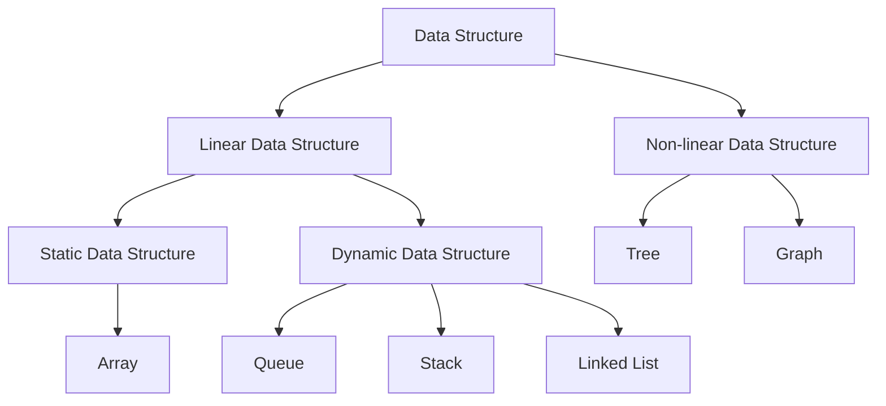

--- 
# 18.07.2024

## C Dili Özellikleri
- Imperative        
- Procedural
- Non-Proprietary
- Middle-level
- Static Typing 
- General Purpose
- Efficient
- Artificial
- Standard
- Portable
- Expressive


## Kavramlar

- Syntax -> Dilin kuralları
- Semantics -> Dilin anlam kuralla
## Tarihçesi

- Geçmişten günümüze programlama dilleri

![[Pasted image 20240803170410.png]]


## Bir C Programlama Kodunun Aşamaları

- Yazılan C kodları bir file'da tutuluyor. Bu file'lar 1 ve 0 lardan oluşan text dosyalarıdır. Bu **text file**'ların oluşumu için **text editor**leri bulunmakta. 
- C kurallarına göre oluşturulmuş kaynak dosyalarının uzantısı `.c` dir.

### Compiler

- C kaynak kodunu ilgili sistem için assembly veya makine koduna dönüştürür.
- Derleme süreci -> Compiler Time
- **Compiler** çıktısı object file çıktısı oluşturur. (object code)
- **Linker** ise derleyiciden çıkan dosyayı çalıştırılabilir dosya haline getirir. (executable code)

**Neden Linker'a ihtiyacımız var?
- Compiler her source file için ayrı bir çıktı oluşturur.
- Linker ise bu çıktıları alıp birleştirerek çalıştırılabilir bir dosya çıktısı oluşturur.
  
### IDE
- Geliştirme ortamı sunar.
- Optimizasyon imkanı sağlar.
--- 
# 19.07.2024

## Preprocessor

- Kaynak kodda compiler öncesinde kodu işleyen ve bazı işlevleri yerine getiren yapı.
- **`#`** işareti ile yazılan kodlar ön işlemciye verilen komutlardır.
- Girişi ve çıktısı text dosyasıdır.
- Input: Source File
- Output: Translation Unit 

## Debugger

- Yazılan programdaki hataları ayıklayabilen, programı ayrı bir ortamda çalıştırıp bug'ları yakalayabilen yapı.


## Tokenizing

- Token: Derleyici derleme esnasında kodu en küçük parçalara ayırır. Bu parçalara **token** denir.
	- Keyword
	- Identifier (name)
	- Operator
	- Constant
	- String Literal
- Token'lar arasındaki boşluklar kodun anlamını değiştirmez.

## Statement
- Türkçeye deyim olarak geçirilebilir.
- C dilinin cümleleridir.
- Genellikle sonu noktalı virgül, iki nokta gibi ifadelerle biten yapılardır.
- null statement, if statement etc..

- `return = 1;`, `a = 5;` gibi ifadeler  expression statement olarak değerlendirilir.
## Expression

- İfadelerin operatörlerle bir araya gelerek oluşturdukları yapıdır.
- Expressions can be assigned or used as operands, while statements can only be declared.
	- `y = x + 4` bir expression iken,
	- `y = x + 4`; bir statement olmaktadır.

- Her ifade:
	- Bir değere sahiptir.
	- Türe (data type) sahiptir.
	- Bellekte yer kaplar.
	- L value veya R value olmak zorundadır.
		- Bir ifadenin L value olması, bellekte bir nesneye karşılık gelmesi demektir. Bellekte bir yeri temsil eder.
			- `x;`
			- `x = x + 25`;
			- ...
		- R value ise hesaplanacak bir değere karşılık gelir. Bellekte bir yer kaplamaz.
			- `25`
			- `x + 25`
			- ...
>[!NOTE]
> Bir ifade eğer L value ise başına adress operatörü `(&)` getirildiğinde bir syntax hatası oluşmaz. Eğer R value ise hata meydana gelir.
		
--- 
# 23.07.2024

## Sayı Sistemleri

- ### Decimal System


- ### Octal System


- ### Hexadecimal System
	- 0,1,2,3,4,5,6,7,8,9,A,B,C,D,E,F digitlerinden oluşmaktadır.
	- A = 11 , B = 12 , C = 13 , D = 14, E = 15, F = 16
	- İki byte'lık en büyük işaretli sayı: 0x7FFF
	- İki byte'lık en küçük işaretli sayı: 0x8000
	- İki byte'lık alanda -1 değeri : 0xFFFF


- ### Binary System
	- Unsigned Binary System
	- Signed Binary System
	- Her bir birime `bit` (binary digit) denir.
	- `1 byte = 8 bit` eşitliği söz konusudur.
	-  `Word =  2 byte` 
	-  `Double Word (dword) = 4 byte`
	- 010100101 örnek verilebilir.
		- En Sağdaki bite `Least Significant Digit (LSD)`, en soldaki bite ise `Most Significant Digit (MSD)` denir.
	- one's complement (bire tümleme)
		- Bir binary sayının 0 bitleri yerine 1, 1 bitleri yerine 0 koyularak 1 e tümlenir.
		- 00000000 -> 11111111
	- two's complement (ikiye tümleme)
		- Bir binary sayının önce bire tümleyeni alınıp daha sonrasında 1 ile toplanılarak elde edilir. 
		- Pratik yol olarak LSB'den başlayarak 1 biti görene kadar değişiklik yapmayıp, sonrasında solunda kalan bitleri toggle ederek 2 ye tümleyeni alınır.
		- **Sistemlerin büyük çoğunluğunda işaretli 2'lik sayı sisteminde ikiye tümleyen aritmetiği kullanılır.**
		- **En yüksek dereceli bit (işaretli sistemlerde sign bit olarak isimlendirilir) 0 ise sayı pozitif, 1 ise negatiftir.**
		-  10010001 -> Negatif
		-  01001010 -> Pozitif
		- İşaretli değerlerde pozitif bir sayının değeri hesaplanırken işaretsiz değerler gibi hesaplanır. Negatif değerlerin ise yani sign bit i 1 olan sayıların ise 2 ye tümleyeni alınır ve bulunan sonucun negatif değeri bize sonucu verir.

## Karakterlerin Terminolojisi

| Simge | Açıklama         |
| ----- | ---------------- |
| `(`   | Parentheses      |
| `)`   | Parentheses      |
| `[`   | Square Bracket   |
| `]`   | Square Bracket   |
| `{`   | Curly Brace      |
| `}`   | Curly Brace      |
| `<`   | Angular Bracket  |
| `>`   | Angular Bracket  |
| `!`   | Exclamation Mark |
| `"`   | Double Quote     |
| `'`   | Single Quote     |
| `#`   | Number Sign      |
| `&`   | Ampersand        |
| `*`   | Asterisk         |
| `-`   | Hyphen           |
| `.`   | Period           |
| `/`   | Slash            |
| `\`   | Back Slash       |
| `:`   | Colon            |
| `;`   | Semi-colon       |
| `^`   | Caret            |
| `     | `                |
| `~`   | Tilde            |

## C Programlamaya Giriş

```C
#include <stdio.h>   /* Önişlemci Komutu*/
int main() {

    printf("Hello, World!\n"); 

    return 0;

}
```

Out: `Hello, World!` 
- Burada ismi main olan bir fonksiyon tanımlanmış, main fonksiyonu içinde ismi printf olan bir fonksiyon çağrılmıştır.

- Kod tekrarından kaçınmak, test edilebilir halde kod yazabilmek gibi önemli sebepler dolayısıyla **fonksiyonlar** kullanılır.
	- function definition
	- function call
	- function declaration
- *NOT:* `{ }` bu brace'lerin arasında kalan alana **block** denir.

### Data Types

---
- **`char`** types    1 byte
- **char** (derleyiciye bağlı olarak işaretli veya işaretsiz olabilir)
- **signed char**    -128 / 127
- **unsigned char**    0 / 255
---
- **`short`** types    2 byte
- short int
- signed short
- unsigned short
---
- signed **`int `**   2/4/8 byte
- unsigned int
---
- signed long int    4 byte
- unsigned long int
---
- signed long long int    8 byte
- unsigned long long int    
---
- `short` <= `int` <= `long` <= `long long ` **OLMAK ZORUNDA**
- *char* türünün 1 byte olması zorunludur. *long long* türü ise **en az 8 byte** olmak zorundadır. Geri kalan büyüklükler derleyiciye bırakılmış durumdadır.
--- 
# 25.07.2024

- Assignment ve initialize aynı şeyler değildir. Her `=` görülen yere *atama* demek doğru değildir.
- Initialize -> `int a = 5;`
- Assignment -> `a = 5`
---
- Kullanılan derleyicideki data type'ların kaç byte alan kapladığını görmek için aşağıdaki kodu kullanabilirsiniz:
```C
#include <stdio.h>

  

int a;  /*Istenilen tüde değişken tanımı*/

  

int main() {

    printf("%d\n",sizeof(a));

    return 0;

}

```

- Daha sık kullanılan türler:
	- Tam sayı türlerinde `int` , gerçek sayı tülerinde `double`'dır. 
	
---
### Derleyicinin Zorunlu Kıldığı İsimlendirme Kuralları
- `A.....Z` (26)
- `a......z` (26)
- `0......9` (10)
- `_`
- Bu karakterler dışında isimlendirmede bir karakter kullanılmamalı.
- Türkçe karakter kullanılmamalı.
- İsimlendirme herhangi bir rakam ile başlayamaz.
- **C Standardına göre `__` ile veya `_` sonrası büyük harf ile bir isim başlayamaz. Bunlar standarda rezerve edilmiştir.**
- **C programlama büyük - küçük harf duayrlı bir dildir.**
---
### Storage Duration / Lifespan
- Her değişkenin bir ömrü vardır.
	- Static Duration
		- Programın sonuna kadar ömrünü sürdüren değişkenlerdir.
	- Automatic Duration
		- Yalnızca belirli bir kodun yürütülmesi süresince bellekte yer edinen değişkenlerdir.
	- Dynamic Duration
		- Dynamic Memory Allocation ile ömürleri kod içerisindeki komutlarla ayarlanabilen değişkenlerdir.
	
- **Global değişkenler statik ömürlüdür.**
- Local değişkenler başında `static` keyword'ü ile tanımlama yapılmadığı sürece automatic ömürlüdür.

```C
int g;                 /*Global Variable*/

int main(){
	int l;             /*Local Variable*/
}
```

- Static ömürlü değişkenler initialize edilmese bile başlangıç değeri `0` kabul edilir.
- Static yerel değişkenler  initialize edilmese bile başlangıç değeri `0` kabul edilir.
- Automatic ömürlü değişkenler init edilmediği zaman bellekte bulunduğu yerdeki değerini alır. Yani ilk değeri tahmin edilemez. (Örneğin bellekte 0110101 değerine sahipse 53 değerini alır. ) **(Indetermined Value)**
- Static Değişkenlere ilk değer verilirken verilen değer constant olmak zorundadır.
--- 
### Önemli Birkaç Terim!!

- Undefined behaviour 
	- Tanımsız Davranış. 
	- Tanımsız Davranış = Ölüm.
	- Programın runtime aşamasında hiçbir garantisinin olmamasıdır.
		- **Indetermined Value kullanılması undefined behaviour'dır!!!**
		- **Derleyici optimizasyon sürecinde bir tane bile tanımsız davranış olmadığını varsayar.**
		- 
```c
int a = 10;  /*Doğru kullanım.*/
int b = a;   /*Yanlış kullanım. Constant Value olması gerekiyor.*/

int main(){
	int x;            /*Automatic değişken, ilk değeri belirsiz.*/
	int y = x + 5;    /*Undefined behaviour. "x" indetermined Value'dur.*/
}
```

```c
a = x / y; /*Eğer y = 0 ise Undefined behaviour.*/
```

- Unspecified behaviour
	- 
- Implementation Defined

--- 
### Scope
- Scope isimlere(identifier) ilişkin bir kavramdır.
- C ve C++ dillerinde bildirilen her ismin scope denilen bir niteliği vardır.
- Bildirilen bir ismin, nerede kullanılırsa aynı değişkenden bahsedildiğinin anlaşılmasıdır. 
- Compile Time a ilişkin bir kavramdır.
- 4 kategoriye ayrılır.
	- **File Scope**
		- **Bildirilen isimler bildirildikleri yerden itibaren her yerde kullanılabilir.**
		- **Global namespace**'de bildirilen isimlerin scope'u file scope olur. 
	- **Block Scope**
		- `{ }` bu iki brace arasında kalan kısma block denir.
		- Bir isim eğer block içerisinde bildirilirse, o isim bildirildiği noktadan block sonuna kadar (closing brace) tanımlıdır. 
		- 
	- **Function Prototype Scope**
	- **Function Scope**

```c
int main(void){

/* a değişkeni burda kullanılamaz (out of scope)  */
	if(1) {
		/* a değişkeni burda kullanılamaz (out of scope)  */
		int a = 4;
		/* a değişkeni burda kullanılabilir  */
	}
	/* a değişkeni burda kullanılamaz (out of scope)  */

}
```

---
# 26.07.2024

### Name Lookup
- Derleyicinin ismin (identifier) nerede tanımlandığını aramasıdır.
- Scope ile benzerdir fakat aynı şeyler değildir.
- C ve C++ dillerinde isim arama, aranan ismin bulunmasıyla biter ve bir daha başlamaz.
- İsmin aranması aşağıdaki sıraya göre özelden genele yapılır.
- 
```c
/* Bu olaya name hiding de denebilir. */
/* C programlamada iyi bir şey değildir.*/
int a = 5; /*Unvisible*/

int main(void){ /* 3 */

	}           /* 2 */
		int a = 10;     /*Name Lookup burda sona erer.*/
		{       /* 1 */
		
			a = 99;
		
		}
	}
}
```


--- 
# 02.08.2024
## Call By Value

- Fonksiyona değişkenin kendisini göndermiyoruz.
- Fonksiyona değişkenin değerini gönderiyoruz
- Yani çağırdığımız fonksiyon bizim gönderdiğimiz değeri kullanabilir fakat değiştiremez.
```c
int foo(int x){
	x = 655;
}

int main(void){
	int a = 4;
	a = foo(a);      
	printf("%d",a);    /*a = 4 */
}
```

## Call By Reference

- Fonksiyona değişkenin kendisini gönderiyoruz.
- Fonksiyon gönderdiğimiz değeri kullanabilir, değiştirebilir.

```c
int foo(int *x){
	*x = 655;
}

int main(void){
	int a = 4;
	a = foo(&a);      
	printf("%d",a);    /*a = 655 */
}
```

## Constants

- Sabitlerin türleri var. Bir sabiti yazarken hangi türde yazdığımız kodun anlamını **değiştirebilir**t


### Integer Constants

- Decimal -> 1265
- Octal -> **0 ön eki alır** 012
- Hex -> *0x ön eki alır* 0x4A4B

#### Türleri
- int
- uint                                   3456u
- long                                  10l
- unsigned long                  1764ul
- long long                          3678768ll
- unsigned long long          45676543ull

- Son ek yoksa int olur.
- 
### Floating Constants

- Eğer son ek yoksa double olur.
#### Türleri 
- double                       0.6 veya .6
- float                           0.6f
- long double               0.6l, 3.L

>[!NOTE]
>büyük küçük harf farketmiyor


--- 
# 06.08.2024

## Karakter Sabitleri

| 34    | Int                |
| ----- | ------------------ |
| 34U   | Unsigned Int       |
| 34L   | Long               |
| 34UL  | Unsigned Long      |
| 34LL  | Long Long          |
| 34ULL | Unsigned Long Long |

Character Coding:
- Sistemde kaç tane karakter var, bu karakterler neler?
- Her karakterimn bir tam sayı karşılığı var.
- Bix ASCII karakter kodlamasını kullanıyoruz.

- 'A' gibi gösterimlerde karakterin değerini gösteriyoruz.

### Escape Sequence

- '\' ile yazılan karakterlerdir. Burda kurallar dışına çıkılarak farklı anlamlara gelebiliyor.

| Escape Sequence | Name               | Description                                                                            |
| --------------- | ------------------ | -------------------------------------------------------------------------------------- |
| \a              | Alarm or Beep      | It is used to generate a bell sound in the C program.                                  |
| \b              | Backspace          | It is used to move the cursor one place backward.                                      |
| \f              | Form Feed          | It is used to move the cursor to the start of the next logical page.                   |
| \n              | New Line           | It moves the cursor to the start of the next line.                                     |
| \r              | Carriage Return    | It moves the cursor to the start of the current line.                                  |
| \t              | Horizontal Tab     | It inserts some whitespace to the left of the cursor and moves the cursor accordingly. |
| \v              | Vertical Tab       | It is used to insert vertical space.                                                   |
| \\              | Backlash           | Use to insert backslash character.                                                     |
| \’              | Single Quote       | It is used to display a single quotation mark.                                         |
| \”              | Double Quote       | It is used to display double quotation marks.                                          |
| \?              | Question Mark      | It is used to display a question mark.                                                 |
| \ooo            | Octal Number       | It is used to represent an octal number.                                               |
| \xhh            | Hexadecimal Number | It represents the hexadecimal number.                                                  |
| \0              | NULL               | It represents the NULL character.                                                      |
| \e              | Escape sequence    | It represents the ASCII escape character.                                              |
| \s              | Space Character    | It represents the ASCII space character.                                               |
| \d              | Delete Character   | It represents the ASCII DEL character.                                                 |

#### Karakter sabitleri yazım biçimleri:

```c
int x = 'A';     // Standard Format
int y = '\n';    // Specials
int z = '\x1a'   // Hexadecimal
int w = '\054'   // Octal
```


## Input - Output Operation

- Standard Input Stream (klavye)
- Standard Output Input (Monitör)
- Standard Error Stream (Monitör)

**Burdan sonrasına katılamadım. Tekrar edeceğim.**


# 08.08.2024

## printf fonksiyonu

- Variadic bir fonksiyondur
- Yazılar null terminated char türünden tutulur.
- Geri dönüş değeri standart output a yazılan karakter sayısıdır.
- "x" string literal denir. Bir dizidir. (Kursun ilerleyen süreçlerinde daha detaylı anlatılacak.)
- %d gibi ifadeler formatlama için kullanılır. (conversion spesificier)
 - The below table contains the most commonly used format specifiers in C:

| Format Specifier     | Description                                |
| -------------------- | ------------------------------------------ |
| ****%c****           | For character type.                        |
| ****%d****           | For signed integer type.                   |
| ****%e or %E****     | For scientific notation of floats.         |
| ****%f****           | For float type.                            |
| ****%g or %G****     | For float type with the current precision. |
| ****%i****           | signed integer                             |
| ****%ld or %li****   | Long                                       |
| ****%lf****          | Double                                     |
| ****%Lf****          | Long double                                |
| ****%lu****          | Unsigned int or unsigned long              |
| ****%lli or %lld**** | Long long                                  |
| ****%llu****         | Unsigned long long                         |
| ****%o****           | Octal representation                       |
| ****%p****           | Pointer                                    |
| ****%s****           | String                                     |
| ****%u****           | Unsigned int                               |
| ****%x or %X****     | Hexadecimal representation                 |
| ****%n****           | Prints nothing                             |
| ****%%****           | Prints % character                         |

## scanf Fonksiyonu
- Scanf bir formatlı **giriş** fonksiyonudur.
- Variadic bir fonksiyondur.
- Call by reference kullanır.
- Girdi olarak adress girilmesi gerekir.
- Başarı garantisi olmayan bir fonksiyondur. Bu yüzden scanf in geri dönüş değeri başarı bilgisidir.
- Geri dönüş değeri set ettiği değişken sayısıdır.
- Scanf'i mutlaka kontrol etmek gerekir.
- Kullanıcının girişine bağlı olarak istenen set işlemini yapamamış olabilir.
- Scanf başarısız olursa hafızasındaki buffer ı temizlemiyor. 
- Eğer scanf giriş işlemini std.input buffer'ına karakter gelmediği için yani buffer boş bırakıldığı için başarısız olmuşsa, geri dönüş değeri bir hata kodu olarak -1 değeridir.
---
### Operators:
- 45 adet operatör vardır.
- a + b ifadesinde + operator iken, a ve b operand olarak isimlendirilir.
- !x -> prefix
- y++ -> posfix

- binary operator: (2 operand)
- unary operator: (1 operand)
- ternary operator: (3 operand)

- C dilinde her operatörün ürettiği bir değer vardır.
#### Operators Precedense:

| Precedence | Operator       | Description                                       | Associativity                          |            |
| :--------: | -------------- | ------------------------------------------------- | -------------------------------------- | ---------- |
|     1      | `++ --`        | Suffix/postfix increment and decrement            | Left-to-right                          |            |
|            | `()`           | Function call                                     |                                        |            |
|            | `[]`           | Array subscripting                                |                                        |            |
|            | `.`            | Structure and union member access                 |                                        |            |
|            | `->`           | Structure and union member access through pointer |                                        |            |
|            | `(type){list}` | Compound literal (C99)                            |                                        |            |
|     2      | `++ --`        | Prefix increment and decrement                    | Right-to-left                          |            |
|            | `+ -`          | Unary plus and minus                              |                                        |            |
|            | `! ~`          | Logical NOT and bitwise NOT                       |                                        |            |
|            | `(type)`       | Cast                                              |                                        |            |
|            | `*`            | Indirection (dereference)                         |                                        |            |
|            | `&`            | Address-of                                        |                                        |            |
|            | `sizeof`       | Size-of                                           |                                        |            |
|            | `_Alignof`     | Alignment requirement (C11)                       |                                        |            |
|     3      | `* / %`        | Multiplication, division, and remainder           | Left-to-right                          |            |
|     4      | `+ -`          | Addition and subtraction                          |                                        |            |
|     5      | `<< >>`        | Bitwise left shift and right shift                |                                        |            |
|     6      | `< <=`         | Relational operators `<` and `<=`                 |                                        |            |
|            | `> >=`         | Relational operators `>` and `>=`                 |                                        |            |
|     7      | `== !=`        | Relational operators `==` and `!=`                |                                        |            |
|     8      | `&`            | Bitwise AND                                       |                                        |            |
|     9      | `^`            | Bitwise XOR (exclusive OR)                        |                                        |            |
|     10     | `              | `                                                 | Bitwise OR (inclusive OR)              |            |
|     11     | `&&`           | Logical AND                                       |                                        |            |
|     12     | `              |                                                   | `                                      | Logical OR |
|     13     | `?:`           | Ternary conditional                               | Right-to-left                          |            |
|     14     | `=`            | Simple assignment                                 |                                        |            |
|            | `+= -=`        | Assignment by sum and difference                  |                                        |            |
|            | `*= /= %=`     | Assignment by product, quotient, and remainder    |                                        |            |
|            | `<<= >>=`      | Assignment by bitwise left shift and right shift  |                                        |            |
|            | `&= ^=         | =`                                                | Assignment by bitwise AND, XOR, and OR |            |
|     15     | `,`            | Comma                                             | Left-to-right                          |            |

# 09.08.2024

## Operators Cont'd

### Aritmetik Operators

- `+` ve `-` operatörleri binary operatorlerdir.
	- R value ifadelerdir (x + y)
	- Temel özelliklerini not almadım. (toplama yapar çıkarma yapar vs vs...)
- `/`, `*` ve `%` operatörlerinin öncelik sıralaması soldan sağadır. R value olarak geçerler.

- `++` ve `--` increment ve decrement operatörlerinin operand'ı L Value **olmak zorundadır.**
- Pre-increment/pre-decrement kullanımı daha yaygındır. (`++a)
- Son ek kullanıldığında ifade bitmeden değer inc-dec yapılmaz.
- Ön ek kullanıldığında ifade bitmeden değer değişir.

```c
int x = 23;
int y = 7;
printf("%d\n", x-- % ++y); // x kendi değerinde kalacak y 1 artacak
printf("+d\n", x % y); // x bir azalarak 22 olur.
```

out:
```
7
6
```


C programlamada, ön ek ve son ek artırma/azaltma operatörleri (`++` ve `--`) genellikle yan etkilere (side effects) neden olur. Bu operatörlerin nasıl çalıştığını ve hangi durumlarda yan etkilere yol açtığını anlamak önemlidir.

### Ön Ek ve Son Ek Operatörleri

1. **Pre-Increment/Decrement (Ön Ek):**
   - `++x` veya `--x` şeklinde yazılır.
   - Önce değişkenin değeri artırılır veya azaltılır, sonra bu yeni değer kullanılır.

   **Örnek:**
   ```c
   int x = 5;
   int y = ++x; // x önce 6 olur, sonra y'ye atanır.
   // Sonuç: x = 6, y = 6
   ```

2. **Post-Increment/Decrement (Son Ek):**
   - `x++` veya `x--` şeklinde yazılır.
   - Önce değişkenin mevcut değeri kullanılır, sonra bu değer artırılır veya azaltılır.

   **Örnek:**
   ```c
   int x = 5;
   int y = x++; // y önce 5 olur, sonra x 6 olur.
   // Sonuç: x = 6, y = 5
   ```

### Side Effect (Yan Etki)

Bu operatörlerin yan etki oluşturmasının nedeni, bir değişkenin değerinin programın durumu içinde değiştirilmesidir. Bu, özellikle karmaşık ifadelerde veya aynı değişkenin birden fazla kez kullanıldığı durumlarda dikkat edilmesi gereken bir durumdur.

**Örnek:**
```c
int x = 5;
int y = x++ + ++x; 
```

Bu örnekte, `x++` ve `++x` operatörlerinin sırası ve yan etkileri önemlidir:

- İlk olarak `x++` ifadesi çalışır, bu durumda `x`'in değeri 5'tir ve bu değer kullanılır, ardından `x` 6 olur.
- Daha sonra `++x` ifadesi çalışır, burada `x` değeri 7'ye yükseltilir ve bu yeni değer kullanılır.
- Sonuç olarak, `y = 5 + 7` olur ve `y` 12 değerini alır, `x` ise 7'dir.

Bu tür ifadelerdeki yan etkiler, özellikle aynı değişkenin birden fazla kez kullanıldığı durumlarda karmaşık ve tahmin edilmesi zor sonuçlara yol açabilir. Bu nedenle, bu tür ifadelerden kaçınmak ya da çok dikkatli kullanmak genellikle iyi bir programlama pratiğidir.

### Genel Öneriler
- Aynı değişkenin birden fazla kez artırıldığı veya azaltıldığı karmaşık ifadelerden kaçının.
- Yan etkilerin daha kolay anlaşılması için, artırma/azaltma işlemlerini basit ve tek başına kullanın.
- Programın tahmin edilebilirliğini artırmak için kodunuzu daha okunabilir ve anlaşılır hale getirin.

### Karşılaştırma Operatorleri

- `>`, `>=`, `<`, `<=`, `==` operatörleridir.
- Geri dönüş değeri **`int`** olur.
--- 
# 13.08.2024 


```c
b = x == y;

---------------------------

if(x == y)
	b = 1;
else
	b = 0;

---------------------------
// Yukarıdaki iki ifade aynı anlamı taşımaktadır.
```

- Ekstra bilgi:
	- double ve float değişkenlerin karşılaştırılması tam sayılar gibi değildir. 
```c
if(dval == 3.4) // Yanlış

if(dval - 3.4 <= 0.000001) // Doğru
```

## Logic Operators

- !expr
- exp1 && expr2
- exp1 || expr2
- expr ? op1 : op2
- if(expr)
- while(expr)
- do ... while(expr)
- for (;expr;)

### ! Operatörü
- Tek operandı vardır.
	- !op1
- **Yan etkisi yoktur.**
```c
if(!a){}
```

### && ve || Operatörleri
- Her iki operant lojik yorumlamaya tabi tutulur.
- **&& yerine & kullanmak kesinlikle hatalıdır ve kodun anlamını değiştirir.**
	- Bu karmaşıklığı engellemek için C++ dilinde && veya || yerine `and`, `or` anahtar sözcüğü kullanılabilir. **C dilinde böyle bir standart alternatif yoktur.**
```c
#include <stdio.h>

int main(void)
{
	int x,y;
	printf("İki tamsayi giriniz: ");
	scanf("%d%d", &x, &y);
    printf("%d && %d = %d \n",x,y,(x && y));
    printf("%d || %d = %d \n",x,y,(x || y));
}
```

- De-Morgan kuralları geçerlidir. 
	- !(a && b) = !a || !b
	- !(a || b) = !a && !b
### Kısa Devre Davranışı (Short Circuit Behaviour)

>[!NOTE]
> Lojik && operatöründe öncelikle sol operand değerlendirilir. Eğer sol operand lojik doğru değilse sağ operand hiç yapılmaz.

>[!NOTE]
> Lojik || operatöründe öncelikle sol operand değerlendirilir. Eğer sol operand lojik doğru ise sağ operand hiç yapılmaz.

```c
#include <stdio.h>

int main(void)
{
	if(x > 10 && y > 20)
		++a;
}
/*YUKARIDAKİ İFADEDE X 10 DAN BÜYÜK DEĞİLSE Y<20 LOJİK İŞLEMİ YAPILMAZ. KISA DEVRE DAVRANIŞI VARDIR.*/

```

```c
#include <stdio.h>

int main(void)
{
	int x = 0;
	int y = 555;
	int z = x && ++y;
    printf("%d\n", z);
    printf("%d\n", y);
}
```

**output:**
`0
555`
**olacaktır. y değeri 556 olmayacaktır. && operatörünün sol operandı lojik yanlış olduğu için sağ operand yapılmaz.**

### `!!x` operatörü 
`!!x` operatörü C programlama dilinde sıklıkla, bir ifadenin boolean (mantıksal) değerini elde etmek için kullanılır. Bu operatör iki aşamada çalışır:

1. `!x`: İlk olarak, `x` ifadesinin değeri tersine çevrilir. Eğer `x` sıfırdan farklı bir değer ise, `!x` sıfır (0) olur. Eğer `x` sıfır ise, `!x` bir (1) olur.
   
2. `!!x`: İkinci aşamada, elde edilen bu ters değer tekrar tersine çevrilir. Bu da orijinal ifadenin mantıksal karşılığını verir. Başka bir deyişle, `!!x`, `x`'in sıfırdan farklı olup olmadığını kontrol eder ve sonucu bir (true) veya sıfır (false) olarak döndürür.

```c
#include <stdio.h>

int main() {
    int a = 5;
    int b = 0;
    int c = -3;

    printf("a: %d, !!a: %d\n", a, !!a);  // a: 5, !!a: 1
    printf("b: %d, !!b: %d\n", b, !!b);  // b: 0, !!b: 0
    printf("c: %d, !!c: %d\n", c, !!c);  // c: -3, !!c: 1

    return 0;
}
```

Bu örneklerde:

- `a` pozitif bir sayı (5) olduğu için, `!!a` 1 (true) döner.
- `b` sıfır olduğu için, `!!b` 0 (false) döner.
- `c` negatif bir sayı (-3) olduğu için, `!!c` 1 (true) döner.

### Neden Kullanılır?

`!!x` operatörü, genellikle bir değerin boolean karşılığını almak ve bu değeri açıkça 1 veya 0 olarak ifade etmek için kullanılır. Bu yöntem, özellikle bir değişkenin sıfır olup olmadığını kontrol etmek ve sonucu boolean türünde bir değişken olarak saklamak istediğiniz durumlarda işe yarar.

Özetle, `!!x`, bir sayının sıfır olup olmadığını kontrol etmek ve sonucunu boolean (1 veya 0) olarak elde etmek için kullanılır.

## Atama Operatörleri

-  Öncelik yönleri sağdan sola doğrudur. (Right Associative)  
- Yan etkiye sahiptirler.
### `=` Operator

- Değer atama operatörüdür.
- Sol operandı L value expression olmalıdır.
- C dilinde atama operatörleri diğer operatörler gibi bir değer üretir. Atama operatörünün ürettiği değerden faydalanan birçok yapı vardır.
- **Atama operatörlerinin ürettiği değer nesneye atanan değerdir.**


--- 
# 15.08.2024

## Atama Operatörleri Cont'd

### Compound Assignment

- variable = variable op expression;
- Statements with the same variable on each side of the equals sign
- May use the shortcut assignment operators (compound assignment)

| Operator | Operation                | Example | Result     |
| -------- | ------------------------ | ------- | ---------- |
| +=       | Compound  <br>Assignment | x += y  | x = x + y  |
| -=       | Compound  <br>Assignment | x -= y  | x = x - y  |
| *=       | Compound  <br>Assignment | x *= y  | x = x * y  |
| /=       | Compound  <br>Assignment | x /= y  | x = x / y  |
| %=       | Compound  <br>Assignment | x %= y  | x = x % y  |
| &=       | Compound  <br>Assignment | x &= y  | x = x & y  |
| ^=       | Compound  <br>Assignment | x ^= y  | x = x ^ y  |
| \|=      | Compound  <br>Assignment | x \|= y | x = x \| y |
| «=       | Compound  <br>Assignment | x <<= y | x = x << y |
| »=       | Compound  <br>Assignment | x >>= y | x = x >> y |

### Sequence Point

- Kendinden önceki kodun yürütülmesi sonucu oluşulacak yan etki gerçekleşmiş olmak zorundadır.

```c

//code1

++x

//---------- sequence point--------

y = x   // x kesinlikle 1 artmıştır.

//code2
```

- deyim sonu `;` bir sequence pointtir.
- `if`  parantezi bitimi de bir seq. pointtir.
- `for` parantezi bir sequence pointtir.
```c

x = 40;
if(x++ > 10){
	a = x;
	
}
else{
	b = x;
}
```

- **Bazı operatörler sequence point oluşturur.**
	- Logic and operatörü `&&`
	- Logic or operatörü `||`
	- Ternary Operator
	- Comma Operator `,`
	
- Bir nesne eğer bir yan etkiye maruz kalıyorsa ve bir seq. point olmadan kullanılırsa **undefined behaviour** durumu oluşur!!
```c
int x = 5;

int y = ++x + x;  //side-effect sonrası seq. point yok.

```

```c
int x = 5; 
x = x++;    // Undefined Behaviour (atama operatörü bir seq. point değildir.)
```

- **Öncelik parantezi bir seq. point oluşturmaz.**

```c
int x = 5;
int y = x + (x = 9);
```

- Yukarıdaki örnek bir **undefined behaviour** olur.

- C ve C++ dilleri arasında sequence point tanımı hakkında farklılıklar vardır.

### Comma `,` Operatörü

- Bazı yerlerde operatör, bazı yerlerde seperatör olarak görev yapar.

```c
foo(int a, int b)    // Seperator

-----------

int a, b;  // Seperator

----

int arr[] = {1,2,3,4,5}; // Seperator


```

- En düşük öncelikli operatördür.
- Virgül operatörü bir ifade oluşturur ve ifade içinde virgülden önce bir seq. point vardır.
```c
int y = 10;
int x = 7;

y++; x = y;

y++, x = y; // Virgül operatörü bir seq. pointtir ve bu ifade yukarıdaki ifadeyle aynıdır.

```

- İfadeleri virgül operatörü ile birleştirerek bir deyim haline getirdiğimizde ayrı ayrı yazmak ile arasında fark yoktur.
```c
temp = x, x = y, y = temp;

```

- Öncelik parantezi ile kullanıldığında en sondaki değeri alır.

```c

int foo(int)

int arr[10] = {{0,1,2,3,4,5,6,7,8}};


int main(void){

	foo((2,5));   // 5 ile fonksiyon çağırılır.

for(int i = 0; i < 10 ;++i){

	printf("%d",arr(i)); // 8 0 0 0 0 0... yazdırır.
	}

}
```

- **Operatör önceliği hangi işlevin önce yapılacağı anlamına gelmez!!**

## Control Deyimleri

- `if` statement
- `while` statement
- `do` statement
- `for` statement
- `continue` statement
- `break` statement
- `switch` statement
- `goto` statement
- `return` statement

### `if` Deyimi
- En çok kullanılan kontrol deyimidir. 
- Parantez içinde bir **expression** olmak zorundadır.
```c
if(x < 10){

//code
}
```

- Eğer sonunda süslü parantezler `{}` ile blok halinde kullanılmaz ise koşul yalnızca if deyiminden sonraki statement ile ilişkilidir. 
```c
if (exp)
x++; y++;                          /*Bu örnekte if deyimindeki exp logic 1 olduğunda yalnızca x++ statement'ı gerçekleşecektir.*/
Z++;


if (exp)
x++, y++, Z++;                          /*Bu örnekte if deyimindeki exp logic 1 olduğunda 3 statement da gerçekleşecektir.*/
```
- zero- nonzero bir deyimdir. 
```c
int a = 5;
if(a){
	printf("necati");   // Bu ifade ekrana necati yazdırır. Çünkü a nonzero bir değere sahiptir.
}
```


```c
if (foo() != 0)
	statement;

if(foo())
	statement;

// Yukaridaki iki ifade aynıdır. Çünkü if deyimi zero-nonzero bir deyimdir.

```

```c
if(10 < x < 20) // always true (10 <x) ifadesi 0 veya 1 değeri döndürür.
```

```c
if (x != 5 || x != 19) // always true
```

```c
if (foo)    // foo fonksiyonu çağırılmaz ama dogru yazısı ekrana yazdırılır.(Ileride işlenecek derslerde daha detaylı anlatılacak.)
	printf("dogru\n");
```

```c
int main(void){
	double d = 0.;
	for(int i = 0; i < 10; ++i){
		d += 0.1;
	}
	if(d == 1.){
		printf("dogru\n")
	}
	else{
		printf("yanlis\n");    // ekrana yanlış yazısı bastırılır
	}
}
```

---
# 16.08.2024

## if-else Deyimi

```c
if(expr)
	statement_t;    /*Expression logic 1 ise statement_t calisacak*/
else
	statement_f;    /*Expression logic 0 ise statement_f calisacak*/
```

- Blok yapısı `{}` yoksa if-else yapısında if ifadesi statement içermek zorundadır.
```c
if(expr)  
else              /*Syntax error*/
	statement_f; 


if(expr) 
	; // null statement
else              /*No error but not recommended*/
	statement_f; 
```
- Yukarıdaki örnekte null statement yerine içi boş blok kullanılması önerilmektedir.


### Dangling else

```c
#include <stdio.h>

int main(){

	if(x > 10)
		if(y > 20)
			++x;
    else                   /*Burdaki else içteki if deyimine aittir.*/
	    ++y; 
    return 0;
}
```

- Bu gibi durumların da karmaşıklığı nedeniyle blok `{}` kullanımı önerilir.

## else-if Ladder(Cascaded if)
- else-if merdiveni denilmesinin sebebi eski zamanlarda aşağıdaki şekilde yazılmasıdır.

```c
if (x == 2)
	a = 5;
else
	if (x == 7)
		b = 9;
	else
		if(x == 12)
			++c;
		else
			if() //...
	
```

- Günümüzdeki kullanımı:
```c
if (exp1)
	a = 5;
else if (exp2)
	b = 9;
else if(exp3)
	++c;
else if(exp4) //...
```

## Input-Output Functions (Additions)

- Unformatted Input-Output Functions:
	- `getchar`
	- `putchar`
	- Bu iki fonksiyon için `stdio.h` kütüphanesi eklenmelidir.

#### getchar

- standart inputtan bir karakter alır. O karakteri return eder.

```c
#include <stdio.h>

int main(){

	printf("bir karakter girin: ");
	int ch = getchar();
	printf("ch = %d\n",ch);

    return 0;
}
/*Yukardaki örnekte ekrana girilen değerlerdeki ilk karakteri detect edip onun ascii karakter numarasını yazdırır.*/
```

>[!NOTE]
>program sonlandırıldığında bile standart buffer içerisinde hala değer tutulmaya devam eder. Mesela getchar() fonksiyonu 3 kez çağırılırsa, ilk çağırıldığında 1. karakteri sonra 2. ve daha sonra 3. karakteri ekrana yazdırır.

```c
#include <stdio.h>

int main(){

	printf("bir karakter girin: ");
	int ch = getchar();
	printf("ch = %d\n",ch);

	ch = getchar();
	printf("ch = %d\n",ch);

	ch = getchar();
	printf("ch = %d\n",ch);
    return 0;
}
```

kod derlendiğinde standart inputa **`123`** yazarsak çıktısı aşağıdaki gibi olacaktır:

```c
bir karakter girin: 123
ch = 49
ch = 50
ch = 51
```

- getchar ile scanf fonksiyonları aynı buffer'ı kullanır.


```c
#include <stdio.h>

int main(void){

	printf("bir tam sayi giriniz:");
	int c;
	while((c = getchar()) != '\n'){
		printf("%d\n",c - '0');
	}
}
```

out:
```c
bir tam sayi giriniz:654321
6
5
4
3
2
1
```
---
>[!IMPORTANT]
> AŞAĞIDA ÖRNEK BİR MÜLAKAT SORUSU BULUNMAKTADIR:

SORU: pozitif bir tam sayının üçe bölünüp bölünmediğini kontrol et ve ekrana yazdır fakat giriş 30 basamaklı bile olabilir.

```c
#include <stdio.h>

int main(void){

	printf("bir tam sayi giriniz:");
	int c;
	int sum = 0;
	while((c = getchar()) != '\n'){
		sum += c - '0';
	}
	if(!(sum % 3)){
		printf("evet uce tam bolunur\n")
	}
	if((sum % 3)){
		printf("hayir uce tam bolunmez\n")
	}
}
```

---
#### putchar

- Verilen int türünden parametreyi standart output'a yazar.
- Printf gibi variadic bir fonksiyon değildir.
```c
#include <stdio.h>
int main(void){
  putchar(65);
  putchar('\n');
  putchar('A');

}
```
out:
```c
A
A
```

```c
#include <stdio.h>
int main(void){
	for(int cnt = 0; cnt <= 128; ++cnt){
		putchar(cnt);
	}

}
```

**`putchar(cnt);` yerine `printf("%c",cnt);` statement'ı ile de aynı sonuç alınabilir.**


## Test Fonksiyonları

- zero-nonzero değer döndürür
- Genelde `is` ile başlarlar. (`isprime()`)
- Biz de test fonksiyonu yazarken bu minvalde oluşturmalıyız.

```c
int iseven(int x){

    return (!(x % 2));

}
```

### Artık Yıl Testi (Leap Year)
- Artık yıl olma şartı:
	- 4 e tam bolünenlerden
		- 100 e tam bölünmeyenler
		- 400 e tam bölünenler

```c
int isleap(int y){
return (y % 4 == 0) && ((y % 100) || (y % 400 == 0));
}
```

### Perfect Number Testi

```c
int isperfect(int y){
	int sum_div = 0;
	for(int i = 1; i < (x/2); ++i){
		if(y % i == 0){
			sum_div += i;
		}
	}
	return (sum_div == y);
}
```

## <ctype.h> Kütüphanesi
- **zero-nonzero değer döndürürler.** `(True = non-zero // false = zero)`
- Bu kütüphanedeki iki fonksiyon hariç tüm fonksiyonlar **karakter test fonksiyonlarıdır.**
- int isupper(int c) büyük harf test fonksiyonu
- int islower(int c) küçük harf test fonksiyonu
- int isdigit(int c) rakam test fonksiyonu
- int isalpha(int c) küçük veya büyük harf test fonksiyonu
- int isalnum(int c) rakam veya harf karakteri test fonksiyonu
- int isxdigit(int c) hex test fonksiyonu
- int isspace(int c) boşluk karakterlerinden biri mi testi  (new line, carrier return, horizonal and vertical tab and space character)
- int isblank(int c) yalnızca space ve yatay tab testi
- int ispunct(int c) yazıdırabilir karakterlerden alphanumeric olmayanların test fonksiyonu
- int isprint() or isgraph() yazıdrılabilir karakterlerin testi
- int iscntrl() kontrol karakter testi

```c
#include <stdio.h>
#include <ctype.h>
int main(void){

	int ch;
	printf("bir karakter girin:");
	ch = getchar();
	if(isupper(ch)){
		printf("buyuk harf karakter\n");
	}
	else{
		printf("buyuk harf degil\n");
	}
}

```

---
# 20.08.2024

### ctype Kütüphanesindeki Dönüşüm Fonksiyonları

- toupper -> argümanı küçük harf karakter ise onu büyük harfe dönüştürür, argümanı büyük harf ise kendisini döndürür.
- tolower  ->  argümanı büyük harf karakter ise onu küçük harfe dönüştürür, argümanı küçük harf ise kendisini döndürür.
---
**Ek Bilgi**: **`Windows.h`** kütüphanesinde bulunan **Sleep**
fonksiyonu delay özelliğine sahiptir.

---

## Döngü Deyimleri (Loop Statements)

- Bir kod parçasının yinelenmeli olarak tekrar edilmesini sağlar
	- while
	- do-while
	- for
- Yardımcı döngü deyimleri:
	- break statement
	- continue statement

### while Statement
- zero-nonzero bir statement'tir.
- parantez içinde bir `expression` olmak zorundadır.

```c
while(exp)
	statement;
```

```c
int main(void){

int i = 0;

while(i < 10){
	printf("%d",i);
	++i;
	
	}

}
```

- Sık kullanılan bir yapı:
```c
int main(void){

int ch;

printf("bir yazi giriniz");

while((ch = getchar()) != '\n'){
	printf("%c %d",ch,ch);
	
	}

}
```

---
***Sık sorular bir soru:***

Armstrong sayısı: Bir abc sayısı eğer `a^3 + b^3 + c^3 = abc` şeklinde yazılabiliyorsa o sayı Armstrong sayısıdır.  Veya abcd sayısı için `abcd = a^4 + b^4 + c^4 + d^4` 

**Soru:** 3 BASAMAKLI ARMSTRONG SAYILARINI EKRANA YAZDIRINIZ.

```c
#include <stdio.h>

int main(void){

    int sayi = 100;

    while(++sayi < 1000)
    {
    	int a = sayi / 100;
    	int b = (sayi % 100) / 10;
    	int c = sayi % 10;
    	int result = (a * a * a) + (b * b * b) + (c * c * c);
    	if(result == sayi)
    	{
    		printf("%d bir armstrong sayisidir\n",sayi);
    	
    	}
    }

}

```

---
**Sürekli karıştırdığım pre-increment, post-increment konusu hakkında detaylı bir örnek:**

```c
int main(void){
	int x = 0;
	while(x++ < 5){
		printf("%d",x);    // output:1,2,3,4,5
	}

}
int main(void){
	int x = 0;
	while(++x < 5){
		printf("%d",x);    // output:1,2,3,4
	}

}

```

Bu iki kod arasında fark olmasının nedeni, `++x` ve `x++` ifadelerinin farklı işleyişinden kaynaklanmaktadır. Bu durum, C programlama dilindeki "arttırma" (increment) operatörlerinin nasıl çalıştığını anlamayı gerektirir. İşte detaylı bir açıklama:

####  **Önce Arttırma (`++x`)**
```c
int main(void){
    int x = 0;
    while(++x < 5){
        printf("%d",x) ;
    }
}
```
Bu kodda `++x`, "önce arttırma" (pre-increment) operatörüdür. Bu operatör, `x`'in değerini önce 1 arttırır, sonra bu arttırılmış değeri kullanır. Kodun işleyişi şu şekildedir:

- İlk başta `x = 0` olduğu için, `++x` ifadesi `x`'i önce 1 yapar, sonra bu değeri döndürür.
- `while` döngüsünün koşulu her seferinde bu yeni değeri kullanarak kontrol edilir. Bu durumda `x` sırasıyla 1, 2, 3, 4 olur.
- `x` 5 olduğunda `while` döngüsü koşulu sağlanmadığı için döngü sonlanır.

**Çıktı:** `1234`

####  **Sonra Arttırma (`x++`)**
```c
int main(void){
    int x = 0;
    while(x++ < 5){
        printf("%d",x) ;
    }
}
```
Bu kodda `x++`, "sonra arttırma" (post-increment) operatörüdür. Bu operatör, `x`'in mevcut değerini döndürür, ardından `x`'i 1 arttırır. Kodun işleyişi şu şekildedir:

- İlk başta `x = 0` olduğu için, `x++` ifadesi önce 0 değerini döndürür, ardından `x` 1 arttırılır.
- `while` döngüsü mevcut değeri kullanarak koşulu kontrol eder, ancak `printf` ifadesine gelindiğinde `x` zaten arttırılmış olur. Bu durumda `x` sırasıyla 1, 2, 3, 4, 5 olur.
- `x` 5 olduğunda, `while` koşulu hala sağlandığı için bir kez daha döngü çalışır ve `5` yazdırılır. Ancak, döngü bitiminde `x` 6 olur ve bir sonraki döngü başında `while` koşulu sağlanmaz ve döngü sonlanır.

**Çıktı:** `12345`

####  **Özet**
- `++x`: Değeri önce arttırır, sonra koşulu kontrol eder ve kullanır.
- `x++`: Koşulu kontrol ettikten sonra değeri arttırır, sonra sonraki işlemde bu yeni değeri kullanır.

Bu fark, özellikle döngülerde ve karşılaştırmalarda önemli olabilir çünkü değişkenin değerinin ne zaman arttırıldığına bağlı olarak programın akışı değişir.


---
#### **Önemli bir fonksiyon**:
- Bu fonksiyon standart buffer da bulunan kullanılmayan karakterlerin silinmesini sağlar.
- `EOF` yerine burda `-1` değeri de yazılabilirdi.
```c
void clear_input_buffer(void){

	int ch;
	while(getchar() != '\n' && ch != EOF)
		;    // null statement

}

```

##### **Çalışma mantığı:**
`getchar()` fonksiyonu, standart giriş (genellikle klavye) tamponundaki karakterleri birer birer okur ve ASCII değerini döner. Bu işlem sırasında okunan karakter tampondan çıkarılır, yani tampondan silinir. 

Fonksiyonun tamponu nasıl temizlediğini anlamak için adım adım açıklayalım:

##### **Giriş Tamponu ve `getchar()` Fonksiyonu:**
   - **Giriş tamponu (input buffer)**: Kullanıcı klavyeden bir şeyler yazdığında, bu veriler önce bir tamponda (buffer) tutulur. Bu tampon, basılan her tuşu sırayla kaydeder. Örneğin, kullanıcı "123\n" yazarsa, tamponda `123\n` karakterleri bulunur.
   - **`getchar()`**: Bu fonksiyon, tampondaki ilk karakteri okur ve ASCII değerini döner. Ancak, aynı zamanda bu karakteri tampondan çıkarır (temizler). Yani, `getchar()` çalıştığında, tamponda kalan karakter sayısı bir azalır.

##### **Tamponu Temizleme İşlemi:**
   - Fonksiyonda kullanılan `while(getchar() != '\n' && ch != EOF)` döngüsü, tampondaki karakterleri tek tek okur (ve böylece tampondan çıkarır). Döngü, `getchar()` fonksiyonunun döndürdüğü karakter `'\n'` (satır sonu) olana kadar devam eder.
   - Her `getchar()` çağrısı, tampondan bir karakter alır ve onu yok eder. Bu şekilde, tampon boşalana veya satır sonu karakterine (`'\n'`) ulaşılana kadar döngü devam eder.

##### **Örnekle Açıklama:**
   - Diyelim ki kullanıcı "abcde\n" yazdı. Bu durumda, tamponda `a`, `b`, `c`, `d`, `e` ve `\n` karakterleri bulunur.
   - `getchar()` çağrıldığında önce `a` karakteri okunur ve tampondan çıkarılır. Geriye `bcde\n` kalır.
   - Döngü devam eder, `b`, `c`, `d` ve `e` karakterleri sırayla okunur ve tampondan çıkarılır.
   - Son olarak, `\n` karakteri okunur ve döngü sona erer. Bu noktada tampon tamamen temizlenmiş olur.

##### **Sonuç:**
   - Fonksiyonun yaptığı işlem, tampondaki kullanılmamış karakterleri `getchar()` ile tek tek okuyup onları yok etmektir. Bu sayede, tampon temizlenmiş olur ve sonraki `getchar()` çağrıları yeni girişleri bekler. 
- Bu, istemediğiniz karakterlerin giriş tamponunda kalmasını ve programınızın beklenmedik şekilde davranmasını önler.

---
#### Güzel Bir Örnek:

- Girilen bir hex sayının decimal karşılığını yazdıran kod:
```c
#include <stdio.h>

#include <ctype.h>

  

int main(void)

{

  

    int x;

    int c;

    int temp = 0;

    // printf("bir hex sayi giriniz ");

    while ((c = getchar()) != '\n'){

        if (isdigit(c)){

            temp = temp * 16 + c - '0';

  

        }else if (isxdigit(c)){

  

            temp = temp * 16 + toupper(c) - 'A' + 10;

	  }
	}
    x = temp;

    printf("x = %d\n", x);

}

```

>[!NOTE]
>Yukarıdaki örnekte `c = getchar()` ifadesi öncelik parantezine alınmaz ise **operatör önceliği** dolayısıyla ifade `while (c = (getchar() != '\n'))` bu şekilde değerlendirilir. Bu da kodun işleyişinde tamamen hataya sebep olur. **Operatör önceliği çok önemli!**

---
# 22.08.2024

## Bir döngüden nasıl çıkılabilir?

- Kontrol ifadesinin yanlış olması ile
- `return` statement
- `break` statement
- `goto` statement
- `exit` ve `abort` fonksiyonları (ilerde görecez)

## `break` statement
- döngüyü sonlandıran statement olarak geçer. 
- Döngünün gövdesinde olduğu zaman döngüyü sonlandırır.
- Döngü ve switch içerisinde kullanılır.
- Kullanımı basittir.
```c
while(exp){

	//statement1;
	//statement2;
	//statement3;
	if(c_ex){
		break;
	}

}

//statement x;    

```

- Yukarıdaki örnekte görüldüğü gibi break keyword ü çalıştığı zaman program akışı *statement x* 'e yönlendirilir.

---
#### Güzel Bir Örnek:

Amaç: Klavye sadece hex karakterlere kilitlenmek isteniyor.

```c
#include <stdio.h>

#include <ctype.h>

#include <conio.h>

int main(void)
{
    int cnt = 5;
    
    printf("5 hex karakter giriniz: ");

    int ch;
    
    while (cnt--)

    {
        while (1)

        {
            ch = _getch();
            
            if (isxdigit(ch))
            {
                break;
            }
        }
        putchar(ch);
    }
}
```

**Not:** `_getch()` fonksiyonu **standart olmayan** `conio.h` kütüphanesinde bulunan ve echo yapmayan bir non-lined buffer bir fonksiyondur. **(yazılan değerler görülmez ve enter tuşuna basmaya gerek yoktur.)** 

---
#### Güzel Bir Örnek 2
İstenen:
ekranda sürekli `bir tam sayı girecek misiniz? (e), (h)` çıktısı olsun. e girilirse `bir sayi giriniz: ` şeklinde olsun, h girilirse program dursun. Her seferinde ortalamayı, min ve max ı göstersin.

**Benim yazdığım kod:**

```c
#include <stdio.h>
#include <ctype.h>
#include <conio.h>

int main(void)

{
    int i = 0;
    int ch_1 = 0;
    int ch_2 = 0;
    int avg = 0;
    int sum = 0;
    int max = 0;
    int min = 0;
    while (1)
    {

        printf("bir tam sayi girecek misiniz (e) (h): \n");
        if ((ch_1 = _getch()) == 'h')
        {
            break;
        }
        else if ((ch_2 = _getch()) == 'e')
        {
            while (1)
            {
                printf("tam sayiyi girin: ");
                scanf("%d", &ch_2);
                i++;
                if (i == 1)
                {
                    max, min = ch_2;
                }
                if (ch_2 > max)
                {
                    max = ch_2;
                }
                if (ch_2 < min)
                {
                    min = ch_2;
                }
                sum += ch_2;
                avg = temp_avg / i;
                
                printf("toplam %d sayi girdiniz\n avg: %d\n max: %d\n min: %d\n", i, avg, max, min);
            }
        }
        else
        {
            printf("Gecersiz sayi.\n");
            break;
        }
    }
}
```

Hocanın yazdığı kod:

```c
				/* SEVİNDİRİCİ NOT: HOCANIN YAZDIĞI KOD NEREDEYSE BENİMLE AYNI. UFAK FARKLILIKLARI ASAGIYA EKİYORUM */
#include <stdio.h>
#include <ctype.h>
#include <conio.h>

int main(void)

{
    int i = 0;
    int ch_1 = 0;
    int ch_2 = 0;         /*ch_2 ismi yerine daha dogru olan "val" isimlendirmesini kullanmış*/
    int avg = 0;
    int sum = 0;
    int max = 0;
    int min = 0;
    while (1)     /*while(1) yerine while((ch_1 =_getch()) != 'e' && (ch_1 = _getch()) != 'h') yaparak programi geçersiz girişte durdurmak                                                                                                             yerine tekrar giriş istiyor.*/
    {

        printf("bir tam sayi girecek misiniz (e) (h): \n");
        if ((ch_1 = _getch()) == 'h')
        {
            break;
        }
        else if ((ch_2 = _getch()) == 'e')
        {
            while (1)
            {
                printf("tam sayiyi girin: ");
                scanf("%d", &ch_2);
                i++;
                if (i == 1)
                {
                    max, min = ch_2;
                }
                if (ch_2 > max)
                {
                    max = ch_2;
                }
                if (ch_2 < min)
                {
                    min = ch_2;
                }
                sum += ch_2;
                avg = temp_avg / i;
                
                printf("toplam %d sayi girdiniz\n avg: %d\n max: %d\n min: %d\n", i, avg, max, min);
            }
        }
        else
        {
            printf("Gecersiz sayi.\n");
            break;
        }
    }
}
		
```

---


## `continue` Statement

- **`continue` statement'ı kendinden sonraki statement'lerin gerçekleştirilmeden döngünün bir sonraki adımına geçilmesini sağlar.**
- break statement gibi yalnzıca terminator token'ı (;) koyulması yeterlidir.
- `continue` yalnızca döngü içerisinde kullanılır.

```c
while(expr){

	statement1;
	statement2;
	statement3;
	if(!isprime(x)){
		continue;
	}
	statement4;
	statement5;
/*Bu durumda statement 4 ve 5 yalnızca x in asal olduğu durumda yapılacak. */
}
```

- Az önce yaptığımız örnekte null pointer yerine `continue` deyimi kullanılabilirdi.
```c
#include <stdio.h>
#include <ctype.h>
#include <conio.h>

int main(void)

{
    int i = 0;
    int ch_1 = 0;
    int ch_2 = 0;         /*ch_2 ismi yerine daha dogru olan "val" isimlendirmesini kullanmış*/
    int avg = 0;
    int sum = 0;
    int max = 0;
    int min = 0;
    while((ch_1 =_getch()) != 'e' && (ch_1 = _getch()) != 'h')
	    continue; // bir önceki örnekte continue yerşine null pointer (;) kullanılmıştı.
    {

        printf("bir tam sayi girecek misiniz (e) (h): \n");
        if ((ch_1 = _getch()) == 'h')
        {
            break;
        }
        else if ((ch_2 = _getch()) == 'e')
        {
            while (1)
            {
                printf("tam sayiyi girin: ");
                scanf("%d", &ch_2);
                i++;
                if (i == 1)
                {
                    max, min = ch_2;
                }
                if (ch_2 > max)
                {
                    max = ch_2;
                }
                if (ch_2 < min)
                {
                    min = ch_2;
                }
                sum += ch_2;
                avg = temp_avg / i;
                
                printf("toplam %d sayi girdiniz\n avg: %d\n max: %d\n min: %d\n", i, avg, max, min);
            }
        }

    }
}
```

## do-while Döngü Deyimi

```c
while(1) {
	statement;
	statement;
	statement;
	statement;
	statement;
	if(!expr){
		break;
	}
}

```

- `do-while` döngü deyimi yukarıdaki while döngüsü ile oluşturulmuş kod ile aynı anlama sahiptir.

```c
do {
	statement;
	statement;
	statement;
	statement;
	statement;
} while(expr);

```

- **`do-while` ile `while` arasındaki temel fark `do-while` döngü deyiminde döngünün en az bir kere yapılma garantisi vardır.** `while` döngüsünde böyle bir garanti olmak zorunda değildir.

```c
int ndigit(int x){

	int digit_count = 0;
	do {
		++digit_count;
		x /= 10;
	} while(x != 0)
	return digit_count;
}

```

---
# 27.08.2024
## for Döngü Deyimi

- Aşağıda `for` döngüsünün `while` kullanılarak temsil edilmesi gösterilmiştir. 

```c
int i = 0;

while(i < 10){

	statement;
	statement;
	statement;
	statement;
	++i;
}
```

- Diğer döngülerden çok daha fazla kullanılmasının sebebi kompakt olmasıdır. Kontrolü döngü içinde sağlanabilmektedir.

### Genel Sentaks

```c
for(ex1;ex2;ex3)
	statement;
```

- Sıklıkla aşağıdaki gibi kullanılır:
```c
int main(void){
	int i;
	for(i = 0; i < n; ++i)
	statement;
}
```

- `for` döngüsünde eğer 2. ifade yoksa 2. ifade yerine `1` yazılmasıyla eşdeğerdir. (sonsuz döngü)

- C99 standardı ile birlikte döngü değişkeni for parantezi içinde tanımlanabilmektedir.

```c
int main(void){
	for(int i = 0; i < n; ++i)
	statement;
}
```

- Aradaki fark `scope`'dur. Yukarıdaki ifadede bir önceki örneğe nazaran i değişkeni yalnızca döngü içerisinde kullanılır.
--- 
### Garip bir kural:
```c
int main(void){
	for(int i = 0; i < 10; ++i){
		int i = 68;
	}
}
```

- Yukarıdaki i değişken tanımlaması C dilinde  sentaks hatası **değildir**.
- Derleyici kodu aşağıdaki gibi yorumlar:
```c
int main(void){
	for(int i = 0; i < 10; ++i){
		{
		int i = 68;   // Name Hiding
		}
	}
	
}
```

- Bu şekilde i değişkenlerinin scope'u farklıdır.
---
- Özel durumlar hariç her zaman 1. kullanım yerine 2. kullanımı tercih edin.
1.
```c
for(int i = 1; i <= n; ++i) // 1. kullanım

for(int i = 0; i < n; ++i) // 2. kullanım

```

- For döngüsü her zaman birer birer arttırılmak/azaltılmak zorunda değildir.
```c
for(int i = 1; i <= n; i += 2)
```

>[!NOTE] Bu kısımda birçok algoritma örneği verildi. Bunların hepsini not almadım. Çünkü Necati Hoca bu örnekleri github'da ilerleyen zamanlarda paylaşacak.


## Ternary Operator (Koşul Operatörü)

- Bir öperatördür. **Deyim değildir.**
- Öncelik sıralaması sağdan sola doğrudur. (birden fazla ternary operator kullanıldığı durumlar için)
- 3 operanda sahiptir.
```c
op1 ? op2 : op3
```

- 1. öperatör lojik olarak değerlendirilir. Doğru ise op2, yanlış ise op3 üretilir.
```c
x > 0 ? x : -x  // Mutlak değer alma işlemi
```

```c
x > y ? x : y  // Max değer  işlemi
```

### Kullanıldığı tipik senaryolar
- 1. Bir değişkene bir koşula bağlı olarak iki değerden birini  ilk değer olarak vermek veya bir değişkene bir koşula bağlı olarak iki değerden birini atamak.

```c
int min = x < y ? x : y;  // Max değer  işlemi
```

- Not: son noktalı virgül için paranteze ihtiyaç **yoktur. (operatör önceliği)**
```c
for(int i = x < y ? x : y; i < 10; ++i)

```
- Yukarıdaki örnekte yapılan işlem if-else yapısı ile yapılamaz. Çünkü istenilen işlem kontrol deyimiyle değil, operatör ile yapılması gereken bir işlemdir.

- 2. Bir fonksiyonu bir koşula bağlı olarak farklı argümanlar ile çağırmak.

```c
--------------------------------------
if(x > y)
	foo(x);
else
	foo(y);
--------------------------------------
foo(x > y ? x : y);
--------------------------------------
Yukarıdaki iki örnek aynı anlama sahiptir.

```

- 3. Return Statement: 

```c
int foo{

	//code...

	if(x > 0)
		return a;
	else 
		return b;
}


int foo{

	//code...
	
return x > 0 ? a : b;
}
```

 - Başka bir operatörün operandı olarak da kullanılabilir.

```c
if(isleap(y) ? 366 : 365)
```

- Tüm senaryoların ortak noktası: koşul operatörünün ürettiği değeri kullanıyoruz.

- **C dilinde R value expression olarak geçer.**

```c
int main(void){

	int x = 10, y = 20, z = 30;
	
	if(x > 5)
		y = 0;
	else
		z = 0;
/////////////////////////////////////////

(x > 5 ? y : z) = 0;  // Bu ifade, C dilinde geçersiz bir ifadedir. Syntax Error
//Cpp dilinde geçerli bir ifadedir.
	
}
```

```c
int main(void){

int x = 13


int a = x == 5 ? 121:
		x == 7 ? 93:
		x == 13 ? 145: 6;
/////////////////////////////////////////
int b;

if (x == 5)
	b = 121;
else if (x == 7)
	b = 93;
else if (x == 13)
	b = 145;
else
	b = 6;

/////////////////////////////

// Yukarıdaki iki ifade aynı anlamı taşımaktadır. Ternary operator right associative bir operatördür.
	
}

```

---
# 29.08.2024

## Function Prototype(s)

```c
int func(int, int); // Fonksiyon bildiriminde fonksiyon parametrelerine isim vermek zorunlu değildir.
int func(int a, int b); // Buradaki a ve b değerleri yalnızca fonksiyon bildiriminde tanımlıdır. (Function prototype scope)
```
- Bu bildirim derleyiciye fonksiyonu bildirir.
### Fonksiyon Bildirimi ile Fonksiyon Tanımının Farkı
- Derleyici fonksiyon tanımı ile ilgilenmez. Fonksiyon bildirimi ile ilgilenir. Linker'ın görevini yapabilmesi için fonksiyona ait bildirimden bir external reference oluşturur.
- Genelde bu iki kavram source ve header adlı ayrı dosyalarda bulunur.

### Header Dosyalarında:

- Client kodların çağırmasının istediğimiz fonksiyonların prototipi (bildirimi).
- Global değişkenklerin bildirimi
- User defined type tür bildirimleri
- Type alias (tür eş isimleri)
- Macro

>[!NOTE] Derleyici veya linker source code a ihtiyaç duymaz. Örneğin standart library fonksiyonlarının hiçbirinin source code u bulunmaz. Burada ihtiyaç olan şey fonksiyon prototipi ve derlenmiş .obj dosyasıdır. Yani bize verilen printf gibi fonksiyonların source code'u derlenmiş ve derlenmiş hali bize verilmiştir.


## Preprocessor (Önişlemci Program)

- Donanımla alakası yoktur.
- Derleyiciden önce çalışan programdır.
- Kaynak dosyada bulunan kendi directive'lerini yürütür, komutlara ilişkin işlemleri yaptıktan sonra derleyiciye input olarak bir çıktı sağlar.
- Ön işlemci girdisi: Source File
- Ön işlemci çıktısı: Translation Unit
- Translation unit'te önişlemci komutları bulunmaz.

>[!IMPORTANT] ÖNİŞLMECİ C BİLMEZ!!!

 - Number Sign `(#)` ile başlar.
 - Satırdaki white space karakterlerinden sonraki ilk karakter number sign olmak zorundadır.
### Preprocessor Directives
```
#           Null Directive
#include
#define
#undef
#if
#else
#elif
#ifdef
#ifndef
#endif
#line
#error
#pragma
``` 

- Sonuna noktalı virgül koyulmaz.
- `#if`, `#elif`,  `#ifdef`, `#ifndef`, `#endif`, `#else` komutları koşullu derleme komutlarıdır. **(Conditional Compiling)**
- Koddaki yerleştirmeleri kodun anlamını değiştirir.
- Genellikle kaynak kodun başında olurlar özellikle `#include` komutu.

---
# 30.08.2024

## `#include` Önişlemci komutu

- Include komutuyla ilgili dosyadaki kodların bulunduğu konuma yapıştırılır. Önişlemci komutlarını yürütür.
- İstisnai durum olmadıkça her zaman header dosyaları kullanılır.
```c
#include <stdio.h>
```

- **`< >` kullanımı genellikle derleyici tarafından hazır olarak gelen kütüphaneleri include ederken kullanılır.**
- **`" "` kullanımı ise genellikle external kütüphaneler için kullanılır.**
```c
#include <stdlib.h>
#include "yavuz.h"
```

- `< >` kullanımında derleyici dosyayı **default directory** içerisinde arar.
- `" "` kullanımında derleyici dosyayı **project directory** içerisinde arar.

## `#define` Önişlemci Komutu

- Önişlemci programa bir isim tanıtıyoruz. Tanıtılan bu isimlere **macro** denir.
	- Object - Like Macro
	- Function - Like Macro

### Object - Like Macro

```c
#define SIZE 100
```
- Burada önişlemci kod içerisinde `SIZE` bulunan her yere SIZE yerine 100 yazar.
- **ÖNİŞLEMCİNİN SCOPE KAVRAMI YOKTUR.!!**
- Üretimde genellikle macrolar tamamen **büyük harfle** yazılır.
- Önişlemci yerdeğiştirmeyi yazı olarka yapar. Yani:
```c
#define SIZE 100+200
int main(void){
	int x = 7 * SIZE;
	printf("%d",x);
}
```
- Yukarıdaki ifade ekrana `900` değeri bastırır. Önişlemci SIZE yerine kodda 100+200 yazar.
- Öncleik parantezi olsaydı yukarıdaki ifade ekrana `2100` değeri bastırırdı.
- Bir makro içinde başka bir makro ismi geçebilir.
```c
#define NEC     100
#define ERG     NEC + 400
```

- `#define` komutu sonrasında noktalı virgül kullanılmaz.
- Macro bir string literal olabilir.
```c
#deifne MESSAGE    "NOT ENOUGH ARGUMENT"
```

- Bir makroda alt satırdan devam etmek için ters bölü işareti (\) kullanılır.

```c
#define NECATI   130
#define ERGIN    NECATI + 250
#define YAVUZ    100 + ERGIN + \
NECATI
```

- Object like makrolar genellikle bir sabitle yer değiştirilmesi için kullanılır.  (Symbollic Constants)
- Taşınabilirlik sağlar
- Bir değeri bulunmayan makrolar derleyici tarafından silinirler.
```c
#define PUBLIC
#define PRIVATE
#define IN
#define OUT

PUBLIC int foo(IN int x); // Syntax hatası yok!!

int main(void){

}
```

## Functional Macro
- Makronun kullanımı bir fonksiyon çağrısı görüntüsü verir. Fakat yine bu durumda da replacement söz konusudur.

```c
#define SQRT(a,b)
#define SQRT(a)
#define SQRT()
```

```c
#define SQUARE(A)    A * A

int main(void){

	int x = 35;
	int a = SQUARE(x);
	printf("%d", a);
}
```
out: 
`1225`
>[!IMPORTANT] 
>Macro parametreleri açılım listesinde her kullanıldığında parantez içerisinde kullanılmalıdır.
>Özetle: MACRO KULLANIRKEN PARAMETRE DEĞİŞKENLERİNİ PARANTEZ İÇİNE ALIN.

```c
//#define SQUARE(A)    A * A  // Yanlış
#define SQUARE(A)    (A) * (A) // Doğru

int main(void){

	int x = 35;
	int a = SQUARE(x+1);
	printf("%d", a);
}
```
- Program çıktısı yanlış olarak yorumlanan şekilde değerlendirilseydi `71` değerini standart output a yazdırırken, doğru şekilde değerlendirilirse `1296` değerini yazdırır. 
- Yukarıdaki örnekte `#define SQUARE(A)    A * A` ifadesi kullanılsaydı kod şu şekilde olurdu:
```c
int main(void){

	int x = 35;
	int a = x + 1 * x + 1;
	printf("%d", a);
}
```

>[!IMPORTANT]
>Öncelik problemlerinden etkilenmemesi için makroyu dıştan parantez içine alın!

```c
//#define SQUARE(A)    (A) * (A) // Yanlış
#define SQUARE(A)    ((A) * (A)) // Doğru

int main(void){

	int x = 5;
	int a = 100 / SQUARE(x);
	printf("%d", a);
}
```
- Yanlış Implementasyon sonucu:
`100`
- Doğru Implementasyon sonucu:
`4`
```c
#include <stdio.h>
#define MAX(A,B)    ((A) > (B) ? (A) : (B))
#define MIN(A,B)    ((A) < (B) ? (A) : (B))

int main(void){

	int x = 5;
	int y = 22;
	int res_max = MAX(x,y);
	int res_min = MIN(x,y);
	printf("max = %d, min = %d\n",res_max,res_min);
}
```

```c
#include <stdio.h>
#define ISUPPER(C) ((C) >= 'A' && (C) <= 'Z')

int main(void){
    
    char x = 'A';
    int res = ISUPPER(x);
    printf("%d",res);

}
```

- Sıkça karşılaşılabilecek bir hata:
```c
#define SQUARE(A)    ((A) * (A)) // Doğru

int main(void){

	int x = 5;
	int a = SQUARE(x++);
	printf("%d", a);
}
```
- Yukarıdaki ifade undefined behaviour olur. Çünkü önişlemci kodu aşağıdaki gibi açar:
```c
int main(void){

	int x = 5;
	int a = x++ * x++;
	printf("%d", a);
}
```
- İki arttırma operatörü arasında sequence point bulunmamaktadır.

>[!NOTE] Bazı kütüphaneler bilerek isteyerek aynı isime sahip macro ve fonksiyon oluştururlar. Kullanıcı istediğini kullanabilir.

```c
#include <stdio.h>

int SQUARE(int x){
	return x * x;

}

#define SQUARE(A)    ((A) * (A)) 

int main(void){

	int x = 5;
	int a = SQUARE(x);  // Makro kullanılır.
	int b = (SQUARE)(x) // Fonksiyon kullanılır
	printf("%d", a);
}
```
- Fonksiyon ismini parantez içine almka syntax ı bozmaz!!
### Neden makro yazıyoruz? Amacı ne?
- Fonksiyon çağrısı giriş kodları, çıkış kodları, argümanlardan parametre kopyalama vs. gibi maliyetli bir işlemdir.  
- Fonksiyonel makro kullanımında ise böyle bir verim maliyeti bulunmamaktadır. Önişlemci tarafından yürütüldükleri için maliyeti çok daha düşük ve hızlıdırlar.
- Özellikle kodu küçük, pure fonksiyonlar için onları makro haline getirmek genellikle çalışacak kod açısından avantaj sağlar.

---

# 03.09.2024

## Önişlemci Operatörleri
- `#`
- `##`
- `defined`
### `#` Önişlemci Operatörü
```c
#define str(x)    #x

int main(void){

	printf(str(kadir));
	//printf("kadir");

// BU İKİ İFADE AYNI ANLAMA GELİR.

}


```
out:
`kadir`

#### String literal ile ilgili Ek Bilgi

>[!NOTE] Eğer string literaller arasında white space harici bir karakter yoksa bu stringler birleştirilir.


```c
printf("Yavuz"
	  "Hanege"
	  "Elazig");

```
out:
`Yavuz Hanege Elazig` 


### `##` operatorü

' ## ' ön işleme operatörü, belirteç yapıştırma işlemini gerçekleştirir. Bir makro genişletildiğinde, her ' ## ' operatörünün her iki tarafındaki iki belirteç, daha sonra ' ## ' ve makro genişletmesindeki iki orijinal belirtecin yerini alan tek bir belirteçte birleştirilir.

```c
// C program to illustrate (##) operator
#include <stdio.h>

// Macro definition using the Token-pasting operator
#define concat(a, b) a##b
int main(void)
{
    int xy = 30;

    // Printing the concatenated value of x and y
    printf("%d", concat(x, y));
    return 0;
}

```

- Önişlemci printf(“%d”, concat(x, y)); ifadesini printf(“%d”, xy); ifadesine dönüştürür.
## Conditional Compiling
- Önişlemcinin bazı komutlarıyla derleyiciye kod seçimi yaptırmak
### `#if` `#elif` `#else` `#endif`

```c
int main(void)
{
#if 1
	printf("necati ergin");

#else 
	printf("yavuz hanege");
#endif
}

```
our:
`necati ergin`


>[!NOTE] `#define NEC` tanımlamasında bir replacement bulunmadığı için NEC makrosu sadece tanımlıdır. DEĞERİ 1 DEĞİLDİR.

###  `ifdef` `ifndef`

```c
#define NEC
int main(void)
{
#ifdef NEC
	printf("necati ergin");

#ifndef NEC 
	printf("yavuz hanege");
#endif
}

```
`necati ergin`

### `#defined`
- Operandı tanımlıysa lojik 1 değerini alır, tanımlı değilse lojik yanlış değerini alır.

```c
#define NEC
int main(void)
{

#ifdef NEC
	printf("necati ergin");

#if defined(NEC) 
	printf("yavuz hanege");
#endif
}

// Yukarıdaki iki ifade aynı anlama gelmektedir.

```

```c
#define NEC

#if kosul1

#elif defined(NEC)

#elif kosul3


#else

#endif

```

- `defined` komutu dile sonradan eklenmiş bir özelliktir. Koşullu derlemede birden fazla koşulu kontrol etme olanağı sağlar. 
- Parantez içindeki koşul doğru ise 1, yanlışsa 0 döndürür.
```c
#define NEC
#define ERG

#if defined(NEC) && defined(ERG)
	//code...
#endif

```


>[!INFO] Header dosyalarını korumak için header guard olarak kullanılabilirler. **(multiple inclusion guard)**

```c
#if !defined NUTILITY_H
#define NUTILITY_H

///... code


#endif

```

### `Undef` İşlemci komutu
- Önişlemci program bu komutu yürüttüğünde eğer daha öncesinde böyle bir makro tanımlıysa o makroyu artık tanımsız kabul ediyor.
- Makro tanımlı değilse bir sorun olmaz.
- Tüm makrolar için geçerlidir. (fonksiyonel, tanımlama vs...)

```c
#undef MAX
#undef SQUARE
```

```c

#define NEC
int main(void)
{

#ifdef NEC
	printf("necati ergin");

#undef NEC
#ifdef NEC
	printf("yavuz hanege");
#endif
}

```
`necati ergin`

- Makrolara "sözde scope" kazandırmak için aşağıdaki gibi bir implementasyon yapılabilir.
```c
#undef SIZE
#define SIZE 100

/* Sözde Scope */

#undef SIZE
#define SIZE 500
```

---
# 05.09.2024

## Predefined Macros

- C89'dan beri var olan predefined macrolar:
```c
__LINE__
__FILE__
__DATE__
__TIME__
__STDC__
```

- `__LINE__` kodun kaçıncı satırında kullanıldıysa o satırın numarası ile yer değiştirir.
- `__FILE__` kaynak dosyanın yolunu string literal olarak yazar.
- `__TIME__` derlenme zamanını verir.
- `__DATE__` derlenme tarihini verir.
- `__STDC__` standart c derleyicileri ile çalıştırıldığında tanımlı olur.
- `__func__` kullanıldığı fonksiyonun adını string litreal olarak döndürebilir.

### `#error` Önişlemci Komutu

- Derleme aşamasında önişlemci sürecinde hata mesajı olarak mesaj döndürür ve program durdurulur.
```c
#include <stdio.h>

int main(void){

#ifndef __STDC__
#error BU PROGRAM C derleyicisi ile derlenmeli.
#endif
}
```

### `#pragma` Komutu

- Derleyicilerin belirli özellikler kazandırabildiği komutlardır. Standart tarafından bu iş için özel olarak ayrılmışlardır.
Örnek:

```c
#include <stdio.h>
#pragma warning(disable:4552)

// warning C4552 : '+' result of expression not used

int main(void){

	int x = 5;
	x + 5;

}

```

- Yukarıdaki örnekte görüldüğü gibi pragma komutu ile istenen uyarı disable edildi. **(Yalnızca Microsoft derleyicisine ait bir pragmadır.)**

#### İleri Düzey Bir Örnek

```c
#include <stdio.h>
#define printf(x)    printf("%d\n",x) 

int main(void){

	printf(4567);

}

```

Burada ekrana `4567` sayısını bastırır. Sebbei ise bir makro replace edildiğinde makronun kendisi çıkarsa o makroyu tekrar açmaz.

## `Switch` Statement

- `else-if` merdiveninin bazı kullanımlarına alternatiftir.
- Kodun daha kolay okunmasını sağlayabilir.
- Kodun daha kolay yazılmasını sağlayabilir.
- Derleyicinin daha etkin kod üretmesini sağlamak.

```c
switch (integer expr){

case 2: 
statement1;
case 6: 
statement2;
case 13: 
statement3;
}
```
- `break` ve `continue` kullanılabilir.
- Her case label'ı unique olmak zorunda. Aynı label a sahip farklı case'ler olamaz.
- Swtich'in içi boş olabilir.(Mantıklı değil ama kurala aykırı da değil.)
- **Her case sonrası bir statement olmak zorunda.**
- Eğer case sonrası break statement yok ise girilen case ve sonrasındaki kodlar çalıştırılır. 

```c
#include <stdio.h>


int main(void){

	int weekday;
	printf("haftanin kacinci gunu : ");
	scanf("%d",&weekday);
	switch(weekday) {
	case 1: printf("pazartesi");
	case 2: printf("sali");
	case 3: printf("carsamba");
	case 4: printf("persembe");
	case 5: printf("cuma");
	case 6: printf("cumartesi");
	case 7: printf("pazar");
	
	}
}

```
Standart inputa 5 değerini verirsek:

`out`
`cumacumartesipazar`

```c
int main(void){

	int weekday;
	printf("haftanin kacinci gunu : ");
	scanf("%d",&weekday);
	switch(weekday) {
	case 1: printf("pazartesi");break;
	case 2: printf("sali");break;
	case 3: printf("carsamba");break;
	case 4: printf("persembe");break;
	case 5: printf("cuma");break;
	case 6: printf("cumartesi");break;
	case 7: printf("pazar");break;
	default: printf("gecersiz gun.\n");
	}
}

```
Standart inputa 5 değerini verirsek:
`out`
`cuma`

- `default` case i en sonda olmak zorunda değil ama genellikle en sonda olur.
- Switch Statement kullanımında genellikle case'ler isimlendirilmiş sabitler (bkz. ENUM) olarak kullanılır.

```c

if(x == 5 || x == 7){
	statement1;
}
else if(x == 9 || x == 13 || x == 17){
	statement2;
}

---------------------------------------

switch (x){

case 5:
case 7: 
	statement1; 
	break;

case 9:
case 13:
case 17:
	statement2;
	break;
}

/* YUKARIDA BULUNAN 2 KOD AYNI İŞLEVİ TAŞIR */

```

- Tek bir tane case olunca block `{ }` kullanılmaması doğru olabilir fakat birden fazla case olduğunda scope u belirlemesi için kullanılması gerekmektedir.

>[!NOTE] Ben genellikle tüm ögeler için bloklama kullanıyorum. Daha az risk oluşturduğundan dolayı. Necati Hoca bu konuda biraz daha özgür bırakıyor öğrencileri.

```c
switch (x) {

case 1: 
statement1;
//fallthrough
case 2: 
statement2;
break;
case 3: 
statement3;
break;
}

```
>[!TIP] Yukarıdaki örnekte 1. case'de break bulunmama sebebinin unutulmuş olmasından değil; bilerek, isteyerek koyulmamış olmasını işaret etmek için genellikle yorum satırı olarak **`//fallthrough`** yazılır.

---
# 06.09.2024

## `goto` Statement

- Katı katıya `goto` deyimine düşman olmamak gerekiyor.
- Kernel kodlarında bir sürü `goto` deyimi bulunur.
- Programın akışını bir başka noktaya yönlendirir. (jump)
	- Long Jump
	- Near Jump

### Syntax

#### Function Scope
- Bir label, kod içerisinde nerede tanımlanırsa tanımlansın, kodun içerisinde **her yerde** kullanılabilir.
- Label kullanımının `goto` haricinde pek bir lojik karşılığı yoktur.
```c
int main(void){

	nec:           //LABEL
		;

}
```

- **Kullanıldığı yerde, programın label'dan sonraki statement'a jump etmesini sağlar.**

```c
int main(void){

	if(expr){
		goto nec;
	}
	statementa;
	statementb;
	statementc;
	statementd;
nec:
	statementx;

}

/*YUKARIDAKİ KODDA IF DEYİMİNİN İÇİNE GİRİLİRSE PROGRAMIN AKIŞI STATEMENTX ADLI STATEMENT'A JUMP EDİLİR.*/

```

- Genellikle iyi kabul edilecek `goto` kullanımlarının hepsinde programın akışı `goto` kullanılan yerden sonrasına jump edildiği kullanımlardır.
```c
int main(void){
nec:                // KÖTÜ KULLANIM!!!
	if(expr){
		goto nec;
	}
	statementa;
	statementb;
	statementc;
	statementd;

}
```

- `goto`'nun en fazla kullanıldığı ve kullanımının doğru kabul edildiği yer:
```c
dongu () {

	dongu(){
	
		dongu(){
		
			if(expr){
				goto yavuz;//break; 
			}
		}
		STATEMENT_A;
	}
	STATEMENT_B;
}
yavuz:
STATEMENT_X;
```

- Yukarıdaki örnekte `break` kullanıldığı durumda yalnızca içinde bulunduğu döngüden çıkar. `goto` kullanarak tüm döngülerden çıkıp STATEMENT_X in gerçekleştirilmesini sağlayabiliriz.
- Bu tür ihtiyaçlarda `goto` yerine flag kullanılabilir. Fakat `goto` kullanılarak çok daha sade bir yapı ile bu işlem gerçekleştirilebilir.

```c
int flag = 0;
dongu () {

	dongu(){
	
		dongu(){
		
			if(expr){
				flag = 1;
				break;
			}
		}
		if(flag == 1){break;}
		STATEMENT_A;
	}
	if(flag == 1){break;}
	STATEMENT_B;
}
yavuz:
STATEMENT_X;
```

- Bir kullanımı daha var fakat o kullanım kursun ikinci yarısında gösterilecek.

## İç İçe Döngüler (Nested Loops)

```c

for(int i = 0; i < 5; ++i){

	for(int k = 0; k < 10; ++k){
	
		printf("i = %d\n k = %d\n",i,k);
	}

}

```

---
### Basit Bir Mülakat Sorusu

```c

for(int i = 0; i < 5; ++i)
	for(int k = 0; k < 10; ++k);
		printf("i = %d\n k = %d\n",i,k);
```
Ekran çıktısı ne olur?
**Cevap:** 
Ekran çıktısı 
`i = 5
k = 10`
olur. Çünkü 2. for döngüsünün sonunda null statement `;` vardır.

---
- İç içe döngülerde fonksiyonlara ayırarak kodun daha anlaşılır hale getirilebilir.

>[!IMPORTANT] Necati Hoca daha erken olsa da kursun ilerleyen süreçlerinde yavaş yavaş [Leetcode](https://leetcode.com/) yazabilirsiniz dedi. 
## Random Number Generation (Rastgele Sayı Üretimi)

- True Random Number Generation
	- Atmosferic Noise ...
	- Deterministik değil
- Sudo Random Number Generation
	- Algoritmik yöntemle rastgele sayı üretimi
	- Deterministiktir. (Aynı input -> Aynı Output)


>[!WARNING]  C'nin standart kütüphanesindeki rastgelelik fonksiyonları profesyonel hayatta kullanım için uygun değildir. Bu fonksiyonlar rastgeleliğin önemli olmadığı ortamlarda kullanılabilir. Yeterli düzeyde fonksiyonlar değildir.

- `stdlib.h` kütüphanesi farklı konularda destekler veren bir kütüphanedir.
- `rand` ve `srand` fonksiyonları da bu kütüphanelerde bulunmaktadır.
```c
int rand(void);
```
- `RAND_MAX` makrosu fonksiyonun üretebileceği max değeri verir.
- Random fonksiyonların inputlarına `seed value` denir. 
- `srand` Seed parametresi ile verilen değeri kullanarak rasgele sayı üreticisini başlatır. Programın içinde rand() fonksiyonu kullanılmadan önce bir kez çağrılmalıdır.
- `rand` fonksiyonu ise parametreye sahip olmayan ve int türünden bir değer döndüren bir fonksiyondur.

```c
int main(void){

	for(int i = 0; i < 100; ++i){
	
		printf("%d\n",rand());
	}

}


```

- Her seed value için farklı random değerler üretilir.

```
#include <stdio.h>
#include <stdlib.h>

int main(void){

	for(int i = 7654; i < 7754; ++i){
		
		srand(i);
		printf("seed value: %d\n",i);
		for(int i = 0; i < 20; ++i){
				
			printf("%d\n",rand());	
		}	
	(void)getchar();
	system("cls");
	
	}
}
```


- 1-6 aralığında rastgele iki zar için dağılım **mod** operatörü ile yapılabilir fakat **profesyonel hayatta kodun uniform açısından doğruluğu için mod operatörü kullanılmaz.**


```
int main(void){

	for(int i = 0; i < 100; ++i){
	
		printf("%d %d\n",(rand() % 6 + 1),(rand() % 6 + 1));
	}

}

```
- Yukarıdaki kodda her zaman aynı sayılar gelecektir.
- Bunu aşabilmek için aşağıdaki gibi bir çözüm uygulanabilir.

```c
#include <time.h>
int main(void){
	srand(time(NULL));

	for(int i = 0; i < 100; ++i){
	
		printf("%d %d\n",(rand() % 6 + 1),(rand() % 6 + 1));
	}

}
```

- time fonksiyonu epoche'dan geçen saniye veya milisaniye (derleyiciye göre değişebilir) sayısını argümanda belirtilen değişkene set eder. Argüman olarka `NULL` verilirse yalnızca bu değeri döndürür. Bu da random number generation için önemli bir true random generator olarak kullanılabilir. (ileride bu kütüphane daha detaylı anlatılacaktır.)

>[!WARNING]  Bu çözümde parametresi `unsigned int` olan bir fonksiyona(srand) `time_t` cinsinden yani Long Long veya Long cinsinden bir değişken veriyoruz. Bu da karmaşıklığa ve derleyicinin uyarı mesajı vermesine neden olur.

```c
void randomize(void){

	srand((unsigned)time(NULL));
}
```

---
# 10.09.2024

- Random number generation olasılık hesaplamalarında da kullanılmaktadır.
- Monte Carlo Yöntemi:

- Problem: Yazı-Tura oyununda yazı gelme olasılığı?
```c
#include <stdio.h>
#include <stdlib.h>
#include <time.h>
#include "nutility.h"

#define NTOSS 100000
#define HEADS 1

int toss(void){

return rand() % 2;

}

int main(void){
	srand(time(NULL));
	int head_count = 0;
	for(int i = 0; i < NTOSS; ++i){
		if(toss() == HEADS){
			++head_count;
	
		}
	}
	printf("tura gelme olasiligi: %f\n",((double)head_count / NTOSS));
}
```

 ---
### Craps Oyunu Algoritması
**Problem**:
Oyuncu 2 zar atar
- Toplamları:
- 7 veya 11 ise oyuncu kazanır
- 2, 3 veya 12 ise oyuncu kaybeder
- diğer toplamlar geldiğince oyuncu ya ilk zarını atıp kazanacak ya da 7 atıp kaybedecek. 
- Not: Uluslararası kumar win rate oranı: %49.20-%49.50 arasında bir değerdir.
```c
#include <stdio.h>
#include <stdlib.h>
#include <time.h>
#include "nutility.h"

#define NGAMES 10000000


int roll_dice(void){

	int dice1 = rand() % 6 + 1; // kotu teknik
	int dice2 = rand() % 6 + 1; // kotu teknik
	return dice1 + dice2;

}

int game_(int dice){
	int new_dice;
	while(1){
		new_dice = roll_dice();
		if(new_dice == dice){return 1;}
		else if(new_dice == 7) {return 0;}
	}
	return 0;
}

// returns 1 for win, 0 for loss
int game(void){
	int dice = roll_dice();
	switch(dice){
	case 7:
	case 11: return 1;
	case 2:
	case 3:
	case 12: return 0;
	default: return game_(dice);
	}


}

int main(void){
int win_count = 0;
	for(int i = 0; i < NGAMES; ++i){
		win_count += game();
	
	
	}

	printf("kazanma olasiligi: %f\n",((double)win_count * 100) / NGAMES);

}
```
---

## Type Conversions (Tür Dönüşümleri)

- Implicit Type Conversions
	- Bir talimat yokken yapılan otomatik dönüşümler.
		- Atama Tür Dönüşümleri
		- Basit Aritmetik Dönüşümler
- Explicit Type Conversions
	- Bir conversion talimatı ile yapılan dönüşümler. 

- Sıklıkla hata yapılan bir konudur.

### Basit Aritmetik Tür Dönüşümleri

```c
a + b
x > y
```
- İşlemin yapılabilmesi için derleyici ya a yı b türüne ya da b yi a türüne dönüştürür. 
- Veri kaybı olmayacak şekilde mümkünse yapılır. 
- Her türün bir `rank` değeri vardır.
	- long double
	- double
	- float
	- long long
	- long
	- int
	- short
	- char
	- `_Bool`
	
>[!NOTE] İşaretli tam sayı türlerinde overflow tanımsız davranış olurken, işaretsiz türlerde elde edilen değerin türün max alabileceği değerin bir fazlasına bölünmesi sonucunu verir.(**yüksek anlamlı bytle'lar gider.**)

```c
long long x = 2000000000000;
long long y = 1000;

printf("%llx\n",x * y);
// TANIMSIZ DAVRANIŞ
```


- İşaret Operatörleri:
```c
+x
!x
```

- Taşma olmaması için genellikle daha büyük olan türe dönüştürülür.
- signed - unsigned işleme sokulduğunda **sonuç unsigned olur.**

>[!IMPORTANT] TÜR DÖNÜŞÜMÜ KALICI DEĞİLDİR.

```C
int main(void){

	int x = 10;
	x / 4.96; // Tür dönüşümü double -> int
	x // X'İN TÜRÜ INT'DİR DOUBLE DEĞİL!!
}

```
---
#### Mülakat Sorusu:

```c
#include <stdio.h>
int main(void){
	int x = 10;
	double dval = (x > 5 ? 5 : 5.) / 2;
	printf("dval = %f\n",dval);

}
```

- Yukarıdaki kodun çıktısı `2` **DEĞİL** 2.5 olur.
>[!NOTE] Terminary operatorünün operandları arasında da tür dönüşümü gerçekleşir. 
- 2. ve 3. operandlar arasında tür dönüşümü gerçekleşeceğinden değer `double` hale gelir.
---
### Atma Tür Dönüşümleri:
```c
-------------------------------------
int x = expr; // expression return value not int
-------------------------------------
x = y; // y not int
-------------------------------------
void foo(int);
foo(arg) // arg not int
-------------------------------------
int bar(.....){
-------------------------------------
return expr;//not int 
}
-------------------------------------
```

- Eşitliğin sağ tarafındaki ifade **source type**, sol tarafındaki ifade ise **target type** olarak isimlendirilir.
- **Tür dönüşümü her zaman target type a yapılır.**
- Küçük tam sayı türlerinden büyük tam sayı türlerine dönüşümde bir kayıp olmadığı için herhangi bir önleme ihtiyaç yoktur.
```c
int x = 3614;
long lval = x;
```

- **Büyük tam sayı türünden küçüj tam sayı türüne dönüşüm veri kaybı riski barındırır.**
```c
int x = 0x1acf34;
unsigned short us = x;
```
- Yukarıdaki örnekte x in yeni değeri `cf34` olur.
- Yüksek anlamlı byte'lar gider.
- **Gerçek sayı türlerinden tam sayı türlerine dönüşümde ondalıklı kısım kaybolur.**
```c
double dval = 56.27;

int ival = dval;

printf("%d\n",ival); // ekrana 56 yazdırır.

```

>[!IMPORTANT] Gerçek sayı türlerinden tam sayı türlerine dönüşümde ondalıklı kısım atıldıktan sonra kalan sayı istenen türe sığmıyorsa undefined behaviour olur.

## Type-Cast Operator

- **`(target type)`**
- Tür dönüşüm operatorü ile oluşturulan ifade **R Value Expression** olur.
```c
int main(void){

	int x = 10;
	int y = 3;
	
	double d1 =  x / y;
	double d2  = (double)x / y;
	double d3  = x / (double)y;
	double d3  = (double)(x / y);
	printf("d1 = %f\n",d1);
	printf("d2 = %f\n",d2);
	printf("d3 = %f\n",d3);
	printf("d4 = %f\n",d4);

}
```
***out:***
`d1 = 3.000000`
`d2 = 3.333333`
`d3 = 3.333333`
`d4 = 3.000000`

- Bazı durumlarda yapılan dönüşümün bilerek yapıldığını belli etmek için de kullanılır.
```c

double foo(void);
int main(void){

	float f;
	f = (float)foo(); // Type-cast operatorü kullanılmasaydı da dönüşüm yapılacaktı.
}
```


Not:

```c
int main(void){

	char c = 178;
	if(c == 178) {
		printf("dogru\n");
	}
	else{
		printf("yanlis\n");
	}
	printf("c = %c\n",c);
}
```

***out:***
`yanlis`
`-78`

>[!INFO] Sebebi ise char değişkene int değer atanırken 178 değeri 0x2b ye eşit olduğundan dönüşüm esnasında işaretini korumak için yüksek bitleri 1 yapacaktır. Bu yüzden c nin değeri 178 olmaz. `c` değişkeni `unsigned char` olsaydı standart outputta `dogru` çıktısını görürdük.

---
# 12.09.2024

## Comment Lines

### Syntax
- İlk standart için geçerli yorum satırları
```c
/*YORUM SATIRI*/
```

```C
/*
BU BİR
UZUN YORUM SATIRI
*/
```
- Açıklama satırları iç içe olamaz.
```c
/*
/*
DİLİN KURALLARINA GÖRE DOGRU DEGİL
*/
*/
```

- C99 ile birlikte dile eklenen yeni bir syntax vardır:
```c
// YORUM SATIRI
```

>[!IMPORTANT] Açıklama satırları önişlemci komutlarından önce ele alınır.

- Kodun daha iyi anlaşılması için kullanılabilirler.
- **Yorum satırı içinde kod olmamalıdır.**
- Kodun genel formatlanması ve belgelenmesi (doxygen vs...)
```c
/*
*   utility.h
*   header file for utility functions
*   author: Yavuz Hanege
*/


/*  Global Functions Declerations  */


```


```c

/**
 * @brief İki sayının toplamını hesaplar.
 *
 * Bu fonksiyon iki tam sayıyı alır ve bu sayıları toplar. 
 * Toplama işlemi sonucunu döndürür.
 *
 * @param a Toplanacak ilk tam sayı.
 * @param b Toplanacak ikinci tam sayı.
 * @return int Toplama işlemi sonucunda elde edilen değer.
 *
 * @note Fonksiyon yalnızca tamsayılarla çalışır.
 * 
 * @warning Eğer sayıların toplamı tamsayının sınırlarını aşarsa taşma olabilir.
 */
int toplama(int a, int b) {
    return a + b;
}
```

>[!TIP] Doxygen formatting için function'ı chatgpt'ye vererek formatlama yaptırılabilir. Güzel bir yöntemdir.

- Koşullu derleme komutlarında bilgilendirme amaçlı kullanılabilirler
```c

#ifdef NEC


#endif // NEC
```

#### Nelere Dikkat Edilmeli?
>[!INFO] En iyi açıklama hiç yapılmayan açıklamadır.
- **Gereksiz açıklamadan kaçınılmalıdır.**
- Bir kod parçasına yorum satır vermek yerine fonksiyon haline getirip işlevini anlatan bir isimle fonksiyon çağrısı tercih edilmelidir. 

## Arrays (Diziler)

- **Data Structures**: Verilerin çalışma zamanında işlenebilmesi için bellekte tutulması gerekmektedir. Bu düzene data structures denir.
- Data structures üzerinde yapılacak işlemlerin nasıl yapılacağına ise **Algorithms** denir.
- **Computational-Complexity**: Bir algoritmanın karmaşıklığını ifade eder. Veri yapısındaki öge sayısının artışı ile yapılacak işlem sayısı artışı arasındaki ilişkidir.
- Bu ilişkileri sınıflandırmak için farklı notasyonlar keşfedilmiştir.
- **Big-O Notation**: O(1) constant
- O(n) linear
- O(n2)...
- C dilinde dilin sağladığı tek veri yapısı `arrays`'dir.
- Bunlara `fixed-array` denir.
- C'de dizilerdeki tüm elemanlar bellekte ardışıktır. 
### Syntax

- `a[constant expression]`

```c
int a[20];
```

```c
int a[]; // geçersiz
int a[0]; // geçersiz
```

```c
int a[10], b[20], c[30]; //Geçerli fakat kullanılması önerilmez.

```

- Statik ömürlü, global ve auto değişken kuralları burada da geçerlidir.

---
## UNUTTUĞUM BİR KONU HAKKINDA HATIRLATMA

C dilinde **statik yerel değişken**, **otomatik yerel değişken** ve **global değişken** arasında önemli farklar bulunmaktadır. Bu farklar, değişkenlerin **ömrü**, **kapsamı**, ve **başlangıç değeri** ile ilgilidir. Her birini detaylıca inceleyelim.

### 1. Otomatik Yerel Değişken (Automatic Local Variable)
- **Kapsam**: Otomatik yerel değişkenler, tanımlandıkları fonksiyon veya blok içindedir. Bu nedenle, sadece o fonksiyon ya da blok içinde erişilebilir.
- **Ömür**: Otomatik yerel değişkenler, fonksiyon ya da blok çalışmaya başladığında yaratılır, fonksiyon tamamlandığında bellekten silinir.
- **Başlangıç Değeri**: Otomatik yerel değişkenler, tanımlandıklarında eğer bir başlangıç değeri atanmazsa, bellek konumundaki rastgele bir değerle başlatılır.
- **Tanımlama**: Otomatik yerel değişkenler varsayılan olarak otomatik (auto) olarak tanımlanır ve `auto` anahtar kelimesi kullanılmazsa bile otomatik olarak kabul edilir.

#### Örnek:

```c
#include <stdio.h>

void fonksiyon() {
    int otomatikDegisken = 0; // Otomatik yerel değişken
    printf("Otomatik değişken: %d\n", otomatikDegisken);
    otomatikDegisken++;
}

int main() {
    fonksiyon();
    fonksiyon();
    return 0;
}
```

### Çıktı:
```
Otomatik değişken: 0
Otomatik değişken: 0
```

**Açıklama**: `otomatikDegisken` her fonksiyon çağrıldığında yeniden yaratılır ve her seferinde sıfırdan başlar. Bu nedenle her çağrıda aynı çıktıyı alırız.

---

### 2. Statik Yerel Değişken (Static Local Variable)
- **Kapsam**: Statik yerel değişkenler de yereldir, yani tanımlandıkları fonksiyonun ya da blokun dışında erişilemezler.
- **Ömür**: Ancak, bir kez tanımlandıktan sonra program sonlanana kadar bellekte kalırlar ve değerlerini korurlar.
- **Başlangıç Değeri**: Statik yerel değişkenler varsayılan olarak **0** ile başlatılır. Eğer bir başlangıç değeri atanmazsa, otomatik olarak sıfırdan başlar.
- **Tanımlama**: `static` anahtar kelimesi kullanılarak tanımlanır.

#### Örnek:

```c
#include <stdio.h>

void fonksiyon() {
    static int statikDegisken = 0; // Statik yerel değişken
    printf("Statik değişken: %d\n", statikDegisken);
    statikDegisken++;
}

int main() {
    fonksiyon();
    fonksiyon();
    return 0;
}
```

### Çıktı:
```
Statik değişken: 0
Statik değişken: 1
```

**Açıklama**: `statikDegisken` değişkeni, fonksiyonlar arasında değerini korur. Yani ilk çağrıdan sonra değeri 1'e yükseltilir ve sonraki çağrıda bu değerden devam eder.

---

### 3. Global Değişken (Global Variable)
- **Kapsam**: Global değişkenler, tanımlandıkları dosyanın her yerinden erişilebilirler. Fonksiyonlar arasında ortak olarak kullanılabilirler.
- **Ömür**: Program başladığında yaratılır ve program sonlanana kadar bellekte kalırlar.
- **Başlangıç Değeri**: Global değişkenler de varsayılan olarak **0** ile başlatılır.
- **Tanımlama**: Global değişkenler fonksiyonların dışında tanımlanır.

#### Örnek:

```c
#include <stdio.h>

int globalDegisken = 0; // Global değişken

void fonksiyon1() {
    globalDegisken++;
    printf("Fonksiyon1'de global değişken: %d\n", globalDegisken);
}

void fonksiyon2() {
    globalDegisken += 10;
    printf("Fonksiyon2'de global değişken: %d\n", globalDegisken);
}

int main() {
    fonksiyon1();
    fonksiyon2();
    return 0;
}
```

### Çıktı:
```
Fonksiyon1'de global değişken: 1
Fonksiyon2'de global değişken: 11
```

**Açıklama**: `globalDegisken` her iki fonksiyon tarafından paylaşılır. `fonksiyon1` onu 1 artırır, `fonksiyon2` ise 10 ekler. Değişken, her iki fonksiyon arasında da aynı değeri korur.

---

### Farkların Özeti:
| Özellik              | Otomatik Yerel Değişken               | Statik Yerel Değişken                | Global Değişken                    |
| -------------------- | ------------------------------------- | ------------------------------------ | ---------------------------------- |
| **Kapsam**           | Tanımlandığı fonksiyon/blok           | Tanımlandığı fonksiyon/blok          | Tüm program                        |
| **Ömür**             | Fonksiyon/blok süresince              | Program sonuna kadar                 | Program sonuna kadar               |
| **Başlangıç Değeri** | Rastgele (tanımsız)                   | Varsayılan olarak 0                  | Varsayılan olarak 0                |
| **Değer Koruma**     | Fonksiyon çağrıları arasında korunmaz | Fonksiyon çağrıları arasında korunur | Her yerden erişilebilir ve korunur |

Bu farklar, C programlama dilinde verimli bellek yönetimi ve veri paylaşımı açısından büyük öneme sahiptir.

---

>[!IMPORTANT] `int a[12]` ifadesinin türü `int` değildir. `int[12]`'dir.

- Bir fonksiyonun parametre değişken türü ve geri dönüş türü dizi türünden olamaz.
>[!NOTE] Bir dizinin ismi bir ifade içinde kullanıldığında bazı istisnalar haricinde derleyici tarafından dizi ismi dizinin ilk elementinin adresine dönüştürülür.(Array Decay)

```c
int a[10];
int b[20];

a = b // Syntax Error (Array Decay Rule)

```


### Dizinin Elemanlarına Erişim

```c

int a[10]; // buradaki köşeli parantez bir operatör değil, declarator'dür.


a[5]   // Buradaki köşeli parantez bir operatördür.

```

```c

int a[10]; 
// a[0]......a[9]

a[6] = 10;
```

- Dizi indexlemesi kodu yazanın sorumluluğundadır derleyicinin değil.

```c
int a[10]; 

int x = 5;
int y = 10;
int z = 43;


a[x] = 13;
a[y] = 8; //undefined behaviour
int ival = a[z]; //undefined behaviour
// NO SYNTAX ERROR!
```

- Dizinin index ifadesinde index sınırları dışında erişmeye çalışmak sık yapılan bir hatadır.
- `[ ]` operatörü en yüksek öncelikli operatördür.
- Genellikle dizi boyutları sembolik sabitler kullanılarak gösterilir.
```c
#define   SIZE    20

int main(void) {
	int a[SIZE];
	a[3] = 20;
}
```

- Otomatik ömürlü diziler ilk değer verilmediğinde `garbage value` ile başlar. Bunları kullanmak `undefined behaviour` oluşturur.
- Statik ömürlü diziler ise ilk değer verilmediğinde tüm elemanlar 0 değeri ile başlar.
#### Dizilere ilk Değer Verme Kuralları
- Diziye ilk değer verirken kendi boyutundan büyük initializer kullanmak sentaks hatasıdır.
```c
int a[10] = {1,2,3,4,5,6,7,8,9,1,1,1,1,};
// Syntax Error
```
- - Diziye ilk değer verirken kendi boyutundan küçük initializer kullanmak sentaks hatası değildir. Diğer elemanlar 0 değerini alır.
```c
int a[10] = {0}; // Tüm elemanlar 0'dır.

```

```c
int a[10] = { }; //C PROGRAMLAMA İÇİN GEÇERSİZDİR.
```

- Dizinin ilk elemanı 0. indisli elemanıdır.
- Designated Initializer: 
	- Dizinin farklı indislerine değer atamayı ve diğer değerin 0 ile başlamasını sağlayan özelliktir. **C99 standardı ile eklenmiştir.**
	- Dizi boyutu yazılmazsa değer verilen en büyük indisin 1 fazlası olarak dizi boyutu alınır.
```c
int a[10] = {[4] = 10, [2] = 20, [5] = 40};
```

---
# 13.09.2024

## Odev 1

```c

// ODEV 1 
// Dizi içerisindeki unique elemanları bulunuz.
#if 1

#define SIZE 20

int main(void){

	int a[SIZE];
	int cnt = 0;
	for(int i = 0; i < SIZE; ++i){

		a[i] = rand() % 20; 
		printf("%d ",a[i]); 
	}
	printf("\n");
	for(int i = 0; i < SIZE; ++i){
	    cnt = 0;
		for(int j = 0; j < SIZE; ++j){
			if(a[i] == a[j]){
				//printf("%d ile %d esittir\n",i,j);
				cnt++;
			}
			
		}
		if(cnt == 1){
		printf("unique = %d \n", a[i]);

		}		
	}
	printf("cnt = %d\n",cnt);

}

#endif

```

> [!NOTE] Bu derste fazlasıyla örnek çözüldüğü için not tutmak yerine `main.c` dosyasında bulunan kodları kendim yazdım.

## sizeof Operator

 - sizeof bir keyword fakat operatör görevi de vardır.
 - Bir türün storage ihtiyacını hesaplar.
 - `size_t` türünden bir değer döndürür.
	 - `size_t` türü derleyiciye göre değişebilen bir **tür eş ismidir.** 
	 - Döndürdüğü değerin eş ismi olan tür değişse de kesinlikle **unsigned** olmak zorundadır.
 - Bir sabit ifadesidir.
 -   sizeof operatörünün operandı bir tür ismi ise parantez içinde olmak zorundadır. `sizeof(int)`
 - sizeof operatörünün operandı bir türe ait değişken ise parantez içinde olmak zorunda değildir.
```c
double dval = 4.5;
printf("%zu", sizeof dval);
printf("%zu", sizeof(dval));
/*Aynı anlama sahiptir.*/
```

>[!INFO] sizeof operatörünü risk almamak için her durumda parantez içinde yazmayı tercih ediyorum.


---
```c
printf("%zu", sizeof(char1 + char2));

```

out:
`4`
**Sebebi:**
- C dilinde iki `char` türünde değişken toplandığında sonuç bir `int` türüne dönüşür. Bunun nedeni, C dilinde aritmetik işlemler sırasında küçük türlerin (`char`, `short` gibi) daha geniş türlere, genellikle `int`'e genişletilmesidir. Buna **integer promotion** (tamsayı genişletmesi) denir. 

Örneğin:

```c
char a = 10;
char b = 20;
int c = a + b;
```

- Burada `a + b` işlemi gerçekleştirilirken, hem `a` hem de `b` önce `int` türüne genişletilir ve sonuç da `int` türünde olur.

- Bu durum, bellek taşmalarını önlemek ve işlemcinin daha verimli çalışması için tasarlanmıştır.

---
>[!NOTE] sizeof operatörü kullanımında **array decay** geçerli değildir. Yani dizinin ilk elemanının adresi operand olarak alınmaz.

### Çok Kullanılan bir İfade

```c
int main(void){

	int a[100];

	int array_element_num = sizeof(a) / sizeof(5); // 5 yerine herhangi bir elemanı gelebilir.
	printf("dizinin eleman sayisi: %zu", array_element_num);

}
```

- Sık kullanılan makrolardan biridir.

```c

#define asize(x) ((sizeof(x)) / (sizeof(x[0]))


int main(void){

	int a[100];

	int array_element_num = sizeof(a) / sizeof(5); // 5 yerine herhangi bir elemanı gelebilir.
	printf("dizinin eleman sayisi: %zu", array_element_num);

}

```

---

>[!NOTE] C programlamada operatör içermesine rağmen derleyicinin bir işlem kodu üretmediği tek durum sizeof operatörüdür!

```c
int main(void){
	int x = 99;
	unsigned int y = sizeof(x++);
	
	printf("%zu\n",y);
	printf("%d\n",x);
}

```

out:
```
4
99
```

---
### Mülakat Sorusu

```c
#define asize(x) (sizeof(x) / sizeof(x[0]))
int main(void){
	int a[5] = {1,2,3,4,5};
	
	for(int i = -2; i < asize(a) - 2; ++i){
		printf("%d",a[i+2]);
	}
}

```

out:
`         `

**Sebebi: for döngüsünde int ile unsigned int(sizeof operatoründen gelen değer) karşılaştırıldığında işlem unsigned int türünden yapılır. Bu sebebple döngü gövdesine girmez.**

---

## Odev2:
- Dizinin elemanlarının değeri kadar ekrana yıldız bastır.
- Yapılan işlemin çıktısının 90 derece saat yönünün tersine döndürülmüş halini ekrana bastır.
```c
#define SIZE 20

int main(void){

	int a[SIZE];
	randomize;
	for(int i = 0; i < SIZE; ++i){
		a[i] = rand() % 20 + 1;
		printf("%d",a[i]);
	}
	printf("\n");
}

```

>[!NOTE] Çözümler Homeworks klasöründe olacaktır.

---

# 17.09.2024

---
## Odev 3

>[!INFO] **subsequence** terimi bir dizinin ardışık elemanlarından oluşan dizidir.
>

Maximum Subsequence Problem:
- En az bir negatif değere sahip bir dizide bulunan en büyük toplamı verecek subsequence bulunması gerekmektedir.

## Odev 4 
- Partition Point
	- Bir dizideki çift elemanlar dizinin başına tekler ise sonuna gelmelidir. Bu örüntüyü bozan ilk eleman partition point olarak nitelendirilir. 
	- Random bir dizi alın ve bunun partition pointini bulun

## Odev 5
- Linear Search algoritmasındaki karşılaştırma işlemleri 1 işlem, arttırma işlemleri 1 işlem olarak sayılır. Toplam 3 işlem olmaktadır. Bu problemi 2 işlem ile yapınız. **(Kolay bir soru değil)**
```c
#define SIZE 20
int main(void){

    int a[SIZE];

    randomize();

    set_array_random(a,SIZE);

    print_array(a,SIZE);

    int key;

    int i;
    printf("Aranacak degeri giriniz: ");

    scanf("%d",&key);
//                  1 islem   1 islem   1 islem
    for(i = 0; i < SIZE && a[i] != key; ++i){

        ; // null statement

    }
    if(i < SIZE){
        printf("bulundu idx = %d\n",i);
    }
    else{
        printf("bulunamadi\n");
    }
}
```

---
## Sıralama Algoritmaları (Sorting Algorithms)

-  Çok fazla sıralama algoritması vardır çünkü sıralama alogirtmalarında **tek önemli ölçüt comp. complexity değildir.**
- Sıralama kriteri ile sıralama algoritması aynı şey değildir.
### Bubble Sort
- Algoritmanın mantığı şu şekildedir:
	- Dizideki 2 eleman alınır. Bu elemanlar istenilen yerde değilse **swap** edilir.

- Küçükten büyüğe sıralama:
```c
#define SIZE 100
int main(void){

    int a[SIZE];

    randomize();

    set_array_random(a,SIZE);

    print_array(a,SIZE);

	for(int i = 0; i < SIZE - 1; ++i){
		for(int k = 0; k < SIZE - 1 - i; ++k){
			if(a[k] > a[k+1]){
				int temp = a[k];
				a[k] = a[k+1];
				a[k+1] = temp;
			}
		
		}
	
	}
	print_array(a,SIZE);
}

```


>[!NOTE] Quick Sort gibi algortima karmaşıklığı daha az olan sıralama algoritmaları kullanılarak büyük verilerle yapılan işlemler çok çok daha kısa sürelerde yapılabilmektedir. 

### Merge Algorithm

```c
#define SIZE 20

int main(void)

{
    int idx_a = 0;
    int idx_b = 0;

    int a[SIZE];
    int b[SIZE];
    int c[SIZE * 2];
    
    randomize();
    set_array_random(a, SIZE);
    set_array_random(b, SIZE);

    sort_array(a, SIZE);
    sort_array(b, SIZE);

    print_array(a, SIZE);
    print_array(b, SIZE);

    for (int i = 0; i < 2 * SIZE; ++i)
    {
        if (idx_a == SIZE)
        {
            c[i] = b[idx_b++];
        }
        else if (idx_b == SIZE)
        {
            c[i] = a[idx_a++];
        }
        else if (a[idx_a] < b[idx_b])
        {
           c[i] = a[idx_a++];
        }
        else
        {
            c[i] = b[idx_b++];
        }
    }
    print_array(c, SIZE * 2);

}
```

### Binary Search

- Sıralı bir verideki istenilen değeri bulmaya yarayan algoritmadır.
```c
/*SIRALI VERIDEKI KEY'I BULMA*/

#if 1

#define SIZE 20

int main(void)

{

    int a[SIZE];

    randomize();

    set_array_random(a, SIZE);

    sort_array(a, SIZE);

    print_array(a, SIZE);

  

    int idx_first = 0;

    int idx_last = SIZE - 1;

    int idx_mid;

    int key;

    printf("Aranacak degeri giriniz: ");

    scanf("%d", &key);

  

    while (idx_first <= idx_last)

    {

        idx_mid = (idx_first + idx_last) / 2;

        if (a[idx_mid] < key)

        {

            idx_first = idx_mid + 1;

        }

        else if (a[idx_mid] > key)

        {

            idx_last = idx_mid - 1;

        }

        else

        {

            break;

        }

    }

    printf("aranilan deger dizinin %d indexinde bulunmaktadir.", idx_mid);

}

#endif

```


## Strings (Yazılar)
- Üst seviye programlama dillerine nazaran C dilinde elemanları char olan bir dizide yazılar tutulur.
- Dizinin uzunluğu da bizim için önemli bir parametredir.
### Null-Terminated Byte String
- Dizinin uzunluğunun belirlenemsi için dizi sonuna **null character `\0`** yerleştirilmesi işlemidir.

```c
int main(void)
{
	char s[100];
	s[0] = 'M';
	s[1] = 'U';
	s[2] = 'S';
	s[3] = 'A';
	s[4] = '\0';
	
	for(int i = 0; i != '\0'; ++i){
		printf("%c",s[i]);
	}
}
```
- Aksi söylenmedikçe NTBS şeklinde implemente edilmiş bir koda sonu null character ile biten bir dizi verilmelidir. Aksi durumda ub olur.

>[!IMPORTANT] Dizi eğer global tanımlı veya statik ömürlü olacak şekilde tanımlanmış bir dizi ise sonuna null karakter koyulmasa bile null karakter bulundurur. Çünkü statik ömürlü karakter dizilerinin tüm elemanları null karakter ile başlar.

```c
char s[100];
int main(void)
{

	s[0] = 'M';
	s[1] = 'U';
	s[2] = 'S';
	s[3] = 'A';
	s[4] = '\0';
	
	for(int i = 0; i != '\0'; ++i){
		printf("%c",s[i]);
	}
}
```

```c

int main(void)
{
	static char s[100];
	s[0] = 'M';
	s[1] = 'U';
	s[2] = 'S';
	s[3] = 'A';
	s[4] = '\0';
	
	for(int i = 0; i != '\0'; ++i){
		printf("%c",s[i]);
	}
}
```

- Bir diziyi yazdırıp sonraki satıra geçilmesi isteniyorsa bu durumda standart kütüphanelerde bulunan aşağıdaki iki fonksiyon kullanılabilir.
	- `puts()`
	- ``
- **printf() fonksiyonuna %s kullanılarak da yazı yazdırılabilir.**

## Karakter dizisine ilk Değer Vermek
- Comma seperated list
```c
int main(void)
{
	 char s[100] = {'K','U','B','A'};
	 puts(s);
}
```
- **Yukarıdaki dizi null-terminated byte string'tir. Fakat dizinin uzunluğu verilmemiş olsaydı NTBS olmazdı.**
```c
int main(void)
{
	 char s[] = {'K','U','B','A'}; // NTBS değil.
	 puts(s); // TANIMSIZ DAVRANIS
}
```

- Double Quote içinde yazılarak da ilk değer verilebilir. Bu kullanım **en sık kullanımdır.**
```c
int main(void)
{
	 char s[] = "yavuz"; // Sonuna \0 eklenir.
	 puts(s); // Tanımsız davranış değil. 
}
```

```c
int main(void)
{
	 char s[4] = "mert"; // C++ da geçersiz fakat C de geçerli. SONUNDA NULL KARAKTER YOK.
	 puts(s); // Tanımsız davranış. 
}
```

### Yazının Sonunda Null Character `\0` Olmadığı Durumlar
- Otomatik ömürlü bir diziye ilk değer verilmediği durumda
- Boyutu verilmeyen diziye ilk değer verildiğinde
- Dizi boyutu ile ilk değer sayısı aynı olduğunda

```c

  // getting string from standart input

  #define   SIZE  100

  int main(void){
    char str[SIZE];

    printf("Enter a string: ");
    scanf("%s", str);  
    printf("You entered: (%s)\n", str);

    // input -> Enter a string : Hello World
    // output -> You entered : (Hello)
  }

```

- Scanf çağrısıyla içerisinde boşluk olan bir yazıyı yazdıramazsınız. Bunun için farklı yollar vardır.

### Standart Inputtan Gelen Boşluk Karakteri içeren bir Yazıyı Almak

 1. Scanf'deki özel formatlama nitelikleri kullanılır.
 2. *C99 ile kaldırılan* `gets` fonksiyonuna çağrı yapılır.
```c
  #define   SIZE  100

  int main(void){
    char str[SIZE];

    printf("Enter a string: ");
    gets(str);
    printf("You entered: (%s)\n", str);
  }
```

3. C11 standardı ile opsiyonel olarak kullanılan `gets_s` i çağırmak
4. standart kütüphanenin ismi fgets olan ve aslında dosyalarla ilgili fonksiyonu çağırmak
5. Kendi fonksiyonumuzu yazmak

```c
  #define   SIZE  100

  int main(void){
    char str[SIZE];

    printf("Enter a string: ");
	int len = 0;
	int ch;
	while((ch = getchar()) != '\n'){
		str[len++] = (char)ch;
	}
	str[len] = '\0';
	printf("yazi (%s) uzunluk (%d)\n",str,len);
  }
```

### Bir Yazının Uzunluğunu Bulmak

```c
#define SIZE 100

int main(void)

{
    char str[SIZE];

    int len = 0;

  

    printf("Enter a string: ");

    sgets(str);

    for (int i = 0; str[i] != '\0'; ++i)

    {

        len++;

    }

    printf("yazinin uzunlugu %d 'dir.", len);

}


```

### Yazıyı Tersten Yazdırın

```c
#define SIZE 100

  

int main(void)

{

    char str[SIZE];

  

    printf("Bir yazi giriniz: ");

    sgets(str);

    int i = 0;

    while(str[i]){

        ++i;

    }

    while(i >= 0){

        putchar(str[i--]);

    }

    putchar('\n');

}

```

### Yazıyı Ters Çevirme

```c
int main(void){
    char str[] = "hello galaxy";

    int len = 0;
    while (str[len])
      ++len;

    for (int i = 0; i < len / 2; ++i){
      char temp = str[i];
      str[i] = str[len - 1 - i];
      str[len - 1 - i] = temp;
    }

    printf("%s\n", str);  // output -> yxalag olleh
  }

```

---
### Palindrom Homework
- Palindrom
	  - en iyi mese bese mi yine?
	  - Ana, Naci Dede ne dedi Canan'a?
	  - Tras neden sart?
	  - Para hazir. Ama Riza harap!
	  - at sahibi gibi hasta
	  - A man, a plan, a canal, Panama

  -  do not use another array
  -  do not change array's elements
  -  check if the string is palindrom


Solution:

```c
void ispalindrom(char *pa, int len)

{

    int idx_start = 0;

    int idx_end = len - 1;

  

    while (1)

    {

  

        while (idx_start <= idx_end && !(isalpha(pa[idx_start])))

        {

            idx_start++;

        }

  

        while (idx_start <= idx_end && !(isalpha(pa[idx_end])))

        {

            idx_end--;

        }

        if (idx_start > idx_end || tolower(pa[idx_start]) != tolower(pa[idx_end]))

        {

            break;

        }

        idx_start++;

        idx_end--;

    }

    if (idx_start > idx_end)

    {

        printf("Bu bir palindromdur.\n");

    }

    else

    {

        printf("Bu bir palindrom degildir.\n");

    }

}
```

---

### String Birleştirme

```c
 // s3 dizisinde s1 ile s2 yazılarının birleşimini oluşturunuz.

  int main(){
    char str1[] = "Hello";
    char str2[] = "World";
    char str3[100];

    int i;
    for (i = 0; str1[i] != '\0'; ++i)
      str3[i] = str1[i];

    for(int k = 0; str2[k] != '\0'; ++k)
      str3[i++] = str2[k];

    str3[i] = '\0';

    printf("(%s) + (%s) = (%s)\n", str1, str2, str3);
    // output -> (Hello) + (World) = (HelloWorld)

```

---
# 20.09.2024

## Pointers
- Adres anlamına gelmektedir.
1. Object Pointers (nesnelerin adresleri)
2. Function Pointers (Fonksiyonların Adresleri)

 - Farklı türlerden değişkenlerin adresleri olan ifadeler farklı türden ifadelerdir.
	- x herhangi bir "T" türünden bir değişken olsun. Eğer bir ifade x değişkeninin adresi anlamına geliyorsa bu ifadenin türü T*'dir.
- Tüm adreslerin kapladığı bellek alanı aynıdır.
	- int* -> pointer to int
	- char* -> pointer to char
- `int* ptr;` değeri **int** nesne adresi olan bir değişken
- `float* ptr` değeri **float** nesne adresi olan bir değişken

- Genellikle asterisk declerator'ü türe yapışık kullanılır. (opsiyonel)
>[!NOTE] Virgüllerle ayrılmış listede pointer tanımı yalnızca ilk değişkene aittir.

```c
//int* p1, p2, p3;
int* p1;
int p2;
int p3;

//Aynı anlama gelmektedir.

```

- Ömür kavramı pointerlarda da değişkenler gibidir. 
	- Auto Ömürlü pointer değişkenler
	- Statik ömürlü pointer değişkenler
```c
int* gp; // Statik ömürlü global

void foo(int* p){ // otomatik ömürlü parametre
	int* a; // otomatik ömürlü yerel GARBAGE VALUE!
	static int* b; // Statik ömürlü yerel
}
```

```c
int main(void){

//	int* p = int türden bir nesne adresi; Burdaki yıldız türü simgeler.
//	p = int türden bir nesne adresi 
}
```

### Pointer Operators
1. `[ ]` subscript / index
2.  `->` member selection
3.  `&`  adress of 
4.  `*` dereferencing

- Dizinin elemanına erişmek için de bir pointer operasyonu gerçekleştirilir.
#### Adress of Operator
- 2. öncelik seviyesinde
- Unary prefix
- right associative (öncelik sağdan sola)
- Operand L Value olmak zorunda.
- Bir değişkenin adresini belirtir.
```c
int x = 6; 
int y = 10;

int* ptr = &x; // ptr'ye x'in adresi initialize edildi.
```
- Bir pointer değişkene;
	- Bir değişkenin adresi,
	- array decay ile bir dizinin ilk elemanının adresi atanabilir.
	- Kendi türünden bir değişken değeri atanabilir.
##### Yapılmaması Gerekenler:
- Pointer değişkene adres olmayan bir değer ataması yapılmamalıdır.
```c
int x = 6; 

int* ptr = x; // C dilinde legal, C++ da illegal. İki dilde de yapılmaması gerekiyor. int ==> int* dönüşümü olur
```

- Farklı türden 
```c
int* p; 
double dval = 4.5;
p = &dval;
```

>[!NOTE] adress of operatörü ile oluşturulan ifade (&x) R Value expression olur.

---


- Pointer değişkenler `%p` ile formatlı bir şekilde yazdırılabilir.
```c
#include <stdio.h>

int main()
{
    int x = 10;
    int* a = &x;
    printf("pointer variable value = %p",a);
}

/*
out: 
pointer variable value = 0x7ffd50efbf0c
*/
```

- Bir pointer değişkenin değeri ve adresi farklıdır.
```c
int main()
{
    int x = 10;
	int* ptr = &x;

	printf("&x  = %p\n",&x);
	printf("ptr  = %p\n",ptr);
	printf("&ptr  = %p\n",&ptr);
}

/*out:
&x  = 0x7ffd170b64dc
ptr  = 0x7ffd170b64dc
&ptr  = 0x7ffd170b64e0
*/
```

#### Dereferencing Operator (`*`)
- Unary Prefix
- **Dereferencing operandı bir adres türünden olmak zorundadır.**
	- * ptr (pointer variable)
	- * &x (adress of operator)
	- * a **(array decay)**
- Operandı olan adresteki nesneye erişim sağlar.

```c

#if 0

/*Dereferencing Operator*/

int main()

{

    int x[] = {10,20,30};

    printf("before assign. a[0] = %d\n",x[0]);

    *x = 777;

    printf("after assign. a[0] = %d\n",x[0]);

}

#endif
```

- ar bir dizi olmak üzere `ar[0]` ile `*ar` yazmak arasında hiçbir fark yoktur.
- İçerik operatörü ile oluşturulan geçerli tüm ifadeler L value'dur.
>[!IMPORTANT] Nesnenin değerine değil nesneye erişim sağlar. 

```c
#if 1
int main()
{
	int x = 35;
	printf("x = %d\n", x);

	int *ptr = &x;

	*ptr = 999;

	printf("x = %d\n", x);
	++*ptr;
	printf("x = %d\n", x);
}

/*
out:
x = 35
x = 999
x = 1000
*/
#endif
```

- **Dereferencing ile nesneye erişerek atama yapılabilir. Dereference operatörü direkt nesneye erişim sağlar yalnızca nesnenin değerine değil!!**
```c
int main()
{
	int x = 35;
	int y = 45;
	int z = 55;
	printf("x = %d\n", x);
	printf("y = %d\n", y);
	printf("z = %d\n", z);
	printf("\n", x);

	int *ptr = &x;
		*ptr = 999;
	ptr = &y;
		*ptr = 999;
	ptr = &z;
		*ptr = 999;

	printf("x = %d\n", x);
	printf("y = %d\n", y);
	printf("z = %d\n", z);
}
/*
out:
x = 35
y = 45
z = 55

x = 999
y = 999
z = 999
*/

```

### Pointer Ne İşe Yarar?
- Fonksiyonlarda parametre geçerken call by reference yaparsak fonksiyona değişkenin kendisini göndeririz.
- Call by value yaparsak yalnızca değişkenin değerini göndermiş oluruz.
- **C dilinde call by reference pointer semantiği ile gerçekleşir.**
```c
void swap(int* a,int* b){
	int temp = *a;
	*a = *b;
	*b = temp;
}
```

- Call by Reference fonksiyonlara parametre olarak:
	- **adress of (&)** operatorü ile değişkenin adresi verilebilir.
	- Değişkenin adresini tutan **pointer değişken** verilebilir.
```c
/*Test of swap fucntion with call by reference*/
int main()
{
	int x = 31;
	int y = 69;

	int *p1 = &x;
	int *p2 = &y;

	printf("x = %d\n", x);
	printf("y = %d\n", y);
	printf("\n");

	swap(&x, &y); // adress of variables

	printf("x = %d\n", x);
	printf("y = %d\n", y);
	printf("\n");

	swap(p1, p2); // pointer variable of x and y variables

	printf("x = %d\n", x);
	printf("y = %d\n", y);
	printf("\n");
}

/*
out:
x = 31
y = 69

x = 69
y = 31

x = 31
y = 69
*/
```

---
# 24.09.2024

### Neden Call by Referance?
- Bir fonksiyon aldığı nesneyi değiştirmek istiyorsa call by reference kullanılmalıdır.
### Neden Bir Nesneyi Değiştirelim
- Şimdiye kadar yazılan fonksiyonlarda bir değer iletmesi için **geri dönüş değeri** kullandık.
- **Alternatif olarak call by reference kullanılarak değerin adresine değer iletilebilir.**

```c
#if 1
/*Call by Reference and Call by Value at same example*/

#define pi 3.1415926
double get_circle_area_1(double radius){
	 double area = pi * (radius * radius);
	  return area;
}

void get_circle_area_2(double radius, double *p_area){
	 *p_area = pi * (radius * radius);
}

int main(void)
{
    double radius = 20;
	double area_1 = 0;
	double area_2 = 0;
	area_1 = get_circle_area_1(radius);
	get_circle_area_2(radius,&area_2);
	printf("area_1 = %d\n",area_1);
	printf("area_2 = %d\n",area_2);
}
#endif

/*out:
area_1 = 1412872442
area_2 = 1412872442
*/
```

>[!IMPORTANT] Yukarıdaki örnekte eğer kullanılan değere başka hiçbir durumda ihtiyaç yoksa call by value daha avantajlıdır. Örneğin bir fonksiyon dairenin alanını parametre olarak alıyorsa yalnızca call by value ile aşağıdaki gibi yazılabilir. 

```c
double get_some_value(double area);

int main(void)
{
	double r = 0;
	double x = get_some_value(get_circle_area_1(r));
}
```

### Call by Reference Avantajları
- Maliyet
- Birden fazla değer iletimi
#### Maliyet
- Değişkene kopyalama maliyeti çok daha azdır.
- Bahsedilen maliyet int, double gibi basic tipler için çok önemli değil fakat user define tipler için bellekte kapladığı alan artabileceğinden çok daha büyük maliyetler ortaya çıkar.
- **Call by Reference ile 100 bytle lık bir alanın bile kopyalanması için 4 bytle'lık maliyet (pointer değişkenlerin kapladığı maliyet) oluşur.**

```c
typedef struct {
	int a[20][20];
	int row, col;

}Matrix;

Matrix get_random_matrix_1(void);
//                       out parameter
void get_random_matrix_2(Matrix* m);

int main()
{
	printf("sizeof(Matrix) = %zu\n",sizeof(Matrix)); //out: 1608 byte
	Matrix m1,m2;
	m1 = get_random_matrix(); // 1608 bytle'lık bir alan kopyalandı.
	get_random_matrix_2(&m2); // 4 bytle'lık alan kopyalandı.
}
```
#### Birden Fazla Dönüş Değeri
- Bir fonksiyon ile birden fazla dönüş değeri isteniyorsa yani birden fazla değişkene değer iletilmek isteniyorsa **Call by Reference** kullanılır.

```c
// 3 out param's 
void get_values(double d1, double d2, double* p_alpha, double* p_beta, double* p_gamma){

	//some code...
	// *p_alpha = exp1;
	// *p_beta = exp2;
	// *p_gamma = exp3;
}

int main()
{
    double dx = 5,6;
    double dy = 4.4;
	double alpha, beta, gamma;
	get_values(dx,dy,&alpha, &beta, &gamma); // alpha beta ve gamma değişkenlerine değer iletildi.
}
```

>[!NOTE] Bazı fonksiyon yazımlarında **input** olarak kullanılan fonksiyon parametreleri de kopyalama işlemi maliyeti sebebiyle call by reference olarak çağırılabilirler fakat bu değişkenlerin yalnızca değeri kullanılabildiği için **const** anahtar sözcüğü ile çağırılırlar. (İleriki kısımlarda daha detaylı bahsedilecektir.)

```c
void foo(T *p);// set function
void bar(const T *p); // input parameter
```

- Bir örnek:

```c
typedef struct {
	int a[20][20];
	int row, col;

}Matrix;
               //in param        in param         out param  
void add_matrix(const Matrix *x, const Matrix *y, Matrix *presult){

}
int main(void)
{
	Matrix m1;
	Matrix m2;
	Matrix result;
	add_matrix(&m1, &m2, &result);
}
```

#### Dizilerin Fonksiyonlarda Kullanılması

- **Dizilerin fonksiyonlara parametre olarak verilmesi için call by value kullanılamaz.**
```c
void foo1(int* p);
void foo2(int p[]);    
//YUKARIDAKİ 2 FONKSİYON TANIMLAMASININ BİR FARKI YOKTUR. PARAMETRELERİ POINTER DEĞİŞKENDİR.

int main(void)
{
int a[100] = {1, 2, 3, 4, 5};
foo1(a);
foo2(a);
/*Array decay dolayısıyla aşağıdaki 2 fonksiyonu yukarıdaki 2 fonksiyon ile aynı anlama gelir. */
foo1(&a[0]);
foo2(&a[0]);
}
```

## `const` Keyword
- Değişkenin değerinin değişememesi yani değişkeni **Immutable** yapabilmek için kullanılan anahtar sözcüktür.
- C/C++ gibi dillerde bir değişkenin değer açısından 2 çeşidi olabilir:
	- Mutable: Değişkenin değerinin değişebilmesi 
	- Immutable: Değişkenin değerinin değişememesi
- C/C++ dillerinde **default** olarak değişkenler **Mutable**'dır.
```c
int x = 10; //Mutable
const int y = 15; //Immutable
```

- Const anahtar sözcüğü ile ilk değer ataması yapılan değişkenlerin değerini değiştirmek amacıyla atama yapılması **syntax hatasıdır**.
```c
const int a = 12;
a = 50; // Syntax error!
```

```c
const int a[5] = {2,3,4,5};

int b = a[3] + a[0]; // No Syntax Error

```

- `const` anahtar sözcüğü tür belirten sözcükten önce veya sonra gelebilir.
```c
const int a = 5;
int const a = 5;
// SAME expression
```

### `const` Anahtar Sözcüğünün Kullanım Senaryoları
- Değeri değişmemesi gereken bir değişken tanımlanırken kullanılır. Güvenlik açısından önem arz eder.
- Kodu okuyana ve derleyici optimizasyonuna yardımcı olmak için kullanılabilir. 

--- 

>[!IMPORTANT] Bir `const` değişkenin değerini pointer kullanarak değiştirmek **UNDEFINED BEHAVIOUR** örneğidir!!

```c
int main(void){
	const int a = 50;
	int* p = (int*) &a;
	*p = 45; // UB
}
```

>[!NOTE] Mülakatlarda sıklıkla sorulur.

---
### Makro ile `const` Kullanım Farkı
1.  Derleyici bir makro tanımını derleme esnasında göremez. Bu sebeple bir **scope'a sahip değildir.**
2.  `const` anahtar sözcüğü ile tanımlanan bir değişkenin adresine erişilebilirken; makrolar bir adrese sahip değildir.
3.  `const` anahtar sözcüğü ile dizi tanımlanabilirken, makro tanımlaması ile dizi oluşturulamaz.
4. `const` anahtar sözcüğü ile tanımlanmış değişkenlere sabit ilk değer atandıktan sonra o değişkenleri *C programlama dilinde* **sabit ifadeler gerektiren** yerlerde kullanamayız.
```c
#define SIZE 1000
int main(void){
const int size = 1000;
int arr[size] = {0}; // C++ dilinde geçerli iken C dilinde geçerli değildir.
int arr[SIZE] = {0}; // C/C++ dillerinde geçerli bir ifadedir.
}
```

## Pointers & `const`
- Pointer değişkenlerde `const` anahtar sözcüğünün kullanımı bulunduğu yere bağlı olarak değişiklik gösterir.
```c
int main(void){
	int x = 10;
	int* const p1 = &x;

/* Bu iki ifade aynı anlama gelir.*/
	const int* p2 = %x;
	int const* p3 = &x;
}
```
- p2 ile p3 aynı anlama gelirken p1 ile p2 ve p3 farklı anlamlara gelmektedir.

- Asteriks `(*)` deklaratöründen sonra gelen `const` anahtar sözcüğü:
	- ***const pointer to int*** veya ***top-level const pointer*** olarak isimlendirilir.
	- **Pointer değişkenin değeri asla değişemez.**
```c
int main(void){
	int x = 10;
	int y = 45;
	
	int* const ptr = &x; // const pointer to int
	
	ptr = &y; // SYNTAX ERROR!
	*ptr = 999; // LEGAL
}
```

- Asteriks `(*)` deklaratöründen önce gelen `const` anahtar sözcüğü:
	- ***pointer to const int*** veya ***Low-Level Const*** olarak isimlendirilir.
	- pointer adresini tuttuğu değere yalnızca okuma yapabilir.
	- **Nesne dereferance operatörü ile kullanılıp değeri değiştirilemez.**

```c
int main(void){
	int x = 10;
	int y = 45;
	
	const int* ptr = &x; // const pointer to int
	
	*ptr = 999; // SYNTAX ERROR
	ptr = &y; // LEGAL
}
```

- Fonksiyonların pointer parametreleri ile tanımlanmalarında 2 ayrı interface vardır. 
```c
void set(T* p); // Set function

void get(const T* p); // get function
```

>[!IMPORTANT] fonksiyon tanımlamalarında `const` sözcüğünün kullanımı sanıldığından çok çok daha büyük bir öneme sahiptir!

- `const` dizilerin fonksiyonlarda kullanılabilmesi için fonksiyon parametresinin `const` anahtar sözcüğü ile oluşturulmuş olması gerekmektedir.
```c
/*const keyword in functions with const arrays*/
void printArray1(int* p, int size){
	//some codes...
}

void printArray2(const int* p, int size){
	for(int i = 0; i < (size -1); ++i){
		//putchar(p[i]);
		printf("%d ",p[i]);
	}
}

int main(void){
	const int daytabs[] = {31,28,31,30};
	//printArray1(daytabs,asize(daytabs)); // HATA  note: expected 'int *' but argument is of type 'const int *'
	printArray2(daytabs,asize(daytabs)); // LEGAL
}
```

>[!NOTE] Bazı fonksiyonlar parametre olarak çağırıldıkları koddan adres isterler ve aldıkları adresin hem değerini kullanırlar hem de yeni bir değeri o değişkene yazarlar. Bu fonksiyon parametrelerine **in-out** parametreler denir.

```c
		//in-out
void foo(int* p){}

		//out      
void bar(int* p){}

int main(void){

	int x;

	bar(&x);
	foo(&x); // UNDEFINED BEHAVIOUR!! x init value is garbage value!
}
```

>[!ERROR] Asla in-out parametrelere garbage value değişken geçmeyiniz. Undefined Behaviour örneğidir.

- **Asteriks deklaratörünün hem sağında hem solunda `const` ifadesi olduğunda pointer'ın işaret ettiği değişken ve o değişkenin değeri değiştirilemez!!**
```c
const int* const p = &x; // const pointer to const int
```

---
# Lesson-31 (26.09.2024)

- Hatırlatma: Array decay sebebiyle aşağıdaki ifadenin türü int* 'dır.
```c
int a[4] = { 0 };
const int b[4] = { 0 };

//&a // ifadesinin türü int* 'dır.
// &b // ifadesinin türü const int* 'dır.
```

>[!WARNING] T bir tür olmak üzere `const T*` türünden `T*` türüne dönüşüm legal değildir. `const cast` olarak adlandırılan birkaç istisna durum(daha sonra anlatılacak) hariç yapılmamalıdır.!

```c
int main(void){

	const int* x = 12;
	int* ptr;
	ptr = &x
/*
warning: initialization of ‘const int *’ from ‘int’ makes pointer from integer without a cast [-Wint-conversion]
*/
}
```


## Pointer Aritmetiği
- C dilinde aşağıdaki işlemler **geçersizdir**:
	- bir tam sayıdan adresin çıkartılması 
	- Bir adres ile bir adresin toplanması 
	
- C dilinde aşağıdaki işlemler **geçerlidir**:
	- bir adresle bir tam sayının toplanması 
	- bir tam sayı ile adresin toplanması
	- bir adresten tam sayının çıkartılması

```c
int main(void){
	int a[10] = {0};
	int* p = a + 7; //Geçerli
	a + 5;//Geçerli
	3 + a;//Geçerli
	p - 5;//Geçerli
	3 - a;//Geçersiz invalid operands to binary + (have 'int *' and 'int *')
	p + 1;//Geçerli
	p + a;//Geçersiz invalid operands to binary + (have 'int *' and 'int *')
}
```

- Geçerli işlemlerdeki operatörlerin ürettiği değer bir **adrestir.**
- Bir nesnenin adresine 1 eklersek o nesnenin türündeki bir sonraki adresi elde edilir.

>[!NOTE] Bir dizinin 5 indisli elemanının adresine 1 toplarsak o dizinin türünden bağımsız olarak 6 indisli elemanının adresini elde ederiz.

>[!NOTE] **Bir sonraki indisli elemanın adresinin kaç olacağı türe bağlıdır!! Örneğin türü int olan bir dizinin x indisli elemanı ile x+1 indisli elemanı arasındaki fark 4 olacaktır.**


```c
int main(void){
	int a[10] = {0}; //int
	for(int i = 0; i < 10; ++i){
		printf("%d. indisli elemanin adresi %p\n",i,a + i);
	}
}
/*
out:
0. indisli elemanin adresi 0x7ffdeb735a40
1. indisli elemanin adresi 0x7ffdeb735a44
2. indisli elemanin adresi 0x7ffdeb735a48
3. indisli elemanin adresi 0x7ffdeb735a4c
4. indisli elemanin adresi 0x7ffdeb735a50
5. indisli elemanin adresi 0x7ffdeb735a54
6. indisli elemanin adresi 0x7ffdeb735a58
7. indisli elemanin adresi 0x7ffdeb735a5c
8. indisli elemanin adresi 0x7ffdeb735a60
9. indisli elemanin adresi 0x7ffdeb735a64
*/
```

```c
int main(void){
	char a[10] = {0}; //char
	for(int i = 0; i < 10; ++i){
		printf("%p\n", a + i);
	}
}
/*
out:
0. indisli elemanin adresi 0x7ffe8f88581e
1. indisli elemanin adresi 0x7ffe8f88581f
2. indisli elemanin adresi 0x7ffe8f885820
3. indisli elemanin adresi 0x7ffe8f885821
4. indisli elemanin adresi 0x7ffe8f885822
5. indisli elemanin adresi 0x7ffe8f885823
6. indisli elemanin adresi 0x7ffe8f885824
7. indisli elemanin adresi 0x7ffe8f885825
8. indisli elemanin adresi 0x7ffe8f885826
9. indisli elemanin adresi 0x7ffe8f885827
*/
```

- pointer aritmetiği ile bir dizinin elemanlarına erişim sağlanabilir.

```c
/*Pointer Arithmetics*/
int main(void){
	int a[10] = {0,1,2,3,4,5,6,7,8,9};
	printf("%d",*(a+3));
}
/* 
out: 3
*/
```

>[!TIP] `&a[3]` ile `a+3` arasında hiçbir fark yoktur.

```c
int main(void)
{
	short a[10] = {0, 1, 2, 3, 4, 5, 6, 7, 8, 9};
	for (int i = 0; i < asize(a); ++i)
	{
		printf("%d %d %d\n", a[i], *(a + i), *(i + a));
	}
}
/*
out:
0 0 0
1 1 1
2 2 2
3 3 3
4 4 4
5 5 5
6 6 6
7 7 7
8 8 8
9 9 9
*/
```

- Bir pointer ++ veya -- gibi ifadelerle işlem yapıldığı zaman adresi bir önceki veya sonraki elemanın adresine eşitlenir ve adres değeri türe bağlı olarak değişir.

```c
int main(void)
{
	int a[10] = {0, 10, 20, 30, 40, 50, 60, 70, 80, 90};
	int* p = a;
	printf("%d\n",*p);
	printf("%p\n",p);
	++p; // p = p + 1 ----> p'nin değeri bir sonraki elemanın adresi olur.
	printf("%d\n",*p);
	printf("%p\n",p);
}
/*
out:
0
0061FEF4
10
0061FEF8
 */

```

>[!NOTE] Bir adresten bir adres çıkarılması geçerli bir işlemdir fakat sonucunda işaretli türden bir tam sayı elde edilir.

## Subscript Operator
- Bir pointer erişim operatörüdür. Kullanılan pointer üzerinde aritmetik işlem yaparak yeni nesnenin değerine erişim sağlar.
- Bu operatör `[ ]` ile kullanılır. 
- Pointer'lar üzerinde kullanılır.
- Operatör öncelik tablosunun en üst sırasında yer alır.
- ptr bir pointer olmak üzere:
	- **`ptr[5]` ifadesi `*(ptr + 5)` ifadesine eşittir.**
```c
/* Subscript Operator */
int main(void)
{
	int x = 5;
	int *ptr = &x;
	printf("x = %d\n", x);
	ptr[0] = 888;
	printf("x = %d\n", x);
}
/*
out:
x = 5
x = 888
*/
```

```c
int main(void)
{
	int a[10] = {0, 1, 2, 3, 4, 5, 6, 7, 8, 9};
	int *ptr = a + 5;

	printf("x = %d\n", a[0]);
	printf("x = %d\n", *ptr);
	printf("x = %d\n", ptr[0]); // *(ptr + 0)

	printf("x = %d\n", a[3]);	// third index
	printf("x = %d\n", ptr[3]); // *(ptr + 3)

	printf("x = %d\n", ptr[-4]); // *(ptr - 4)
	printf("x = %d\n", 2 [ptr]); // *(2 + ptr)
}
/*
out:
x = 0
x = 5
x = 5
x = 3
x = 8
x = 1
x = 7
*/
```

- **Yani, `a[0]` ile `a*` arasında bir fark bulunmamaktadır.**

>[!NOTE] Sık kullanımdan dolayı köşeli parantez ifadesi yalnızca dizilerde kullanılıyormuş algısı oluşmaktadır. Köşeli parantez ifadesi subscript operatörü olarak da kullanılabilir bunu göz önünde bulundurmak gerekir.

## Diziler Üstünde İşlem Yapan Fonksiyonlar

- Bir fonksiyon bir **dizinin herhangi bir elemanını** ve dizinin **boyutunu** parametre olarak alırsa dizinin diğer elemanlarına da pointer aritmetiği yoluyla erişebilir.
- Bir dizinin tüm elemanlarını yazdırmak istersek:
```c
void foo(const int *ptr, int size)
{
	/* First Method for printing array */
	for (int i = 0; i < size; ++i)
	{
		printf("%d ", ptr[i]);
	}
	printf("\n");
	/* Second Method for printing array */
	while (size--)
	{
		printf("%d ", *ptr);
		ptr++;
	}
	printf("\n");
}

int main(void)
{
	int ex = 592;
	int a[10] = {0, 1, 2, 3, 4, 5, 6, 7, 8, 9};
	foo(a, asize(a));
}

/*
out:
0 1 2 3 4 5 6 7 8 9
0 1 2 3 4 5 6 7 8 9

*/
```

- Dersin ilerleyen kısımlarında çeşitli fonksiyon implementasyonları yazılmıştır. Bu implementasyonlara `main.c` ve `nutility.c` dosyalarından ulaşılabilir.

>[!INFO] `void func(int* p,int size);` şeklinde yazılan fonksiyonlar için **alternatif bir yol** daha var. `void func(int p[],int size);` şeklinde kullanım da aynı anlama gelmektedir. Fakat bu yalnızca fonksiyon parametresi olan pointerlar için geçerlidir.

```c
void func(int* p,int size);
void func(int p[],int size);
/* IKI FONKSIYON DA AYNI ANLAMA GELMEKTEDİR.*/
```

>[!NOTE] Necati Hoca asla bu 2. kullanım şeklini kullanmıyor. Ben de kullanmayı düşünmüyorum.

---
# Lesson-32 (27.09.2024)

## Pointer Idioms

- Bu kısımda bazı ifadelerin idiom mu syntax hatası mı olduğunu ele alınacaktır.
```c
int main(void){
	int x = 5;
	//++&x; /*Syntax Error*/
	//&x++; /*Syntax Error*/
	//&++x; /*Syntax Error*/
}
```


```c
int main(void){
	int x[5] = {10,20,30,40,50};
	int* ptr = a;
	*ptr++ = 500; // Geçerli.
	/*x dizisinin ilk elemanı 500 oldu. */
}
```

```c
int main(void){
	int x[5] = {10,20,30,40,50};
	int* ptr = a;
	*++ptr = 700; // Geçerli.
	/*x dizisinin ikinci elemanı 700 oldu. */
}
```

## Adresler ve Karşılaştırma İşlemleri

C dilinde 2 adresin eşit olma şartı :
- İkisi de aynı nesneyi gösteriyorsa
- İkisi de aynı dizinin bittiği yeri gösteriyorsa
- İkisi de NULL pointer ise

```c
int main(void){
	int x[5] = {10,20,30,40,50};
	int* ptr = a;
	int* ptr2 = a;

	if(ptr == ptr2){
		printf("iki pointer esittir.");
	}
}
/*
out: iki pointer esittir.
*/
```

- Dizinin bittiği adrese ilişkin bir örnek:
```c
#include <stdio.h>

int main(void)
{
    
    int a[5] = {10,20,30,40,50};
    
    int* p = a;
    int* pend = a+5;
    
    while(p != pend){
        printf("%d\n",*p++);
    }
}
/*
out:
10
20
30
40
50
*/
```

- printArray fonksiyonunun alternatif yazım biçimi:

```c
void printArray(const int* ps,const int* pe){
	while(ps != pe){
		printf("%3d ",*ps++);
	}
}
```

- Yukarıdaki fonksiyona parametre girilirken (a,a+SIZE) şeklinde girilmelidir.

>[!NOTE] C ve C++ dillerinde değişkenler 1 elemanlı diziymiş gibi kullanılabilirler.

```c
int main(void){
	int x = 10;
	int* p1 = &x + 1;
}

```

- ReverseArray fonksiyonuna alternatif yazım:
```c
void ReverseArray(int* p, int size){
	int* plast = p + size - 1;
	while(p < plast){
		swap(p++,plast--);
	}
}
```

## Adres Döndüren Fonksiyonlar
### Syntax
 
```c
int *foo(void); // Adres döndüren fonksiyon
int bar(void); // Normal fonksiyon
```

>[!IMPORTANT] Bu şekilde yazılan fonksiyonların geri dönüş değerini **pointer** türünden bir değişkende tutmak gereklidir.

```c
int *foo(void); // Adres döndüren fonksiyon

int main(void){

	int* ptr = foo();
}
```

```c

int g = 10;
int *foo(void){ // Adres döndüren fonksiyon
    return &g;
} 

int main(void){

	int* ptr = foo();
	printf("g = %d\n",g);
	*ptr = 999;
	printf("g = %d\n",g);
}
/*
out:
g = 10
g = 999
*/
```

- **ÇOK SIK YAPILAN BİR HATA!!**
```c
int *foo(void){ // Adres döndüren fonksiyon
    int x = 0; // Auto Variable
	// codes...
	x = 999;
	return &x;
} 
```
- Yukarıdaki ifadede `x` bir yerel değişkendir. **Auto ömürlüdür.** Bundan dolayı x'in adresi fonksiyon sonrasında x'e ait değildir. **UNDEFINED BEHAVIOUR**

- Adres Döndüren Fonksiyonlar tanımsız davranış olmadan aşağıdaki adresleri döndürebilir:
	1. Static Ömürlü nesne adresi döndürebilir.
	2. Çağıran koddan aldığı adresi döndürebilir.
	3. Dinamik ömürlü bir nesne adresi döndürebilir.

- Bir fonksiyon bir adres döndürerek nesneye erişim sağlar. `Call by Reference` ile bir nesneyi doğrudan fonksiyona gönderebilirken adres döndüren fonksiyonlar ile de fonksiyonun nesnenin kendisini döndürmesini sağlayabiliriz.

- Daha önceden yazılan max_array fonksiyonunu ele alalım. Bu fonksiyon arraydeki en büyük değeri döndürür fakat biz fonksiyonu kullanarak o değeri değiştiremeyiz. Bunu yapabilmek için fonksiyonun adres döndüren bir fonksiyon olması gerekmektedir.

```c
int* get_Array_Max(const int* p, int size){

	int* pmax = (int*)p;

	for(int i = 0; i < size; ++i){

		if(*(p+i) > *pmax){

			pmax = (int*)(p+i);
		}
	}
	return pmax;
}
```

### Selection Sort Algorithm Implementation

```c
/**
 * @brief Sorts an array in ascending order using the selection sort algorithm.
 *
 * @param p Pointer to the first element of the array to be sorted.
 * @param size The number of elements in the array.
 * 
 * @note The function assumes that the `swap` and `get_Array_Min` functions are
 * defined elsewhere and work as expected.
 */
void selection_sort(int* p, int size){
	for(int i = 0; i < size - 1; ++i){
		swap(p+i, get_Array_Min(p+i, size-i));
	}
}
```


---
# Lesson-33 (01.10.2024)

- Bir Pointer değişken 2 state'de olabilir:
	- Valid Pointer 
	- Invalid Pointer -> Bir ptr bu durumdayken atama dışında hiçbir işlemde kullanılmamalıdır.

- Invalid Pointers
	- Auto ömürlü bir pointer değişken (garbage value)
	- Dangling Pointers
- Valid Pointers
	- Hayatı devam eden bir nesneyi tutan pointer
	-  Bir dizinin bittiği yerin adresini tutan pointerlar
	-  **NULL Pointers**

## NULL Pointer
- **`NULL` bir anahtar sözcük değildir.**
- `NULL` derleyici açısından bir isim değildir.
- `NULL` bir makrodur.
- `NULL` makrosu C'nin standart kütüphanesinin bazı başlık dosyalarında tanımlanmıştır (**stdio.h, stdlib.h,time.h** vs...).
- NULL pointer bir adres sabitidir.
- NULL pointer her türden değişkene ilk değer verilebilecek ve/veya atanabilecek bir adrestir.
- **Semantik olarak bakılınca bir pointer'ın değerinin NULL pointer olması o pointer değişkenin hiçbir nesneyi göstermemesi demektir.**
>[!note] NULL POINTER'ı dereference etmek undefined behaviour'dır.

```c
int main(void){
	int* ptr = NULL; /*NULL Pointer*/
	*ptr; /* UB */
	++ptr; /* UB */
	--ptr; /* UB */
}
```

>[!TIP] C ve C++ dillerinde lojik ifade beklenen bir yerde bir pointer ifadesi (bir adres) kullanılabilir. Bu durumda lojik yorumlama pointer ifadesinin NULL pointer olup olmadığı sınamasıdır.

```c
int main(void){
/*Aşağıdaki iki ifade aynı anlama gelmektedir. */
	if(ptr != NULL)
	if(ptr)
/*Aşağıdaki iki ifade aynı anlama gelmektedir. */
	if(ptr == NULL)
	if(!ptr)
	
/*Aşağıdaki iki ifade aynı anlama gelmektedir. */
	while(ptr != NULL)
	while(ptr)

/*Aşağıdaki iki ifade aynı anlama gelmektedir. */
	p1 && p2
	p1 != NULL && p2 != NULL
}
```

- Statik ömürlü bir pointer değişkene ilk değer verilmezse hayatına `NULL Pointer` olarak başlar.
>[!NOTE] Normal olarka bir pointer değişkene bir adres atanmalıdır. Örneğin bir pointer değişkene bir tamsayı ifadesi atanması yanlıştır. Ancak ..... bir istisna vardır. **Pointer değişkene 0 değeri *tam sayı sabiti olarak* atanırsa derleyici NULL Pointer ataması yapar.**

```c
int main(void){
	int x = 0;
	int* p1 = x; // Error. Its not integer constant
	int* p2;
	p2 = 12;       /* Error! */
	int* ptr = 0; /* No error! */
}
```

### NULL Pointer Ne İşe Yarar?
- Tipik bazı temalar (senaryolar):
	- Adres döndüren fonksiyonlarda fonksiyonun başarısız olması durumunda geri dönüş değeri olarak **NULL Pointer** döndürmesi en sık kullanılan senaryodur.
	- Bazı adres döndüren arama (Search) fonksiyonlarında aranan değerin bulunamaması için kullanılır.

- Bazı fonksiyonlara NULL Pointer parametre olarak geçilebilir ve bu özel bir durum yaratır. Bu fonksiyonun dokümanını okumayı ve bu durumun olup olmadığını kontrol etmeyi gerektirir.

## Type Alias or Typedef Declaration(Tür Eş İsim Bildirimleri) 

### Syntax
```c
typedef int Word; // Word isminin kullanıldığı her yerde int olarak değerlendirilir.

typedef int Myint;

Word foo(Word);

int main(void){
	int ival = 0;
	Word x, y, z;
	Woard ar[10];
	Word* ptr = &ival;
}
```

- Tüm türlere tür eş ismi verilebilir.
```c
typedef int* Iptr;

int main(void){
	Iptr p;

}
```

- Comma seperated list olarak kullanıldıklarında tüm listeyi kapsarlar.
```c
typedef int* Iptr;

int main(void){
	Iptr p1,p2; // int* p1, int* p2
	int* p3,p4; // int* p3, int p4

}
```

>[!NOTE] `int a[20]` ifadesinin türü **int değildir.** İfadenin türü `int[20]`'dir. Bu da demek oluyor ki bu türe de tür eş ismi verilebilir.

```c
typedef int[20] ia20;

int main(void){
	ia20 a; // int a[20]; 

}
```

>[!NOTE] Bir typedef yapmanın altın kuralı:
>- Hangi türe eş isim vermek istiyorsanız o türden bir değişken tanımlayın
>- Değişken tanımının başına typedef anahtar sözcüğü koyun
>- Değişken isminin yerine vermek istediğiniz eş ismi koyun

```c
typedef int INTA20[20] ;
```

### Çok Önemli Bir Nokta

>[!IMPORTANT] `const` anahtar sözcüğü ile birlikte tür eş ismi kullanıldığında türün kendisine `const` özelliği sağlanmış olur.

```c
typedef int* Iptr;

int main(void){
	const Iptr p1 = &x; // int* const p1 = &x


	p = /*assignment*/; /*SYNTAX ERROR*/

}

```

# Lesson 34

### Typedef Bildirimleri ile Makro Tanımlamanın Farkı

- **Bazı durumlarda** typedef in alternatifi olarak makrolar kullanılabilir.
```c
#define WORD int
```

- Önişlemci makrolarının **scope**'u yoktur. Typedef bildirimlerinin vardır.
- Makrolar ile tanımlanmış türlerde comma seperated definition yapılamaz.
- Dizi tür tanımlamaları makrolar ile yapılamaz. 

### Kullanım Amaçları

- Kodun okunmasını ve yazılmasını kolaylaştırmak
	- function pointers
	- structs


- Standart kütüphanelerde sıklıkla kullanılmaktadır. (size_t, clock_t...)
- Standart kütüphanelerdeki tür eş isimlerinin tanımlanması compiler'a bırakılmıştır.

### `size_t` 
### Standart Kütüphane

- Yazıların uzunluğunu ifade eden tür.
- sizeof operatörünün ürettiği değerin türü
- Dizi boyutu türü
- tane - adet isteyen parametreler için


### `size_t` kullanımında Verbosity Problemi

- `size_t` bir işaretsiz tür olduğundan dolayı işaretli türlerle karşılaştırılma yapıldığında tür dönüşümünden dolayı derleyiciler hata mesajı verebilir.

```c
#if 1
void clear_array(int *p, size_t size)
{
	for (int i = 0; i < size; ++i)  /*warning: '<': signed/unsigned mismatch*/
	{
		*(p + i) = 0;
	}
}
int main(void)
{
	size_t SIZE = 10;

	int a[SIZE];
	set_array_random(a, SIZE);
	print_array(a, SIZE);
	clear_array(a, SIZE);
	print_array(a, SIZE);
}

#endif
```

- Bundan kurtulmak için:
	- Döngü değişkeninin (i) türünü de `size_t` yapmak
	- Type-cast
	- `size_t` yerine işaretli bir tür kullanmak

### Fixed Integer Types

- C99 ile dile eklenen `stdint.h` kütüphanesiyle dile eklenen tür eş isimleridir.
- Bit sayısını belirterek tanımlama yapılmasını sağlar.

```c
int16_t 
uint8_t
int8_t

```

```c
int_least8_t // En az 8 bitlik

uintptr_t // unsigned integer type capable of holding a pointer

```

#### Types

|                                                                                                   |                                                                                                                                                                                                                                |
| ------------------------------------------------------------------------------------------------- | ------------------------------------------------------------------------------------------------------------------------------------------------------------------------------------------------------------------------------ |
| Defined in header `<stdint.h>`                                                                    |                                                                                                                                                                                                                                |
| `**int8_t**`  <br>`**int16_t**`  <br>`**int32_t**`  <br>`**int64_t**`                             | signed integer type with width of  <br>exactly 8, 16, 32 and 64 bits respectively  <br>with no padding bits and using 2's complement for negative values  <br>(provided only if the implementation directly supports the type) |
| `**int_fast8_t**`  <br>`**int_fast16_t**`  <br>`**int_fast32_t**`  <br>`**int_fast64_t**`         | fastest signed integer type with width of  <br>at least 8, 16, 32 and 64 bits respectively                                                                                                                                     |
| `**int_least8_t**`  <br>`**int_least16_t**`  <br>`**int_least32_t**`  <br>`**int_least64_t**`     | smallest signed integer type with width of  <br>at least 8, 16, 32 and 64 bits respectively                                                                                                                                    |
| `**intmax_t**`                                                                                    | maximum width integer type                                                                                                                                                                                                     |
| `**intptr_t**`                                                                                    | integer type capable of holding a pointer                                                                                                                                                                                      |
| `**uint8_t**`  <br>`**uint16_t**`  <br>`**uint32_t**`  <br>`**uint64_t**`                         | unsigned integer type with width of  <br>exactly 8, 16, 32 and 64 bits respectively  <br>(provided only if the implementation directly supports the type)                                                                      |
| `**uint_fast8_t**`  <br>`**uint_fast16_t**`  <br>`**uint_fast32_t**`  <br>`**uint_fast64_t**`     | fastest unsigned integer type with width of  <br>at least 8, 16, 32 and 64 bits respectively                                                                                                                                   |
| `**uint_least8_t**`  <br>`**uint_least16_t**`  <br>`**uint_least32_t**`  <br>`**uint_least64_t**` | smallest unsigned integer type with width of  <br>at least 8, 16, 32 and 64 bits respectively                                                                                                                                  |
| `**uintmax_t**`                                                                                   | maximum width unsigned integer type                                                                                                                                                                                            |
| `**uintptr_t**`                                                                                   | unsigned integer type capable of holding a pointer                                                                                                                                                                             |

## Standart Library

### `string.h`
- Yazı işlemlerini içerir.
- C de yazıların neredeyse default tutulma biçimi **Null Terminated Byte String**'tir. 
- Bir fonksiyon eğer bir yazıyı yalnızca okumak için kullanmak isterse dizinin boyutunu bilmek zorunda değildir. (Null Terminated Byte String)
```c
#define SIZE 100
void myputs(const char* p){
	/*First Way*/
	// for(int i = 0; *(p+i) != '\0';++i){
	// 	putchar(*(p+i));
	// }
	/*Second Way*/
	while(*p){
		putchar(*p++);
	}

	putchar('\n');
}

int main(void){
	char str[SIZE] = "yavuz hanege";
	myputs(str);
}
```

- Eğer fonksiyon
	- Adresini aldığı diziye bir yazı yerleştirecek ise
	- Adresini aldığı dizideki yazıyı büyütme ihtimaliyle değiştirecekse
	- Dizinin boyut bilgisi kodun güvenliği açısından önemlidir.

>[!NOTE] Standart kütüphanedeki çoğu fonksiyon boyut bilgisini almaz. Taşma riskini kullanıcının sorumluluğuna bırakır.
```c
void strcopy(char* pdest, const char* psource){

}
int main(void){
	char str[SIZE] = "yavuz hanege";
	myputs(str);
}
```

###  `strlen` Fonksiyonu
- bir yazının uzunluğunu döndüren fonksiyondur.
```c
size_t strlen(const char*);
```

```c
/* string.h */
#include <string.h>
#include <stdint.h>

#define SIZE 100

int main(void){
	char str[SIZE];
	printf("bir yazi giriniz: ");
	sgets(str);
	printf("(%s)\n",str);
	size_t len = strlen(str);
	printf("uzunluk: %zu\n",len);
}
```


```c
/* strlen function implementation by yourself */
#include <string.h>
#include <stdint.h>

#define SIZE 100

size_t strlen_1(const char* p){

	size_t len = 0;
	for(int i = 0; *(p+i) != '\0'; ++i){
		len++;
	}
	return len;
}

size_t strlen_2(const char* p){

	size_t len = 0;
	for(; *(p+len) != '\0'; ++len){
		;
	}
	return len;
}
size_t strlen_3(const char* p){

	size_t len = 0;
	while(*(p+len)){
		len++;
	}
	return len;
}
size_t strlen_4(const char* p){

	const char* tempch = p;
	while(*p){
		++p;
	}
	return (size_t)(p-tempch); // dönüş türü ptrdiff_t olduğu için tür dönüşümü yapıldı
}

int main(void){
	char str[SIZE];
	printf("bir yazi giriniz: ");
	sgets(str);
	printf("(%s)\n",str);
	size_t len = strlen_4(str);
	printf("uzunluk: %zu\n",len);
}
```
### `strchr` Fonksiyonu

- Yazıda karakter arayan fonksiyondur.
- NULL Pointer konvensiyonunu implemente eden standart bir C fonksiyonudur.

```c
char* strchr(const char* p,int ch){
	int cnt = 0;
	for(; p[cnt] != ch; ++cnt){
		if(p[cnt] == '\0'){
			break;
		}
	}
	if(p[cnt] == ch){
		return p+cnt
	}
	else{
		return NULL;
	}
	
}
int main(void){
	char str[SIZE];
	int c = 0;
	printf("bir yazi giriniz: ");
	sgets(str);
	printf("arancak karakteri giriniz: ");
	int c = getchar();
	char* p = strchr(str,c);
}
```

İlk karakter null character olursa fonksiyon doğru çalışmadığından tam implementasyonu:

```c
char* strchr_1(const char* p,int ch){
	while(*p){
		if(*p == ch){
			return (char*)p;
		}
		p++;
	}
	if(ch == '\0'){
		return (char*)p;
	}
	return NULL;
}

```

# Lesson 35

### `strrchr` Fonksiyonu
- Yazıyı sondan başlayarak arar.

```c
char *strrchr_1(const char *p, int ch)
{
	char *pfound = NULL;
	while (*p)
	{
		if (*p == ch)
		{
			pfound = (char *)p;
		}
		++p;
	}
	if (ch == '\0')
	{
		return (char *)p;
	}
	return pfound;
}
```

### Önemli Bir Not:

- NULL Pointer ile NULL Character aynı şey değildir!
```c
/* ASAGIDAKI IKI IFADE AYNI ANLAMA GELMEKTEDİR! */
if(p != NULL && *p != '\0')

if(p && *p)

/* ASAGIDAKI IKI IFADE AYNI ANLAMA GELMEKTEDİR! */
if(p == NULL || *p == '\0')

if(!p || !*p)

```

### `strstr()` Function Homework
- Yazı içinde yazı arayan standart kütüphanedeki `strstr` fonksiyonunu yazınız.

```c
char *strstr_1(const char *hay, const char *needle)
{
	size_t needle_size = strlen(needle);
	while (*hay)
	{
		if (*hay == *needle)
		{
			needle++;
			if (*needle == '\0')
			{
				return (char *)(hay - needle_size + 1);
			}
		}
		hay++;
	}
	return NULL;
}
```

### `strpbrk()` Function

- Bir yazı içerisinde başka bir yazıyla gösterilen karakterler kümesinden birinin arandığı fonksiyondur.

```c
char *strpbrk_1(const char *ps, const char *pchars)
{
	for(int i = 0; ps[i] != '\0'; ++i){
		if(strchr(pchars,ps[i])){
			return (char*) (ps+i);
		}
	}
	return NULL;
}
```

### `strcpy` Function

- string copy fonksiyonudur.

>[!NOTE] C dilinde tipik olarak bir diziye bir yazı yerleştiren ya da bir dizideki yazıyı değiştiren fonksiyonlar aldıkları adresi döndürürler.

```c
char *strcpy_1(char *pdest, const char *psource)
{
	char *pret = pdest;
	while (*psource)
	{
		*pdest++ = *psource++;

	}
	*pdest = '\0';
	return pret;
}

```


>[!ERROR] Aynı bellek bloğunda okuma ve yazma işlemlerinin yapılmasını her fonksiyon desteklemez! **OVERLAPPED BLOCKS**
 
```c
int main(void){
	char str[SIZE];
	printf("bir isim girniz"); //gulden ismi girilirse "den" kısmı overlapped olur.
	scanf("%s",str);

	if(strlen(str) >= 3){
		strcpy(str+3,str); //undefined behaviour!!
	}

	printf("%s",str);
}
```

### `strcat` Function
- **Concatanate** fonksiyonu
- ilk parametredeki yazının sonuna 2. parametredeki yazıyı ekler.


```c
char *strcat_1(char *pdest, const char *psource)
{
	char *pret = pdest;
	while (*psource)
	{
		*pdest  ++ = *psource++;

	}
	*pdest = '\0';
	return pret;
}
```

# Lesson 36
### `strcmp` Function
- Karşılaştırma fonksiyonudur.
```c
int strcmp(const char* lhs, const char* rhs);
```

Compares two null-terminated byte strings lexicographically.

The sign of the result is the sign of the difference between the values of the first pair of characters (both interpreted as unsigned char) that differ in the strings being compared.

The behavior is undefined if lhs or rhs are not pointers to null-terminated byte strings.

### Return value

- Negative value if lhs appears before rhs in lexicographical order.

- Zero if lhs and rhs compare equal.

- Positive value if lhs appears after rhs in lexicographical order.

```c
if(!strcmp(s1,s2)) // s1 ve s2 nin eşit olup olmadığının karşılaştırılması
```

- Function implementation
```c
int strcmp_1(const char *p1, const char *p2)
{
	while(*p1 == *p2){
		if(*p1 == '\0')
			return 0;
		++p1;
		++p2;
	}
	return *p1 - *p2;
}
```

## String Literals

- Bir C derleyicisi kod içindeki **çift tırnak** ile yazılmış bir yazı gördüğünde bir dizi oluşturur ve bu yazıyı dizinin içine koyar.
- Dizi boyutu **yazının uzunluğu + 1** uzunluğunda olur.
- Türü **char dizisi**'dir. **Array decay** dolayısıyla bir adrese dönüştürülür. `char*` türüne atama yapılabilir.
```c

int main(void){
	char* ptr = "kadir";
}
```

>[!NOTE] C dililnde string literalleri statik ömürlüdür.

>[!ERROR] Her ne kadar statik ömürlü programlama dillerinde string literal'leri char dizisi olsa da bir string literalinin değiştirilmesi işlemi **UNDEFINED BEHAVIOUR** olur.

```c
int main(void){
	char* ptr = "yavuz";
	puts(p);
	p[0] = 'g'; /*UNDEFINED BEHAVIOUR*/
	puts(p);
}
```

- Salt okuma amaçlıdır.

```c
int main(void){
	char* ptr = "yavuz";
	strcpy(ptr,"kerem"); /*UNDEFINED BEHAVIOUR!*/
}
```

- Bir fonksiyona eğer bir string literal gönderilecekse o fonksiyonun parametresi kesinlikle `const char*` olmalıdır.


>[!NOTE] Bir pointer değişkeninin bir string literal i göstermesi istendiğinde pointer değişken `const` anahtar sözcüğüyle tanımlanmalıdır. Aksi halde kod c++ dilinde geçerli olmayacaktır ve değişime uğradığı durumda derleyici hata vermeyecektir.

```c
int main(void){
	const char* ptr = "yavuz";
	// *p; syntax error
	// p[3]; syntax error
}

```

---
## Mülakatlarda En Fazla Sorular Sorulardan Biri

```c
int main(void){
	char str[] = "selami"
	char* p = "kelami"
}
```

- Bu iki ifade arasındaki fark nedir?
	- İlk ifadenin ömrü program sonuna kadar duramaz. char dizisinin initialization işlemidir.
	- İlk ifadedeki dizinin elemanı değiştirilebilir.
	- İkinci ifade statik ömürlüdür. 
	- İkinci ifadede bir char pointer değişkenine derleyici tarafından tanımlanan bir dizi atanmıştır.(array decay ile)
	- İkinci ifadedeki dizinin bir elemanı değiştirilemez, değiştirilmesi UB olur.
	- İkinci ifadenin const olarak tanımlanması daha uygundur.
---

>[!NOTE] Özdeş string literallerinin aynı adrese sahip olup olmayacağı derleyiciye bağlıdır.

```c

  int main(void)
  {
    char* p1 = "hello world";
    char* p2 = "hello world";
    // when same string literals 
    // used as a static storage duration array more than once
    // depends on the compiler, it will store that literal once or more
    // inside the read only memory (unspecified behaviour)

    if (p1 == p2) {} // unspecified behaviour
  }
```


---
## HATIRLATMA

C programlamada tek tırnak (`' '`) ile çift tırnak (`" "`) arasındaki fark, bu karakterlerin dildeki kullanımlarının temelde farklı türleri temsil etmesinden kaynaklanır. Resmi C standartlarına göre:

1. **Tek Tırnak (`' '`) - Karakter Sabitleri**:
   - Tek tırnak içinde yazılan ifadeler **char** türünde bir karakter sabiti olarak değerlendirilir. Tek bir karakter içerir ve bellekte karakterin ASCII veya Unicode değerini temsil eden bir **integer** (tam sayı) değeri olarak saklanır.
   - Örneğin, `'A'` ifadesi, C derleyicisinde `65` değerine eşdeğerdir. Bu durumda `'A'`, bir karakter sabiti olup `sizeof('A')` 1 bayt tutar.

2. **Çift Tırnak (`" "`) - Karakter Dizileri (String Literals)**:
   - Çift tırnak içinde yazılan ifadeler bir karakter dizisi olarak değerlendirilir. Bu durumda C, ifade sonuna `\0` adlı null karakteri ekleyerek diziyi sonlandırır.
   - `"A"` ifadesi bir `char` dizi (`char[2]`) olarak saklanır ve `sizeof("A")` 2 bayt tutar (bir bayt `A` karakteri için, bir bayt `\0` için). Bu yapı, dizi işlemlerinde güvenli sonlandırmayı sağlar.

### Özetle
- Tek tırnak (`' '`) ile yazılanlar tek bir **char** karakteri ifade ederken, çift tırnak (`" "`) ile yazılanlar **char** dizisi olarak kabul edilir ve otomatik olarak null karakter ile sonlandırılır.
- Tek tırnaklı karakterler matematiksel işlemler için uygun olup integer değer olarak kullanılabilirken, çift tırnaklı ifadeler dizilerle işleme girmeye elverişlidir.

Bu ayrım, C dilinin karakter işlemleri ve bellek yönetimi üzerinde sıkı bir yapı sunmasını sağlarken, programın güvenilirliğini ve taşınabilirliğini artırır.

---


```c
#define SIZE 100
int main(void)
{
	char old_file_name[SIZE] = {0};
	char new_file_name[SIZE] = {0};
	printf("bir dosya ismi giriniz: ");
	scanf("%s", old_file_name);
	strcpy(new_file_name, old_file_name);
	char *p = strstr(new_file_name, ".");
	if (p)
	{
		if (!strcmp(p, ".jpg"))
		{
			strcpy(p, ".gif");
		}
		else if (!strcmp(p, ".xls"))
		{
			//strcpy(p, "");
			*p = '\0';
		}
	}
	else
	{
		strcat(new_file_name, ".txt");
	}
	printf("old file name = (%s)\nnew file name = (%s)\n", old_file_name, new_file_name);
}

#endif
```

```c
  #include <string.h> // strlen

  void foo(char p[])
  {
    printf("[8] -> %zu\n", sizeof(p));
  }

  int main(void)
  {
    char str[] = "hello";
    char* p = "world";

    printf("[1] -> %zu\n", sizeof(str));    // output -> [1] -> 6
    // "sizeof(str)" is a constant expression (compile time constant)

    printf("[2] -> %zu\n", strlen(str));    // output -> [2] -> 5
    // strlen function is executed at run-time

    printf("[3] -> %zu\n", sizeof(*str));   // output -> [3] -> 1
    // when sizeof operators operand is an expression
    // it will check the size of the type of the expression
    // "*str" is an expression and its data type is char

    printf("[4] -> %zu\n", sizeof(p));      // output -> [4] -> 8
    
    printf("[5] -> %zu\n", sizeof(p++));    // output -> [5] -> 8
    // no operation code will be generated for p++ expression

    printf("[6] -> %zu\n", strlen(p));      // output -> [6] -> 5

    printf("[7] -> %zu\n", sizeof(p[900])); // output -> [7] -> 1
    // "p[900]" is an expression and its data type is char
    // because of no operation code will be generated 
    // for p[900] expression, it won't be an UB

    foo("Istanbul Ankara Izmir");           // output -> [8] -> 8

    printf("[9] -> %zu\n", sizeof(""));     // output -> [9] -> 1

    printf("[10] -> %zu\n", strlen(""));    // output -> [10] -> 0
  }

```

- Güzel bir örnek:
```c
int main(void)
{
	printf("%d elma\n",2["elma"]-1["elma"]);
	printf("%d elma\n","elma"[2]-"elma"[1]);
	printf("%d elma\n",'m'-'l');
}
```

out:
```c
1 elma
1 elma
1 elma
```


- Escape karakter kullanılabilir.
```c
int main(void)
{
	printf("\"yavuz\"");
}
/*
out:
"yavuz"
*/
```


>[!IMPORTANT] Bir string literali bir satırda başlayıp diğer satırda doğrudan devam ettirilemez. Farklı çözüm yolları vardır.

- Ters bölü karakter `\` yazının sonuna getirilerek bir sonraki satırdan devam ettirilebilir. (Çok kullanılan bir yöntem değildir.)
```c
"yavuz\
hanege"
```

- Farklı çift tırnaklar içerisinde kullanılması ile oluşturulabilir.

```c
char* p = "yavuz"
		  "hanege"
		  "yildiz"
		  "teknik";

```


---
# Lesson 37

## Pointer Arrays

- Elemanları pointer değişkeni olan dizilerdir.

```c
int* foo(void);

int* ar[10];
int x = 10;
int b[35];

int* ptr = &x;

ar[2] = ptr;
ar[3] = &x;
ar[4] = b;
ar[5] = foo();

```

- Bir örnek:
```c
int x,y,z,t;
int main(void){

	int* ar[] = {&x,&y,&z,&t};
	*ar[0] = 999; /* x = 999;*/
	*ar = 999; /* warning: assignment to ‘int *’ from ‘int’ makes pointer from integer without a cast [-Wint-conversion] */

}
```

- Dereferencing işlemlerindeki arttırma azaltma operatörlerine dikkat edilmelidir.

```c
/*Pointer Arrays*/
int x, y, z, t;
int a[] = {10,20,30,50};


int main(void)
{

	int *ar[] = {&x,a ,&y, &z, &t};
	//*ar[0] = 999; /* x = 999;*/
	**ar = 999; /* x = 999;*/
	printf("%d\n",*++ar[1]); 
	printf("%d\n",++*ar[1]);
}

/*
out:
20
21
*/
```

- `const` anahtar kelimesi dizinin elemanlarına erişimi ve/veya elemanların gösterdiği değişkenin değerinin değiştirilmesini sınırlandırabilir.

```c
int x = 10;
int y = 20;
int z = 30;
int t = 40;
int main(void)
{
	int* const p1[] = {&x, &y, &z, &t};
	const int* p2[] = {&x, &y, &z, &t};
	// code
	// p1[2] = error
	//*p1[2] = 90; legal
	//**(p1 + 2) = 90; // legal

	p2[2] = NULL; // legal
	//*p2[2] = 90; error
	//**(p2+2) = 90; // error
	printf("x = %d\n", x);
	printf("y = %d\n", y);
	printf("z = %d\n", z);
	printf("t = %d\n", t);
}
```

- Bir pointer dizisinde iki adet dereferencing operatörünün kullanılmasına **double dereferencing** denmektedir.

```c
int main(void)
{

	const char* pdays[] = {"pazartesi", "sali", "carsamba", "persembe", "cuma", "cumartesi", "pazar"};

	for (size_t i = 0; i < asize(pdays); ++i)
	{
		/*Way 1*/
		printf("%c", *pdays[i]);
		/*Way 2*/
		printf("%c", pdays[i][0]);
		/*Way 3*/
		printf("%c", **(pdays + i)); /*Double Dereferencing*/
	}
}
```
- Yukarıdaki örnekte 3 işlem de aynı sonucu vermektedir.

### Odev 5

```c
/*ODEV!
DIZIDEKI YAZILARDAN ICINDE HERHANGI BIR KARAKTERDEN BIRDEN FAZLA OLANLAR YAZDIRILACAK
*/

int has_repeated_char(const char *pa)
{
	for (int i = 'a'; i < 'z'; ++i)
	{
		char *pin = strchr(pa, i);
		if (pin)
		{
			// printf("%s yazisinda %c harfinden bir adet bulundu.",pa,i);
			if (strchr((pin + 1), i))
			{
				// printf("%s yazisinda %c harfinden iki adet bulundu.",pa,i);
				return 1;
			}
		}
	}
	return 0;
}

int main(void)
{
	const char *p[] = {"pazartesi", "sali", "carsamba", "persembe", "cuma", "cumartesi", "pazar"};
	for (size_t i = 0; i < asize(p); ++i)
	{
		if (has_repeated_char(p[i]))
		{
			printf("%s\n", p[i]);
		}
	}
}

```


>[!NOTE] String literallerinin değiştirilmesi tanımsız davranış oldıuğundan dolayı string literal dizilerinin `const char*` olarak tanımlanması güvenlik açısından daha iyidir.

```c
int main(void)
{
	const char *p[] = {"pazartesi", "sali", "carsamba", "persembe", "cuma", "cumartesi", "pazar"};
	for (size_t i = 0; i < asize(p); ++i)
	{
		*p[i] = '*';
	}
}
```

#### Alfabetik Sıraya Göre Bir String Literal dizisini Sıramala

```c
int main(void)
{
	char *p[] = {"pazartesi", "sali", "carsamba", "persembe", "cuma", "cumartesi", "pazar"};
	for (size_t i = 0; i < asize(p) - 1; ++i)
	{
		for (int k = 0; k < asize(p) - i - 1; ++k)
		{
			if (strcmp(p[k],p[k+1]) > 0)
			{
				char *ptemp = p[k];
				p[k] = p[k + 1];
				p[k + 1] = ptemp;
			}
		}
	}
	for (size_t i = 0; i < asize(p); ++i)
	{
		printf("%s\n", p[i]);
	}
}

```


>[!NOTE] Elemanları `const` olan diziler farklı bir sebep olmadığı durumlarda genellikle her seferinde init edilmemesi için `static` anahtar sözcüğüyle tanımlanır. 

```c
	char* p[] = {"pazartesi", "sali", "carsamba", "persembe", "cuma", "cumartesi", "pazar"}; // Elemanları değiştirilebilir (Undefined Behaviour)
	
	const char* p[] = {"pazartesi", "sali", "carsamba", "persembe", "cuma", "cumartesi", "pazar"}; // Elemanlarının içeriği değiştirilemez fakat elemanları değiştirilebilir.

	const char* const p[] = {"pazartesi", "sali", "carsamba", "persembe", "cuma", "cumartesi", "pazar"}; // Elemanları değiştirilemez ve elemanlarının içeriği de değiştirilemez
	
	static const char* p[] = {"pazartesi", "sali", "carsamba", "persembe", "cuma", "cumartesi", "pazar"}; // Elemanları değiştirilemez ve her defasında initialize edilmez.

	static const char* const p[] = {"pazartesi", "sali", "carsamba", "persembe", "cuma", "cumartesi", "pazar"}; // Elemanları ve elemanlarının içeriği değiştirilemez ve her defasında initialize edilmez.
```

### Pointer Dizileri ile İlgili Idiomatik Yapılar
- Bazen pointer dizilerinin son elemanına `NULL` pointer verilir.
```c
int i = 0;
while(p[i]){
	puts(p[i++]);
}
```


- Bazen index sayısı ile dizideki elemanların sayısını aynı yapabilmek için başına `" "` NULL string koyulur
```c
static const char* p[] = {"", "pazartesi", "sali", "carsamba", "persembe", "cuma", "cumartesi", "pazar"};
```

## Pointer to Pointer 

- **Pointer değişkenin değeri olan adress ile pointer değişkenin kendi adresi farklı şeylerdir.**

```c
int main(void){

	int x = 10;
	int* p = &x;
	
	printf("&x = %p\n",&x);
	printf("p = %p\n",p);
	printf("&p = %p\n",&p);
}
```

- Yukarıdaki kodda ilk iki printf çağrısı aynı adresi yazdırırken üçüncü printf çağrısı farklı bir adresi yazdırır.
>[!NOTE] `int` değişkeni gösteren bir pointer değişkenin adresini gösteren pointer değişkeninin türü `int**`'dır.

```c
int main(void){

	int x = 10;
	int* p = &x; /* Pointer to int */
	int** ptr = &p; /* Pointer to pointer to int*/
	printf("&x = %p\n",&x);
	printf("p = %p\n",p);
	printf("&p = %p\n",&p);
}
```

- `pointer to pointer` ile de değişkene erişim sağlanabilir.
```c
/* Pointer to Pointer */
int main(void){

	int x = 10;
	int* p = &x; /* Pointer to int */
	int** ptr = &p; /* Pointer to pointer to int*/
	printf("x = %d\n",x);
	*p = 99;
	printf("x = %d\n",x);
	**ptr = 31;
	printf("x = %d\n",x);
	++**ptr;
	printf("x = %d\n",x);
}

/*
out:
x = 10
x = 99
x = 31
x = 32
*/
```

>[!ERROR] **Double Pointer** diye bir şey yoktur!!!

- bir ismin(identifier)'ın oluşturduğu ifadeler     L value'dur.
- adres operatorü(&) ile oluşturulan tüm ifadeler   R value'dur.
- içerik operatörü(*) ile oluşturulan tüm ifadeler  L value'dur. 

| Expression | Data type | Value Category(L / R) |
| ---------- | --------- | --------------------- |
| x          | int       | L                     |
| &x         | int*      | R                     |
| p          | int*      | L                     |
| &p         | int**     | R                     |
| *p         | int       | L                     |
| pp         | int**     | L                     |
| &pp        | int***    | R                     |
| *pp        | int*      | L                     |

---

# Lesson 38

```c
int main(void)
{
	double dval[] = {3.4, 5.6, 7.23, 30.0};
	printf("dval[2] = %f\n", dval[2]);
	double *dp = dval;
	double **ptr = &dp;
	(*ptr)[2]++;
	printf("dval[2] = %f\n", dval[2]);
}

/*
out:
dval[2] = 7.230000
dval[2] = 8.230000
*/
```

## Pointer to Pointer Ne İşe Yarar?

- Pointer değişkene erişim onunla işlem yapmak isteyen fonksiyonlarda `call by reference` için kullanılır.

```c
void foo(int** ptr);

int main(void){
	int* p;
	foo(&p);

}

```


>[!TIP] Bir fonksiyon parametre olarak pointer değişkeni alıyorsa o fonksiyon `call by reference` yoluyla değişkenin kendisini değiştirebilir fakat pointer değişkeni değiştiremez. Pointer değişkeninin değiştirilebilmesi için fonksiyona parametre olarak pointer değişkenin adresinin verilmesi gerekmektedir.

```c
int main(void){
	int x = 10;
	int* p = &x;
	//foo(p); // yalnızca x i değiştirebilir.
	//bar(&p); // hem x i hem de p yi değiştirebilir.
}
```


```c
int g = 31;

void foo(int *ptr)
{
	*ptr = 777;
}
void bar(int **ptr)
{
	*ptr = &g;
}

int main(void)
{
	int x = 10;
	int *p = &x;

	printf("x = %d\n", x);
	printf("x = %d\n", *p);
	foo(p);
	printf("x = %d\n", x);
	printf("x = %d\n", *p);
	bar(&p);
	printf("x = %d\n", x);
	printf("x = %d\n", *p);
}

/*
out:
x = 10
x = 10
x = 777
x = 777
x = 777
x = 31
*/
```

- Bir `pointer dizisi` bir fonksiyona parametre olarak geçilirken fonksiyon parametresi `call by reference` dolayısıyla **pointer to pointer** olmalıdır.

```c
void print_pointees(int* const* pa, int size)
{
	/*WAY 1*/
	for (int i = 0; i < size; ++i)
	{
		printf("%d\t", **(pa + i));
	}
	/*WAY 2*/
	while (size--)
	{
		printf("%d\t", **(pa));
		pa++;
	}
	printf("\n");
}

int main(void)
{
	int x = 10;
	int y = 20;
	int z = 30;
	int t = 40;
	int* a[] = {&x, &y, &z, &t};
	print_pointees(a, asize(a));
}

/*
out:
10    20    30    40
*/
```

### `const` Doğruluğu

```c
/*const Corrections*/
int main(void)
{
	int x = 10;
	int y = 35;
	int *p1 = &x;
	int *p2 = &y;

	int **ptr = &p1;
	// int ** const ptr = &p1; // Durum 1
	// int *const* ptr = &p1; // Durum 2
	// const int ** ptr = &p1; // Durum 3

	ptr = &p2;	 // Durum 1 için ERROR
	*ptr = &x;	 // Durum 2 için ERROR
	**ptr = 999; // Durum 3 için ERROR
}
```

## Dizinin Adresini Tutan Değişkenler
- Öyle bir pointer değişkeni olsun ki dereference edildiğinde dizinin kendisini göstersin

```c
int a[5] = {0,10,20,30,40};
int (*p)[5] = &a;

```

- Burdaki ifadede `*p` ifadesi `a` dizidir.
```c
/*Dizinin adresini tutan değişkenler*/
int main(void)
{
	int a[5] = {0, 10, 20, 30, 40};
	int(*p)[5] = &a;

	for (int i = 0; i < 5; i++)
	{
		printf("%d ", (*p)[i]);
		/* code */
	}
}

/*
out:

0 10 20 30 40

*/
```

- **`**p` ise a dizisinin ilk elemanı demektir.**
```c
/*Dizinin adresini tutan değişkenler*/
int main(void)
{
	int a[5] = {0, 10, 20, 30, 40};
	int(*p)[5] = &a;

	++**p;
	for (int i = 0; i < 5; i++)
	{
		printf("%d ", (*p)[i]);
		/* code */
	}
}

/*
out:
1 10 20 30 40 
*/
```

- Fonksiyon parametresi olarak da `int (*p)[5]` girilebilir.

>[!NOTE] fonksiyon parametresi olarak pointer to pointer parametre girilirken `int** p` ile `int* p[]` aynı anlama gelmektedir.


## `void` Pointer

- `void` da `int` gibi bir türdür.
- Bir değişkenin türü `void` olamaz.
- `sizeof(void)` syntax error.
- Bir ifadenin türü `void` olabilir.
	- Non-return Functions
	- Type-cast operator
	- Parametresi olmayan fonksiyonlar


>[!NOTE] C++ dilinde aşağıdaki iki gösterimin farkı yoktur. Fakat C dilinde farkı vardır. `bar` fonksiyonunun parametre parantezinin boş bırakılması `void` olduğu anlamına **GELMEZ**. Fonksiyon hakkında bilgi verilmemesi anlamına gelir. 

```c
void foo(void);
void bar();
```

- Lojik ifade beklenen yerlerde `void` türünden bir ifade kullanılamaz.

```c
void foo(int);

int main(void){
	if(foo(2)){ /*Syntax Error*/
	}
}
```

- `void*` bir object pointer türüdür.
- **`void*` türünden bir değişkene legal olarak ve doğru olarak herhangi bir türden nesnenin adresini atayabiliriz.**
```c
void foo(int);

int main(void){
	int x = 5;
	double dval = 3.4;
	char str[] = "burhanettin";

	int* p;
	void* vp;
	p = &x;
	//p = &dval; /*Syntax Error*/
	vp = &dval; /*Legal*/
}

```

>[!INFO] `void` pointer'ın varlık nedeni çoğu zaman herhangi bir türden değişkenin adresini tutabilmesidir.


>[!WARNING]  `void pointer` değişkenlerine yalnızca adres atayınız legal olmasına güvenerek (C++ da Legal Değil) tam sayı veya gerçek sayı değerlerini atamayınız.

>[!ERROR] void pointer adresini tuttuğu nesnenin türünü compiler bilemeyeceğinden **dereference edilmez**!!

>[!ERROR] Pointer aritmetiği void pointerlar ile kullanılamaz!!

>[!NOTE] C ve C++ programlama dillerinde başka bir türden `void*` türüne dönüşüm yapılabillir fakat `void*` türünden diğer türlere dönüşüm yalnızca C dilinde Legal ve doğrudur.

```c
int main(void){

	int x = 10;
	void* vp = &x; /*int* ==> void* type cast */ /*C and C++ Legal*/
	int *iptr = vp; /* void* ==> int* type cast*/ /*C++ illegal*/

}

```

---

# Lesson 39

### `void*` Ne İşe Yarar?

#### Generic Programming
- Türden bağımsız programlamadır. (Mesela: generic function)
```c
void gswap(void *vp, void *vp2, size_t size)
{
	
}
```

- generic fonksiyonlar aldıkları nesnenin türünü bilmediklerinden aldıkları nesneyi `char*` türüne atayıp nesnenin ardışık byte'larıyla işlem yapabilirler.

```c
int main(void){
	double x = 34.7823;
	double y;

	//y = x;
	const char* px = (const char*)&x;
	char* py = (char*)&y;
	size_t size = sizeof(x);
	while(size--){
	
		*py++ = *px++;
	}
	printf("x = %f\n",x);
	printf("y = %f\n",y);

}

```
- Yukarıdaki örnekte y değişkenine x i direkt atamak yerine char* kullanılarak atama yapılmıştır.


- Objeyi kopyalayan bir **generic function** implementation aşağıdaki gibidir:
```c
void copy_object(void* vpdest,const void* vpsource,size_t n){
	const char* psource = (const char*)vpsource;
	char* pdest = (char*)vpdest;
	while(n--){
		*pdest++ = *psource++;
	}
}

int main(void){

	double d1 = 873.97664;
	double d2;

	int i1 = 6789;
	int i2;
	int a[] = {3,6,1,2,3,56,9};
	int b[7];

	copy_object(&d2,&d1,sizeof(double));
	copy_object(&i2,&i1,sizeof(int));
	copy_object(&b,&a,sizeof(b));

	printf("d1 = %f\n",d1);
	printf("d2 = %f\n",d2);
	printf("i1 = %d\n",i1);
	printf("i2 = %d\n",i2);
	print_array(a,asize(a));
	print_array(b,asize(b));
}
/*
out:

d1 = 873.976640
d2 = 873.976640
i1 = 6789
i2 = 6789
  3   6   1   2   3  56   9
---------------------------------------
  3   6   1   2   3  56   9
---------------------------------------
*/
```

- generic swap fonksiyonu:
```c
void gswap(void *vp, void *vp2, size_t size)
{
	char ctemp;
	char *cp1 = (char *)vp;
	char *cp2 = (char *)vp2;
	/*WAY 1*/
	// for(int i = 0; i < size;++i){
	// 	ctemp = cp1[i];
	// 	cp1[i] = cp2[i];
	// 	cp2[i] = ctemp;
	// }
	/*WAY 2*/
	while (size--)
	{
		ctemp = *cp1;
		*cp1++ = *cp2;
		*cp2++ = ctemp;
	}
}

int main(void)
{

	int x = 5, y = 475;
	double dx = 69.69;
	double dy = 31.31;

	printf("x = %d\t y = %d\n", x, y);
	gswap(&x, &y, sizeof(x));
	printf("x = %d\t y = %d\n", x, y);
	printf("x = %f\t y = %f\n", dx, dy);
	gswap(&dx, &dy, sizeof(dx));
	printf("x = %f\t y = %f\n", dx, dy);
}
```


- Generic reverse_array fonksiyonu
```c
/*generic reverse array function*/
void gswap(void *vp, void *vp2, size_t size)
{
	char ctemp;
	char *cp1 = (char *)vp;
	char *cp2 = (char *)vp2;
	/*WAY 1*/
	// for(int i = 0; i < size;++i){
	// 	ctemp = cp1[i];
	// 	cp1[i] = cp2[i];
	// 	cp2[i] = ctemp;
	// }
	/*WAY 2*/
	while (size--)
	{
		ctemp = *cp1;
		*cp1++ = *cp2;
		*cp2++ = ctemp;
	}
}
// size -> sizeof 1 elements in array
void g_get_reverse_array(void *vp,size_t len, size_t size)
{
	char *p = (char *)vp;
	for (int i = 0; i < (len / 2); ++i)
	{
		gswap((p + i * size), (p + (len - 1 - i) * size), size);
	}
}

int main(void)
{
	int a[5] = {0, 2, 4, 5, 31};
	print_array(a, asize(a));
	g_get_reverse_array(a, asize(a), sizeof(int));
	print_array(a, asize(a));
}

```

- Alternatif Implementation
```c
void g_get_reverse_array(void *vp,size_t len, size_t size)
{
	char *p = (char *)vp; // first element of array
	char *pe = (char*)vp + (len-1) * size; // end of array

	while(p < pe){
		gswap(p,pe,size);
		p += size
		p -= size
	}

}
```

- Türden bağımsız bir diziyi küçükten büyüğe sıralayan bir fonksiyon yazılabilir mi?
	- Şu anki bilgilere göre hayır.
	- `p[k] > p[k+1]` karşılaştırılması tür bilinmediğinden dolayı yapılamaz.
	- **Function Pointers** ile bu işlem yapılabilir. Bir sonraki konuda anlatılacaktır.

### Standart Kütüphane Temel Generic Functions

- Bu fonksiyonlar `string.h`'da yer alır.
- Isimleri genellikle **mem** ile başlar
	- memset
		- Bir bellek bloğunun bütün byte'larına aynı tam sayı değerini yazan fonksiyondur.
		- `void* memset(void* vp, int val, size_t sz)`
	- memcpy
		- Bir bellek bloğunu bir yerden başka bir yere kopyalar
			- `void* memcpy(void* vpdest,const void* vpsource,size_t sz)`
	- memmove
		- memcpy ile aynı işleve sahiptir aralarında sadece 1 fark bulunur.
			- `void* memcpy(void* vpdest,const void* vpsource,size_t sz)`
	- memchr
		- Bir bellek bloğunda bir byte arayan fonksiyondur.
			- ` void* memchr(const void* vp, int val, size_t sz)`
	- memcmp
		- İki bellek bloğunu karşılaştıran fonksiyondur
			- `int memcmp(const void* vp1, const void* vp2, size_t sz)`

## `memset` Function

- Bir değişkenin değerini 0 yapmak:
```c
int main(void)
{
	int x = 10;
	printf("x = %d\n",x);
	memset(&x,0,sizeof(x));
	printf("x = %d\n",x);
}

```

- Source code:
```c
void* mymemset(void* vp, int val, size_t sz){
	char* p = vp;
	while(sz--){
	
		*p++ = (char)val;
	
	}
	return vp;
}

```

#### Güzel Bir Mülakat Sorusu
```c
int main(void)
{
	int x;
	memset(&x,255,sizeof x);
	printf("x = %d\n",x);
}
```
- yukarıdaki kodun çıktısı ne olur?
Cevap: `-1` olur.
- `memset()` fonksiyonu **her bir byte'ı** 255 yapar. Bu da tüm bitlerin 1 olması anlamına gelir.


## `memcpy` Function

- Generic bir kopyalama fonksiyonudur. çağrısı aşağıdaki gibidir.

`void* memcopy(void* vpdest, const void* vpsource, size_t n) `


```c
  // memcpy function's implementation
  void* memcpy_T( void* restrict vp_dest, const void* restrict vp_source, size_t block_size)
  {
    char* p_dest = vp_dest;
    const char* p_source = vp_source;

    while(block_size--)
      *p_dest++ = *p_source++;

    return vp_dest;
  }

```

## `restrict` Keyword

C99 standardında tanımlanan `restrict` anahtar kelimesi, C dilinde belirli bir pointer’ın (işaretçinin) başka bir pointer ile "overlap" etmeyeceğine (birbirine çakışmayacağına) dair bir garanti vermek için kullanılır. Bu garanti sayesinde derleyiciye, belirli optimizasyonları güvenle yapabilme fırsatı tanınır. 
### Amaç ve Kullanım
`restrict` anahtar kelimesi, bir pointer’a erişimi hızlandırmak için kullanılır. Eğer bir pointer `restrict` olarak tanımlanmışsa, bu pointer aracılığıyla erişilen belleğe başka bir pointer üzerinden erişilmeyeceği (ya da başka bir pointer ile bu bellek bölgesinin paylaşılmadığı) garantisi verilmiş olur. Örneğin:

```c
void add_arrays(int *restrict a, int *restrict b, int *restrict c, size_t size) {
    for (size_t i = 0; i < size; i++) {
        c[i] = a[i] + b[i];
    }
}
```

Yukarıdaki örnekte, `a`, `b` ve `c` işaretçileri `restrict` olarak tanımlanmıştır. Bu, `a`, `b` ve `c` işaretçileri tarafından gösterilen bellek bölgelerinin birbiriyle çakışmadığını ve dolayısıyla aynı bellek hücrelerine farklı yollarla erişilmediğini garanti eder. Bu garanti sayesinde derleyici, döngüyü daha iyi optimize edebilir ve işlemciye daha etkili bir kod sunabilir.

### `restrict` Kullanımının Faydaları
`restrict` kullanımı, bellek erişimlerini daha hızlı hale getirebilir çünkü derleyici, belleğe erişimlerin birbirinden bağımsız olduğunu bildiği için bazı ek yüklerden kaçınabilir. Örneğin:
- Aynı belleğe farklı yollardan erişilmediğini bildiği için gereksiz bellek erişimlerini tekrar etmekten kaçınabilir.
- Bellek erişimlerinin sırasını veya belleğe yüklenmesini optimize edebilir, çünkü verinin başka bir yerden değiştirilmediğini bilir.

Bu optimizasyonlar özellikle büyük dizilerle veya yüksek performans gerektiren işlemlerde fark edilir bir hız artışı sağlayabilir.

### Örnek ve `restrict` Olmadan Performans Kaybı

Örneğin, `restrict` olmadan şu durumda derleyici her iki işaretçinin aynı bellek alanını işaret edip etmediğini kontrol etmek zorundadır:

```c
void copy(int *a, int *b, size_t size) {
    for (size_t i = 0; i < size; i++) {
        a[i] = b[i];
    }
}
```

Eğer `a` ve `b` aynı bellek alanını işaret ediyorsa (çakışma durumu), her bir atama işlemi sonrası `b[i]` değerinin tekrar okunması gerekebilir. Ancak, `restrict` ile şu şekilde tanımlarsak:

```c
void copy(int *restrict a, int *restrict b, size_t size) {
    for (size_t i = 0; i < size; i++) {
        a[i] = b[i];
    }
}
```

Bu durumda, `a` ve `b` aynı bellek alanını işaret edemeyeceği için derleyici daha rahat bir optimizasyon yapabilir.

### Dikkat Edilmesi Gerekenler
`restrict` anahtar kelimesi, yalnızca pointer’lara uygulanabilir ve doğru kullanılmazsa programın beklenmedik şekilde davranmasına neden olabilir. Yanlış `restrict` kullanımı, yani bir pointer’ın aslında çakıştığı durumda `restrict` olarak tanımlanması, **tanımsız davranış** (undefined behavior) ile sonuçlanabilir. Bu nedenle, `restrict` kullanımı hakkında emin olunmayan durumlarda kullanılmaması daha güvenlidir.

### Özetle
- `restrict`, bir pointer’ın gösterdiği belleğe başka bir pointer ile erişilmeyeceğini garanti eder.
- Bu garanti sayesinde derleyiciler daha verimli optimizasyonlar yapabilir.
- Özellikle yüksek performans gerektiren uygulamalarda büyük hız artışları sağlanabilir.
- Ancak, yanlış kullanımda tanımsız davranışa yol açabileceği için dikkatli olunmalıdır.

## `memmove` Function

- `memcpy` fonksiyonu ile aynı işleve sahiptir fakat tek fark `memmove` fonksiyonu overlapped bloklar üzerinde kullanılabilmektedir.
```c
  // memmove function's implementation
  void* my_memmove( void* restrict vp_dest, const void* restrict vp_source, size_t block_size)
  {
    char* p_dest = vp_dest;
    const char* p_source = vp_source;

    while(block_size--)
      *p_dest++ = *p_source++;

    return vp_dest;
  }
```

- Overlapped fonksiyonlar üzerinde işlem yapılacağı zaman `memmove` fonksiyonu kullanılmalıdır.
```c
/*memmove functions*/
int main(void)
{

	char str[100] = "gulsen";
	// strcpy(str+3,str);// UNDEFINED BEHAVIOUR
	// memcpy(str+3,str,strlen(str) + 1);// UNDEFINED BEHAVIOUR
	memmove(str + 3, str, strlen(str) + 1); // LEGAL

	puts(str);
}

```


## `memchr` Function
- Bir bellek bloğunda ikinci parametresine geçilen tam sayı değerini arayan fonksiyondur.
- Bulursa bulduğu yerin adresini, bulamazsa NULL pointer döndürür.
```c
/*memchr function*/
void *my_memchr(const void *vp, int key, size_t size)
{
	const char *c = vp;

	while (size--)
	{
		if (*c == key)
		{
			return (char*)c;
		}
		c++;
	}
	return NULL;
}

int main(void)
{
	char str[] = "ankara'da kara gozlu kara kasli bir arkadasim var";

	if (my_memchr(str, 'v', sizeof(str)))
	{
		printf("bulundu.");
	}
}
```


## `memcmp` Function

- İki bellek bloğunu karşılaştıran fonksiyondur.
- `memcmp` fonksiyonunun döndürdüğü değerin 0 dan küçük veya büyük olmasının değişkenlerin sahip oldukları değerlerin büyüklüğü ile hiçbir ilgisi yoktur.
- 
```c
int my_memcmp(const void *vp1, const void *vp2,size_t size){

	char* p1 = vp1;
	char* p2 = vp2;

	while(size--){
		if(*p1++ != *p2++){
			if(*p1 > *p2){
				return 1;
			}
			else if (*p1 < *p2){
				return -1
			}
		}
	
	}

}

```


```c
#define SIZE 10
/*memcmp function*/
int my_memcmp(const void *vp1, const void *vp2, size_t size)
{

	const unsigned char *p1 = (const unsigned char *)vp1;
	const unsigned char *p2 = (const unsigned char *)vp2;

	while (size--)
	{
		if (*p1 != *p2)
		{
			if (*p1 > *p2)
			{
				return 1;
			}
			else if (*p1 < *p2)
			{
				return -1;
			}
		}
		++p1;
		++p2;
	}
	return 0;
}

int main(void)
{

	char a[SIZE] = {1, 2, 3, 4, 5, 7, 8, 0};
	char b[SIZE];
	memcpy(b, a, sizeof(a));

	if (!my_memcmp(a, b, sizeof(b)))
	{
		printf("esittir\n");
	}
	else
	{
		printf("esit degildir\n");
	}

	a[3]++;

	if (!my_memcmp(a, b, sizeof(b)))
	{
		printf("esittir\n");
	}
	else
	{
		printf("esit degildir\n");
	}
}

/*
out:
esittir
esit degildir
*/
```

- Nesnelerin değerleri ile memcmp fonksiyonunun büyük-küçük olarak döndürdüğü değer aynı anlamda değildir.
```c
int main(void){

	int x = -856;
	int y = 981;

	if(y > x)
		printf("evet dogru");
	else
		printf("dogru degil");

}

```

  
## Endianness


- Bir 4 bytle'lık int değişkenin değeri 15 olsun.
- binary olarak `00000000 00000000 00000000 00001111` bu şekilde görünür.
- her bir byte'ın adresi sırasıyla 4800, 4801, 4802, 4803 olsun.
- Bellekte görünüm iki şekilde olabilir
### big-endian

		x
4800   00000000
4801   00000000
4802   00000000
4803   00001111

## little-endian

		x
4800   00001111
4801   00000000
4802   00000000
4803   00000000

```c

/*
  int main(void)
  {
    int x = 15;   // 0x00'00'00'0F
    printf("%p\n", &x);  // output -> 00000050FC9FF90C

    // in Big Endian Architecture, LSByte is at the highest address
    // 00000050FC9FF90C     0x00    0b0000'0000 (Most Significant Byte) 
    // 00000050FC9FF90D     0x00    0b0000'0000  
    // 00000050FC9FF90E     0x00    0b0000'0000
    // 00000050FC9FF90F     0x0F    0b0000'1111 (Least Significant Byte)

    // in Little Endian Architecture, LSByte is at the lowest address
    // 00000050FC9FF90C     0x0F    0b0000'1111 (Least Significant Byte)
    // 00000050FC9FF90D     0x00    0b0000'0000
    // 00000050FC9FF90E     0x00    0b0000'0000
    // 00000050FC9FF90F     0x00    0b0000'0000 (Most Significant Byte)
  }
*/

/*
  - from big endian to little endian 2 byte swap operation needed
  - from little endian to big endian 2 byte swap operation needed
*/
```

---
### Sık Sorulan Bir Mülakat Sorusu

- Kod çalıştırılınca sistemin little-endian veya big-endian olduğunun anlaşıldığı bir kod yazınız.
```c
int main(void)
{
	int x = 1; /*00000000 00000000 00000000 00000001 */
	if (*(char*)&x)
	{
		printf("little endian");
	}
	else
	{
		printf("big-endian");
	}
}
```

---

### Bazı `void*` Hataları

- Bir void* değişkene herhangi bir adresi atayabilirsiniz Fakat `void**` türünden bir değişkene yalnızca `void*` türünden bir değişkenin adresi atanabilir. `void**` generic bir tür değildir.
- `void*` türünden elemanlara sahip diziler olabilir, legaldir.

---
# Lesson 40

## Function Pointers

- Fonksiyonlar fonksiyonlar tarafından birbirlerine aktarılan işlevlerdir.
- `callback` mekanizmasının temelidir.
- Her fonksiyonun bir adresi vardır.
- Bir fonksiyonun adres türü fonksiyonun parametre türleri, geri dönüş değeri türü gibi etkenlere göre değişkenlik gösterir.
```c
int foo(int) /*Türü: int (*)(int)*/
int bar(int,int) /*int (*)(int,int) */

```

```c
/*
  ------------------------------------------------------------------
  | function                | int f1(int)                          |
  | function type           | int(int)                             |
  | function pointer type   | int(*)(int)                          |
  |----------------------------------------------------------------|
  | function                | double f2(double, double)            |
  | function type           | double(double, double)               |  
  | function pointer type   | double(*)(double, double)            |
  |----------------------------------------------------------------|
  | function                | size_t strlen(const char*)           |
  | function type           | size_t(const char*)                  |
  | function pointer type   | size_t(*)(const char*)               |
  |----------------------------------------------------------------|
  | function                | int strcmp(const char*, const char*) |
  | function type           | int(const char*, const char*)        | 
  | function pointer type   | int(*)(const char*, const char*)     | 
  ------------------------------------------------------------------
*/

```


- C dilinde bir fonksiyonun adresini elde etmenin 2 yolu vardır:
	- `adress of `operatörü`(&)` ile
	- Bir ifade içinde bir fonksiyon ismi kullanıldığında derleyici o fonksiyon ismini örtülü olarak söz konusu fonksiyonun adresine dönüştürür. **(function to pointer conversion)**
```c
int foo(int,int);


int main(void){
	//f; adress of func
	//&f; adress of func
}
```

- fonksiyon adres türünden değişken atamaları:
```c
int f1(int,int);
int f2(int,int);

int main(void){
	int (*fptr)(int,int) = &f1; 
	fptr = f2; /*function to pointer conversion*/
}
```

```c
int f1(int, int);
int f2(int, int);
void f3(int, int);

int main(void)
{
	int (*fptr)(int, int) = &f1;
	fptr = f2;			 /*function to pointer conversion*/
	fptr = f3; /*error*/ /*assignment from incompatible pointer type [-Wincompatible-pointer-types]
						  */
}
```

>[!IMPORTANT] C dilinde bir türe eş isim verilebilir. `(typedef)` Bir fonksiyon adresi türüne de eş isim verilebilir.

```c
typedef int(*FPTR)(int,int);
/*FPTR ==> int (*)(int,int)*/

```

- fonksiyon adres değişkenleri de statik ömürlü, otomatik ömürlü yerel değişkenler veya global değişkenler olabilir.
```c

  typedef int(*FPTR)(int, int);

  int (*g_fp)(int, int);  
  FPTR g_fp2;
  // global pointer variable
  // static storage duration object.

  void func(void)
  {
    int (*fp)(int, int);
    FPTR fp2;
    // local pointer variable
    // automatic storage duration object.

    static int (*s_fp)(int, int);
    static FPTR s_fp2;
    // local pointer variable
    // static storage duration object.
  }

  void foo(int(*fp_param)(int, int), FPTR fp_param2)
  {
    // fp_param is a function pointer parameter variable
    // automatic storage duration object.
  }
```

- Array şeklinde de tanımlama yapılabilir:
```c
int foo(int a, int b){return 1;}
int bar(int a, int b){return 1;}
int baz(int a, int b){return 1;}
int bom(int a, int b){return 1;}
typedef int (*FPTR)(int, int);
int main(void)
{

	int (*fa1[4])(int,int) = {&foo,&bar,&baz,&bom};
	int (*fa2[4])(int,int) = {foo,bar,baz,bom};
	FPTR fa3[] = {foo,bar,baz,bom};
}

#endif

```

>[!NOTE] Fonksiyon çağrısı yapılırken bir fonksiyonun ismi(designator) ve sonrasında `function call` operatörü kullanılır. Bu operatör fonksiyon ismini `function to pointer conversion` ile fonksiyonun adresine dönüştürerek fonksiyonun çağrılması sağlanır.

```c
void foo(void){
	printf("void func call");
}

int main(void)
{
/*SAME CALL TYPES*/
	foo();
	(&foo)(); 
}

```

- function pointer ile fonksiyon çağrısı da gerçekleştirilebilir.
```c
#if 1
/*Function call*/
void foo(void){
	printf("void func call\n");
}

int main(void)
{

	void (*fp)(void) = &foo;
	fp(); /*FUNCTION CALL*/
}

#endif

```

- bir function pointer çağrısının hangi fonksiyonu çağırdığı runtime'da değişebileceğinden koda bakarak anlaşılmayabilir.
```c
/*Function call*/
void foo(void){printf("void foo func call\n");}
void bar(void){printf("void bar func call\n");}
void baz(void){printf("void baz func call\n");}

int main(void)
{

	void (*fptr)(void);

	fptr = &foo;
	fptr();
	fptr = &bar;
	fptr();
	fptr = &baz;
	fptr();
}

/*
out:
void foo func call
void bar func call
void baz func call
*/
```

### Function Pointers De-referencing
- Function pointer değişkenleri de-reference edip `function call` operatörü ile çağırarak da fonksiyon çağrısı yapılabilir.

```c
void foo(void){printf("void foo func call\n");}
void bar(void){printf("void bar func call\n");}
void baz(void){printf("void baz func call\n");}

int main(void)
{

	void (*fptr)(void);

	fptr = &foo;
	(*fptr)(); /*Function Call*/
}

```

- Kullanım amacı için bazı programcılar fonksiyon pointer değişken olduğunu belli etmek için bu notasyonu kullanırlar.
```c
f(1,2) /*Function*/
(*f)(1,2) /*Function Pointer*/

```

>[!TIP] BU BIR KURAL DEGIL KONVENSIYONDUR!!


- Aşağıdaki tüm çağrılar fonksiyonun çağrılmasını sağlar.
```c
int main(void){
	void (*fp)(void) = &foo;


	foo();
	(&foo)();
	(*foo)();
	fp();
	(*fp)();
}

```


- Fonksiyonlara parametre olarak da geçilebilir.
- `callback` mechanism:
```c
void foo(void) { printf("void foo func call\n"); }
void bar(void) { printf("void bar func call\n"); }
void baz(void) { printf("void baz func call\n"); }


void func(void(*fp)(void)){
	fp();

}

int main(void){

	func(foo); // foo function call
	func(&foo); // foo function call
	func(&bar); // bar function call

	

}
```

- `ctype.h` kütüphanesinde bulunan karakter fonksiyonlarını parametre olarak alan bir fonksiyon yazalım. Fonksiyona istediğimiz fonksiyon adresini göndererek istenilen özellikteki tüm karakterleri yazdıralım.
```c
void print_chars(int (*fp)(int))
{
	for (int i = 0; i < 128; ++i)
	{
		if (fp(i))
		{
			putchar(i);
		}
	}
	putchar('\n');
}
int main(void)
{

	print_chars(isupper);
	print_chars(islower);
	print_chars(isalpha);
	print_chars(isalnum);
	print_chars(isxdigit);
}
```

>[!NOTE] `callback` yapısına ait pratikler proje içerisinde bulunan `main.c` dosyası içerisindedir.

## `qsort()` Function

- Türden bağımsız bir diziyi sıralayan fonksiyondur.
```c
void qsort(void *vpa,size_t size,size_t sz,int (*fp)(const void*,const void*))
```


- `qsort` fonksiyonunun son parametresi bir fonksiyon pointer parametredir. Bu parametreye türe bağımlı bir karşılaştırma fonksiyonu geçilerek qsort fonksiyonu çağırılır.
```c
/*story of qsort()*/
#define SIZE 20
int mycmp(const void* vp1,const void* vp2){
	const int* p1 = (const int*)vp1; 
	const int* p2 = (const int*)vp2;
	if(*p1 == *p2)
		return 0;
	else if(*p1 > *p2){
		return 1;
	}
	else{
		return -1;
	}

}

int main(void)
{
	int a[SIZE];
	randomize();
	set_array_random(a,SIZE);
	print_array(a,SIZE);
	qsort(a,SIZE,sizeof(int),&mycmp);
	print_array(a,SIZE);
	
}


```

---
### Kritik Mülakat Sorusu

- Generic bir bubble sort fonksiyonu yazın. Türden bağımsız.
- Tıpkı qsort işlevi gibi sıralayan

```c
void gbsort(void *vpa,size_t size,size_t sz,int (*fcmp)(const void*,const void*)){
	
	char* p = (char*)vpa;

	
	for(int i = 0; i < size-1;++i){
		for(int k = 0; k < size - i -1;++k){
			if(fcmp((p+k*sz),(p+(k+1)*sz))){
				gswap((p+k*sz),(p+(k+1)*sz),sz);
			}
		}
	}

}

```

- Test Code:

```c
#define SIZE 20
/*bubble sort generic algortihm like qsort*/
void gbsort(void *vpa,size_t size,size_t sz,int (*fcmp)(const void*,const void*)){
	
	char* p = (char*)vpa;

	
	for(int i = 0; i < size-1;++i){
		for(int k = 0; k < size - i -1;++k){
			if(fcmp((p+k*sz),(p+(k+1)*sz))){
				gswap((p+k*sz),(p+(k+1)*sz),sz);
			}
		}
	}

}

int myicmp(const void* vp1,const void* vp2){
	const int* p1 = (const int*)vp1; 
	const int* p2 = (const int*)vp2;
	if(*p1 == *p2)
		return 0;
	else if(*p1 > *p2){
		return 1;
	}
	else{
		return -1;
	}

}

int main(void){
	int a[SIZE];
	randomize();
	set_array_random(a,SIZE);
	print_array(a,SIZE);
	qsort(a,SIZE,sizeof(int),&myicmp);
	print_array(a,SIZE);
}
```

---

# Lesson 41

## `bsearch` Function
- Generic binary search algoritması fonksiyonudur. 
- Son parametresi bir pointer function değişkendir.
```c
(const void *, const void *, size_t, size_t, int (*)(const void *, const void *));
```
- bsearch algoritması için öncesinde dizinin sıralanması gerekmektedir.
- Dizi sıralandıktan sonra karşılaştırma fonksiyonu parametre olarak girilip search işlemi yapılır.

```c
#define SIZE 20
int icmp(const void *vp1, const void *vp2)
{
	const int *p1 = (const int *)vp1;
	const int *p2 = (const int *)vp2;
	if (*(p1) > *(p2))
	{
		return 1;
	}
	else if (*(p1) < *(p2))
	{
		return -1;
	}
	else
	{
		return 0;
	}
}

int main(void)
{

	int a[SIZE];
	randomize();
	set_array_random(a, SIZE);
	print_array(a, SIZE);
	qsort(a, SIZE, sizeof(a[0]), icmp);
	print_array(a, SIZE);
	int key;
	printf("arancak degeri giriniz: ");
	scanf("%d", &key);
	int *p = bsearch(&key, a, SIZE, sizeof(a[0]), icmp);
	if (p)
	{
		printf("bulundu, dizinin %d indexli adresi\n", p - a);
	}
	else
	{
		printf("bulunamadi.\n");
	}
}

```

---

### Homework
- bir `char pointer dizisini` `qsort` fonksiyonu ile sıralayınız.
- Bunun için gerekli callback fonksiyonunu yazınız.

```c
#if 1
/*HOMEWORK:Bir char pointer dizisindeki tüm elemanlari qsort fonksiyonu ile sıralayınız. */

int g_c_cmp(const void *vp1, const void *vp2)
{
	const char *const*p1 = (const char *const*)vp1;
	const char *const*p2 = (const char *const*)vp2;

	return strcmp(*p1, *p2);
}
int main(void)
{
	const char *charPointerArray[] = {
		"G", "B", "K", "D", "Y", "W", "L", "Q", "E", "A", "Z", "U", "T",
		"R", "H", "P", "C", "S", "F", "X", "I", "V", "M", "N", "J", "O"};

	for (size_t i = 0; i < asize(charPointerArray); ++i)
	{
		printf("%s ", charPointerArray[i]);
	}
	putchar('\n');
	printf("-----------------------------------------");
	putchar('\n');

	qsort(charPointerArray, asize(charPointerArray), sizeof(charPointerArray[0]), g_c_cmp);

	for (size_t i = 0; i < asize(charPointerArray); ++i)
	{
		printf("%s ", charPointerArray[i]);
	}
	putchar('\n');
	printf("-----------------------------------------");
	putchar('\n');
}


```

---

### Geri Dönüş Türü Function Pointer olan Fonksiyonlar
- Bir fonksiyonun geri dönüş türü function pointer da olabilir.
- Bu durumda syntax aşağıdaki gibi olmalıdır.

```c
int foo(int,int);

int(*bar(void))(int,int){
	return &foo;
}
```

- Function call with fp
```c
/*function pointer return type functions */
int foo(const char* c1,const char* c2){
	printf("function foo call");
	return 1;
}

int(*bar(void))(const char*,const char*){
	return &foo;
}
int main(void){
	const char ch1,ch2;
	int(*fp)(const char*,const char*) = bar();
	fp(&ch1,&ch2);

}
```

- Typedef kullanılarak çok daha okunaklı bir şekilde yazılabilir.

```c
typedef int (*FPTYPE)(const char*,const char*);

/*function pointer return type functions */
int foo(const char* c1,const char* c2){
	printf("function foo call");
	return 1;
}

// int(*bar(void))(const char*,const char*){
// 	return &foo;
// }

FPTYPE bar(void){
	return &foo;
}

int main(void){
	const char ch1,ch2;
	//int(*fp)(const char*,const char*) = bar();
	FPTYPE fp = bar();
	fp(&ch1,&ch2);

}
```

## Function Pointer Array

- Elemanları `function pointer` olan dizilerdir.
```c
int(*fp[10])(int,int); /* elemanları int(*)(int,int) türündne olan 10 elemanlı fp dizisi*/
```

```c
int f1(int,int);
int f2(int,int);
int f3(int,int);
int f4(int,int);

int(*fp[])(int,int) = {&f1,&f2,&f3,&f4}

```


```c
/*Function pointer arrays*/
int f1(int x, int y)
{
	printf("x = %d\ty = %d function f1 call\n",x,y);
	return 1;
}
int f2(int x, int y)
{
	printf("x = %d\ty = %d function f2 call\n",x,y);
	return 2;
}
int f3(int x, int y)
{
	printf("x = %d\ty = %d function f3 call\n",x,y);
	return 3;
}
int f4(int x, int y)
{
	printf("x = %d\ty = %d function f4 call\n",x,y);
	return 4;
}

int main(void)
{
	int (*fp[])(int, int) = {&f1, &f2, &f3, &f4};
	for (int i = 0; i < 4; i++)
	{
		(fp[i])(i, i);
	}
}

/*
out:
x = 0   y = 0 function f1 call
x = 1   y = 1 function f2 call
x = 2   y = 2 function f3 call
x = 3   y = 3 function f4 call
*/
```


### Jump Table Yapısı
- `Function Pointer Arrays` başlığı altında en çok kullanılan yapılardan biri `jump table` yapısıdır. 
- Bu yapıyla kullanıcının seçimine bağlı olarak belirli indexteki fonksiyon çağrılabilir.
- Örneğin: Kullanıcı önce bir karakter girmeli daha sonrasında bu karaktere hangi sınamayı yapmak istediğini girmelidir.

```c
/*Function Pointer Array Example*/
void print_menu(void)
{
	printf(
		"[1] isupper\n"
		"[2] islower\n"
		"[3] isalpha\n"
		"[4] isdigit\n"
		"[5] isalnum\n"
		"[6] isxdigit\n"
		"[7] ispunct\n");
}

int get_option(void)
{
	print_menu();
	int option;
	printf("seciminizi giriniz: ");
	scanf("%d", &option);
	return option;
}

int (*fa[])(int) = {isupper,
					islower,
					isalpha,
					isdigit,
					isalnum,
					isxdigit,
					ispunct};

int main(void)
{
	printf("bir karakter girin: ");
	int ch = getchar();
	int op = get_option();
	if (fa[op](ch))
	{
		printf("girilen karakter secilen fonksiyona uygun degildir.");
	}
	else
	{
		printf("girilen karakter secilen fonksiyona uygundur.");
	}
}
```

---
#### Jump Table Mülakat Sorusu
- Kullanıcı standart inputa bir karakter girsin.
- Girilen karakter sonrasında ekrandaki fonksiyonlardan birinin ismi standart inputtan kullanıcı tarafından girilsin.
- Ismi girilen fonksiyon çağırılarak standart inputtan alınan karakter o fonksiyona parametre olarak geçilsin ve döndürdüğü değer standart output'a yazdırılsın.

```c
/*Function Pointer Array Interview Question*/
void print_menu(void)
{
	printf(
		"[1] isupper\n"
		"[2] islower\n"
		"[3] isalpha\n"
		"[4] isdigit\n"
		"[5] isalnum\n"
		"[6] isxdigit\n"
		"[7] ispunct\n");
}

char *get_option(void)
{
	print_menu();
	static char str_option[45];
	printf("seciminizi giriniz: ");
	scanf("%s", str_option);
	return str_option;
}

const int (*fa[])(int) = {isupper,
					islower,
					isalpha,
					isdigit,
					isalnum,
					isxdigit,
					ispunct};

const char *func_names[] = {
	"isupper",
	"islower",
	"isalpha",
	"isdigit",
	"isalnum",
	"isxdigit",
	"ispunct"};

int main(void)
{
	printf("bir karakter girin: ");
	int ch = getchar();
	char *op = get_option();
	for (size_t i = 0; i < asize(func_names); ++i)
	{
		if (!strcmp(op, func_names[i]))
		{
			if (fa[i](ch))
			{
				printf("OK\n");
			}
			else
			{
				printf("NOK\n");
			}
		}
	}
}

```


---

#### Hatırlatma:
- C ile C++ dilleri arasında aşağıdaki kod parçacığında farklılıklar olduğunu belirmiştik
```c
void foo();
void bar(void);
```
- C++ da bu iki fonksiyon bildirimi aynı anlama gelirken C de aynı anlama gelmemektedir.
- C programlama dilinde fonksiyon parametresinin boş olması fonksiyonun parametreleri hakkında bilgi verilmemesi anlamına gelir.
- **Function pointer için de aynı bildirim geçerlidir.**
```c
void f1(void);
  void f2(int);
  void f3(int, int);
  void f4(int, int, int);
  void f5(double);
  void f6(double, double);

  int main(void)
  {
    void(*fp_arr[])() = { f1, &f2, f3, &f4, f5, &f6 };
  }
```

### function behaviour set in library function

- Function pointer'lar bir fonksiyonu çağırmadan fonksiyonun işlevini bir kütüphane içerisinde değiştirilmesini sağlayabilirler.
Örneğin:

- .c file
```c
#include "fpointers.h"
#include "stdio.h"

/**
 * @brief neco fonksiyonunun tanımı
 *
 * Bu fonksiyon ekrana "neco cagirildi." mesajını yazdırır.
 */
void neco(void)
{
    printf("neco cagirildi.\n");
}

/**
 * @brief gfp işaretçisi, neco fonksiyonunu işaret eder.
 */
ftype gfp = &neco;

/**
 * @brief foo fonksiyonu
 *
 * Varsayılan olarak gfp işaretçisini kullanarak neco fonksiyonunu çağırır.
 */
void foo(void)
{
    gfp();
}

/**
 * @brief foo'nun davranışını değiştiren fonksiyon
 *
 * @param fp Yeni fonksiyon işaretçisi.
 * @return ftype Eski fonksiyon işaretçisini döndürür.
 *
 * Bu fonksiyon, hangi fonksiyon adresi verilirse, foo fonksiyonunun
 * davranışını değiştirecek şekilde gfp işaretçisini günceller.
 */
ftype set_foo(ftype fp)
{
    ftype ret = gfp;

    gfp = fp;

    return ret;
}
```

- main.c
```c
void yavuz(void) { printf("yavuz cagirildi\n"); }
/*function behaviour set in library function*/
#include "fpointers.h"
int main(void)
{
	foo();
	ftype fpp = set_foo(yavuz);
	foo();
	set_foo(fpp);
	foo();
}

/*
out:
neco cagirildi.
yavuz cagirildi
neco cagirildi.
*/
```

- Fonksiyonların kayıt edilerek uzaktan çağırılabildiği güzel bir örnek:

```c
/*function register with function pointer arrays example*/
#include "fpointers.h"
void f1(void) { printf("f1 cagrildi\n"); }
void f2(void) { printf("f2 cagrildi\n"); }
void f3(void) { printf("f3 cagrildi\n"); }
void f4(void) { printf("f4 cagrildi\n"); }
void f5(void) { printf("f5 cagrildi\n"); }

int main(void)
{
	reg_func(f1);
	// reg_func(f2);
	reg_func(f3);
	// reg_func(f4);
	reg_func(f5);

	reg_foo();
}

/*
out:
f1 cagrildi
f3 cagrildi
f5 cagrildi
*/
```

>[!TIP] standart kütüphanede bulunan ve genellikle programı sonlandırma görevine sahip `exit()` fonksiyonu ile birlikte kullanılan `atexit()` fonksiyonu da bu şekilde implemente edilmiştir. Fakat `atexit()` fonksiyonu kayıt edilen fonksiyonları baştan sona değil sondan başa olarak çağırır.

```c
void f1(void) { printf("f1 cagrildi\n"); }
void f2(void) { printf("f2 cagrildi\n"); }
void f3(void) { printf("f3 cagrildi\n"); }
void f4(void) { printf("f4 cagrildi\n"); }
void f5(void) { printf("f5 cagrildi\n"); }

int main(void)
{
	atexit(f1);
	atexit(f2);
	atexit(f3);
	atexit(f4);
	atexit(f5);
	printf("main basladi.\n");
	exit(1);
	printf("main devam ediyor\n");
}

/*
out:
main basladi.
f5 cagrildi
f4 cagrildi
f3 cagrildi
f2 cagrildi
f1 cagrildi
*/
```

## Multi-dimensional Arrays

```c
int a[10][20]; /* türü: int[20] */
int a[10][30]; /* türü: int[30] */
```

- Yukarıdaki gibi çok boyutlu array tanımlamalarında `[10]` değeri a dizisinin boyutudur.
- İkinci köşeli parantez içine yazılan değer a'nın boyutu **DEĞİLDİR** a'nın elemanları olan dizinin boyutudur.
```c
int a[10][20];
printf("a size = %zu",asize(a));

/*
out:
a size = 10
*/
```


>[!TIP] Lojik ilişki içerisindeki dizileri bir arada tutmanın en temel yollarından biri `multi-dimensional array` kullanmaktır.

```c
/* 20 kisilik 8 sinifa ait notlarin tutuldugu bir array */
int grades[8][20]
```


---
# Lesson 42

- Çok boyutlu dizilerde tür eş ismi tanımlamaları ile okunurluk arttırılabilir.
```c
typedef int inta20[20];

int main(void){
	int a1[10][20];
	inta20 a2[10];

}

```

## Initializing Multi-Dimensional Arrays 

```c
int a[4][3] = {{1,1,1},{2,2,2},{3,3,3},{4,4,4}};

```


- Alt-süslü parantez kullanmadan da bu dizilere ilk değer verilebilir.

```c
/* Asagidaki iki dizi de ayni degerlere sahiptir */
int ax[4][3] = {{1,1,1},{2,2,2},{3,3,3},{4,4,4}};
int ay[4][3] = {1,1,1,2,2,2,3,3,3,4,4,4};


```


- Diziler for döngüsüyle taranabilir.
```c
int main(void)
{
	int a[4][3] = {{1, 1, 1}, {2, 2, 2}, {3, 3, 3}, {4, 4, 4}};
	for (int i = 0; i < 4; ++i)
	{
		for (int k = 0; k < asize(a[1]); ++k)
		{
			printf("%d", a[i][k]);
		}
		putchar('\n');
	}
}

```
- **`designated Initializing`** işlemi de dizilerde olduğu gibi burada da geçerlidir.
```c
int ax[4][3] = {[2] = {1, 1, 1}, [3] = {3, 3, 3}};
int ay[4][3] = {[2] = {1, 1, 1}, [3] = {[1] = 3, [2] = 31,[3] =  39}};

```

---
### Mülakat Sorusu

- Aşağıdaki tanımlamalardan hangileri sentaksa uygun değildir?
```c
int ax[][] = {1,1,1,2,2,2,3,3,3,4,4,4}; /*SYNTAX ERROR*/
int ay[4][] = {1,1,1,2,2,2,3,3,3,4,4,4};/*SYNTAX ERROR*/
int az[][3] = {1,1,1,2,2,2,3,3,3,4,4,4};/*LEGAL*/

```

- Dizinin boyutu belli olmayabilir fakat **türü** belli olmak zorundadır.

---


>[!NOTE] Çok boyutlu dizilerin elemanları bellekte ardışık olmak zorundadırlar.

- Array decay kullanımı burda da gerçekleşmektedir.

```c
int main(void)
{

	int a[4][3] = {
		{1, 1, 1},
		{2, 2, 2},
		{3, 3, 3},
		{4, 4, 4}};

	for (int i = 0; i < 4; ++i)
	{
		/* ARRAY DECAY */
		print_array(a[i], 3);
		// print_array(&a[i][0],3);
		/* NO DIFFERENCE */
	}
}
```

>[!ERROR] `int* p = a;` ifadesi  a dizisinin ilk elemanı olan `int[4]` türüne sahip diziyi gösterir. bu dizinin ilk elemanını göstermez.

```c
int main(void)
{

	int a[4][3] = {
		{1, 1, 1},
		{2, 2, 2},
		{3, 3, 3},
		{4, 4, 4}};

	int* p = a; /* warning: int* differs in levels of indirection from int(*)[4] */
	int (*p)[3] = a;
}
```

- Şayet bir `int*` pointerın **dizinin ilk elemanındaki dizinin ilk elemanını** göstermesi isteniyorsa burada 3 farklı yöntem bulunmaktadır.
```c
int* p1 = (int*)a; /*type-cast*/
int* p2 = a[0]; /*Array to pointer conversion*/
int* p3 = &a[0][0]; /*adress-of operator*/
```


## Çok Boyutlu Dizilerin Fonksiyonlarda Kullanımı

- Çok boyutlu diziler fonksiyonlara geçilirken asıl önemli olan nokta 
	- C programlama dilinde çok boyutlu dizilerin türleri `int[X]` şeklinde tanımlandığından dolayı bir fonksiyon tüm çok boyutlu dizilere hitap edemez.
	- **Fonksiyona parametre olarak dizi türü ve uzunluğu geçilmelidir.**
```c
void foo(int(*p)[20],size); 
```
- Yukarıdkai fonksiyona yalnızca `int[size][20]` türüne sahip diziler parametre olarak verilebilir.

>[!NOTE] Fonksiyonel makrolar kullanılarak bu sorun ortadan kaldırılabilir. Yazılacak fonksiyon bir fonksiyonel makroya geçilerek fonksiyonel makronun parametresi dizinin boyutu olursa dizi türlerine özgü fonksiyonlar ön-işlemci tarafından oluşturulur.

```c
#define set_mtrx(s)                           \
	void set_matrix##s(int(*p)[s], int size) \
	{                                         \
		for (int i = 0; i < size; ++i)        \
		{                                     \
			for (int k = 0; k < s; ++k)      \
			{                                 \
				p[i][k] = rand() % 31;        \
			}                                 \
		}                                     \
}
```

- yukarıdaki gibi bir fonksiyonel makro tanımlamasıyla artık makronun çağırıldığı s değerine göre o boyuta uygun fonksiyon tanımlanacaktır.
```c
/*Mult-Dim arrays with function makros*/

#define set_mtrx(s)                          \
	void set_matrix##s(int(*p)[s], int size) \
	{                                        \
		for (int i = 0; i < size; ++i)       \
		{                                    \
			for (int k = 0; k < s; ++k)      \
			{                                \
				p[i][k] = rand() % 31;       \
			}                                \
		}                                    \
	}

#define print_mtrx(s)                                            \
	void print_matrix##s(const int(*p)[s], int size)                   \
	{                                                            \
		for (int i = 0; i < 4; ++i)                              \
		{                                                        \
			for (int k = 0; k < s; ++k)                          \
			{                                                    \
				printf("%d ", p[i][k]);                          \
			}                                                    \
			putchar('\n');                                       \
		}                                                        \
		printf("-------------------------------------------\n"); \
	}

/*
void set_matrix20(int(*p)[20],int size){
	for(int i = 0; i < size;++i){
		for(int k = 0; k < 20;++k){
			p[i][k] = rand() % 31;
		}
	}
}
*/

/*void print_matrix20(const int(*p)[20],int size){
	for (int i = 0; i < 4; ++i)
	{
		for (int k = 0; k < 20; ++k)
		{
			printf("%d ",p[i][k]);
		}
		putchar('\n');
	}
	printf("-------------------------------------------\n");
}*/

set_mtrx(20);
set_mtrx(5);
print_mtrx(20);
print_mtrx(5);
int main(void)
{
	int b[12][5];
	int a[4][20];
	set_matrix20(a, 4);
	set_matrix5(b, 12);
	print_matrix20(a, 4);
	print_matrix5(b, 12);
}

#endif

```

- Bir başka yol ise fonksiyona satır ve sütun değerlerini parametre olarak geçerek sanki `(row*column)` uzunluğuna sahip bir dizi ile işlem yapılıyormuş gibi fonksiyon yazılabilir.

```c
set_matrix(int* p, int row, int col){
	for(int i = 0; i < row; ++i){
		for(int k = 0; k < col; ++k){
			p[i * row + k] = rand % 31;
		
		}
	}
}
```

>[!NOTE] Bu kullanımda fonksiyon çağrılırken matrisin direkt ismi `a` ile çağrılamaz.
>Tür dönüşümü ile `(int*)a` veya `a[0]` veya `&a[0][0]` ile çağrılabilir.

- çok boyutlu diziler char türünden tanımlanarak çeşitli yazıları tutmak için de kullanılabilirler.

>[!IMPORTANT] char* pointer dizisi ile `char[][]` aynı şey değildir. Pointer dizisi adres tutarken çok boyutlu char dizisi yazının kendisini tutar!!

```c
char names[10][20] = {"ahmet","mehmet","ahmet","mehmet","ahmet","mehmet","ahmet","mehmet","ahmet","mehmet"};
char* p[] = {"ahmet","mehmet","ahmet","mehmet","ahmet","mehmet","ahmet","mehmet","ahmet","mehmet"};

```

>[!WARNING] p dizisinin elemanlarına erişilip değişim yapılamaz çünkü `string literal`'ler değiştirilemez fakat char dizisinde bulunan string'ler değiştirilebilir.

- Çok boyutlu dizileri sıralayan fonksiyon yazımı:
```c
#include <string.h> // strcpy, strcmp

  #define   SIZE    10

  void print_names(const char(*p)[20], size_t size)
  {
    while (size--)
      printf("%s ", *p++);
    printf("\n");
  }

  // max 19 character strings(NTBS)
  void name_swap(char* p1, char* p2)  
  {
    char temp_name[20];
    strcpy(temp_name, p1);
    strcpy(p1, p2);
    strcpy(p2, temp_name);
  }

  void sort_names(char(*p)[20], size_t size)
  {
    for (size_t i = 0; i < size - 1; ++i)
      for (size_t k = 0; k < size - 1 - i; ++k)
        if (strcmp(p[k], p[k + 1]) > 0)
          name_swap(p[k], p[k + 1]);
  }

  int main(void)
  {
    char names[SIZE][20] = {
      "Kemal", "Veli", "Hasan", "Huseyin", "Mehmet",
      "Ayse", "Fatma", "Zeynep", "Ali" , "Necati",
    };

    print_names(names, SIZE);
    // output ->
    // Kemal Veli Hasan Huseyin Mehmet Ayse Fatma Zeynep Ali Necati

    sort_names(names, SIZE);
    print_names(names, SIZE);
    // output ->
    //  Ali Ayse Fatma Hasan Huseyin Kemal Mehmet Necati Veli Zeynep
  }
```

- Yazıların karşılaştırılması ve swap edilmesinin `char*` dizisi ile yapılması:
```c
 #include "../nutility.h"
  #include <stddef.h>   // size_t
  #include <stdlib.h>   // qsort
  #include <string.h>   // strcmp

  int s_compare(const void* vp1, const void* vp2)
  {
    const char* p1 = *(const char**)vp1;
    const char* p2 = *(const char**)vp2;

    return strcmp(p1, p2);
  }

  int main(void)
  {
    char names[][20] = {
      "ata", "emrecan", "adem", "burhan", "korhan", "demir", "bilal", 
      "emrecan", "celik", "zahide", "dost", "lale", "baran", "saniye", 
      "poyraz", "saadet", "aynur", "yeliz", "berivan", "mukerrem", 
      "melih", "necati", "cezmi", "muslum", "azize", "atif", "rupen", 
      "alev", "haldun", "hulusi", "yelda", "billur", "yasemin", "tarcan", 
      "yasar", "tarkan", "refik", "berk", "kenan", "izzet", "adnan", };

    char* p_names[asize(names)];

    for (size_t i = 0; i < asize(names); ++i)
      p_names[i] = names[i];

    // swapping char arrays are expensive
    // think about we will swap c_arr1('hello') and c_arr2('world')
    // we need to create a temporary char[] and
    // copying c_arr1 to temp array will copy 6 characters including '\0'
    // copying c_arr2 to c_arr1 will copy 6 characters including '\0'
    // copying temp array to c_arr2 will copy 6 characters including '\0'
    // (18 copy operation)

    // swapping char pointers are cheap
    // we will reach strings by dereferencing the pointer 
    // that points to the string
    // after comparison operation 
    // we will swap pointers (3 copy operation)

    qsort(p_names, asize(p_names), sizeof(char*), s_compare);

    for (size_t i = 0; i < asize(p_names); ++i)
      printf("%s ", p_names[i]);
    // output ->
    // adem adnan alev ata atif aynur azize baran berivan 
    // berk bilal billur burhan celik cezmi demir dost emrecan 
    // emrecan haldun hulusi izzet kenan korhan lale melih mukerrem 
    // muslum necati poyraz refik rupen saadet saniye tarcan tarkan 
    // yasar yasemin yelda yeliz zahide
  }

```

---
# Lesson 43

## Other `string.h` Library Functions

### `strncpy()` Function
- `char* strncpy(char* pdest, char* psource, size_t n)`
	- `n` tane karakteri destination'a kopyalar.
	- n'in içinde `NULL CHARACTER` de bulunması gerekir aksi taktirde `NULL TERMINATED BYTE STREAM` olmaz.
	- Null Character koyulmamasının sebebi genelde bu fonksiyonun replace için kullanılmasıdır.
```c
#define SIZE 100
int main(void)
{
	char dest[SIZE];
	char source[SIZE] = "yavuz hanege";
	strncpy(dest, source, 5);
	puts(dest); /*puts fonksiyonu NULL karakteri arar. UB!!*/
}

/*
out:
yavuz|~v
*/

```
### `strncmp()` Function
- `char* strncat(char* pdest,const char* psource,size_t n)`
	- Yazının sonuna n kadar karakter kopyalar
- `strncmp(const char* p1, const char* p2,size_t n)`
	- Yazıların ilk n karakteri karşılaştırılır.

### `strspn()` Function
- `size_t strspn(const char* str1,const char* str2)`
	- 1. parametredeki yazının içinde ikinci parametredeki karakterlerden herhangi biri olmayan ilk indexi yani bir başka deyişler spnain uzunluğunu döndürür.
```c
int main(void){

	char str1[] = "yavuz";
	char str2[] = "vuay";
	int indx_span = strspn(str1,str2);
	printf("span = %d\n",indx_span);
}
#endif

/*
out:
span = 4
*/
```
### `strcspn()` Function
- `size_t strcspn(const char* p1, const char* p2)`
	- Birinci parametreye geçilen yazıdaki ikinci parametredeki yazıda olan karakterlerden oluşmayan span'i bulur.
```c
/*strcspn() function*/
int main(void){

	char str1[] = "yavuz";
	char str2[] = "vu";
	int c_indx_span = strcspn(str1,str2);
	printf("c_span = %d\n",c_indx_span);
}

/*
out:
c_span = 2
*/
```

### `strtok()` Function
- `char* strtok(char* str,char* seperator)`
- Bir yazıyı tokenizing etmek için kullanılır.
	- tokenizin nedir örnek:
		- `yavuz--hanege..ders! çalışıyor`
		- Bu yazıdaki `yavuz`,`hanege`,`ders`,`çalışıyor` kelimelerini elde etmek için kullanılır.
- Fonksiyon hangi karakterlerin **seperator** olarak kullanacağı bilgisini de almalıdır.
- Fonksiyonun çalışma prensibi şu şekildedir:
	- Diyelim ki seperatör boşluk karakteri olsun:
	- Fonksiyon ilk defa çağırıldığında ilk token i alır ve sonuna `null character` ekler
	- Daha sonra tekrar çağrıldığında ikinci token için aynı işlemi yapar ve bu devam eder.
>[!WARNING] Bu fonksiyon yazıya null karakter eklemeleri yaptığından dolayı yazıyı değiştiren bir fonksiyondur.
- İlk çağrıdan sonra fonksiyona null pointer geçilir.
```c
/*strtok() function*/
int main(void)
{
	char str1[100];
	printf("bir yazi giriniz: ");
	sgets(str1);
	const char *p = strtok(str1, " \t.!"); /*bosluk, tab, nokta ve unlem karakterleri seperator*/
	while (p)
	{
		puts(p);
		p = strtok(NULL, " \t.!");
	}
}

/*
bir yazi giriniz: yavuz!hanege!hande.kubilay
yavuz
hanege
hande
kubilay
*/
```

### Yazılar ve Sayılar Arasındaki Dönüşümler

 - Bu fonksiyonlar `stdlib.h` kütüphanesinde bulunur.

#### `atoi()` Function
- `int atoi(const char* p)`
- Str parametresi ile gösterilen karakter dizisini int bir değere çevirir.
- Fonksiyon, önce boşluk karakteri içermeyen ilk karakteri bulana kadar boşluk atlar. Daha sonra, bu karakterden başlayarak, int değer içeriğine benzeyen karakterleri sayısal değerlere çevirir. Karakter dizisindeki son geçerli karakterden sonraki karakterler dikkate alınmaz.
>[!NOTE] Sayının int sınırları içerisinde olması lazım.

```c
/*atoi() function*/
int main(void)
{
	char str1[100];
	printf("bir yazi giriniz: ");
	sgets(str1);
	int val = atoi(str1);
	printf("val = %d\n",val);
}

/*
out:
bir yazi giriniz: 3131yavuz
val = 3131
*/

```

### `atof()`, `atol`, `atoll` Functions
- atof string to float
- atol string to long
- atoll string to long long

### `strto` functions
- strtod
- strtof
- strtol
- strtoll
- strtold...

#### strtol Function
- `long strtol(const char* p, char** psend,int base)`
- base -> sayı sistemi(10'luk,16'lık...)
- psend -> bitiş adresini döndüren pointer to pointer

```c
int main(void)
{
	char str[] = "87542hande";
	char *p = 0;
	long x = strtol(str, &p, 10);
	printf("(%s) yazisinin sayi kismi %d ve bittigi yerdeki karakter (%c) ve adresi %p", str, x, *p, p);
}

/*
out:
(87542hande) yazisinin sayi kismi 87542 ve bittigi yerdeki karakter (h) ve adresi 0061ff16
*/
```


## Other `stdio.h` Functions
### `sprintf()` Function

- `int sprintf (char buffer, const char *format, par1, par2, ...);`
- Bir karakter dizisi içinde format tanımlayıcıları ile tanımlanan değerleri bir karakter dizisi içine yazar.

- Format parametresi ile gösterilen karakter dizisi içinde yer alan karakterleri normal bir şekilde, % işareti ile başlayan format tanımlayıcılarını ise tanımlanan her bir format tanımlayıcı için, format parametresinden sonra yer alan parametrelerden sıra ile değer okuyarak format karakter dizisini buffer parametresi ile gösterilen karakter dizisine yazar.

- Format parametresinde yer alan karakter dizisi buffer parametre dizi genişliğini aşarsa belirsiz sonuçlar yaratabilir.
```c
#include <stdio.h>

int main(void)
{
    int id = 36;
    float fd = 121.45;
    char cdizi[] = "C Programlama Dili";
    char buffer[100];

    sprintf(buffer, "%d %.2f %s", id, fd, cdizi);
    printf("Oluşturulan karakter dizisi: %s\n", buffer);

    /* Sadece ilk 7 karakteri okur. */
    sprintf(buffer, "%.*s\n", 7, cdizi);
    printf("Oluşturulan karakter dizisi: %s\n", buffer);
}
```

### `sscanf()` Function
- Bir karakter dizisinden verileri okuyarak değişkenlere atar.
- `int sscanf (const char *buffer, FILE *stream, const char *format, par1, par2, ...);`
- Buffer parametresi ile gösterilen karakter dizisinden okunan değerleri, format parametresi ile gösterilen karakter dizisindeki format tanımlayıcılarının sırasına ve veri yapısına uygun olarak, üç nokta (...) ile ifade edilen ve format parametresinden sonra aynı sırayla yer alan değişken parametrelere aktarır.

- Fonksiyonun format parametresi " " karakterleri arasında tanımlanan bir karakter dizisidir. Kontrol dizisi olarak adlandırılan bu karakter dizisinin içinde hem normal karakterler hem de % işareti ile başlayan format tanımlayıcıları adı verilen ifadeler yer alabilir.

- Format tanımlayıcıları, format parametresinden sonra yer alan parametreler tarafından adresleri gösterilen değişkenlere buffer karakter dizisinden okunan bilgilerin hangi yapıda atanacağını belirler. Fonksiyon bir format tanımlayıcısı ile karşılaştığında, buffer karakter dizisinden bir veri okuyacağını ve bu verinin format tanımlayıcısına karşılık gelen argümanda adresi gösterilen değişkene atanacağını anlar.

---
# Lesson 44

## Programların Sonlandırılması
- Program 2 şekilde sonlanabilir
	- Normal Termination
		- `exit()` function
			- `atexit()`
	- Abnormal Termination
	- `abort()` function

### `exit()` Function
- `stdlib.h` library
- `void exit(int status)`
- parametresi işletim sistemine iletilen `exit code`'dur
	- main fonksiyonunda `return` statement kullanıldığı zaman return edilen ifadeyi derleyici `exit()` fonksiyonuna parametre olarak geçer.
- Genelde `exit(0)` ile program sonlandırılmış ise **SUCCESS**; `exit(non-zero)` ile sonlandırılmış ise **FAILTURE** olarak kullanılır.
- Bunlar için `EXIT_SUCCESS` ve `EXIT_FAILTURE` isimli iki adet makro bulunmaktadır.

### `atexit()` Function
- `int atexit(void(*p)(void));`

```c
/* atexit() Function */

void fooo(void)
{
	printf("program sonlandirilmadan once fooo() calistirildi\n");
}
void bar(void)
{
	printf("program sonlandirilmadan once bar() calistirildi\n");
}
void baz(void)
{
	printf("program sonlandirilmadan once baz() calistirildi\n");
}

int main(void)
{

	atexit(&fooo);
	atexit(&bar);
	atexit(&baz);
	printf("main() basladi.\n");
	exit(EXIT_SUCCESS);
}

/*
out:
main() basladi.
program sonlandirilmadan once baz() calistirildi
program sonlandirilmadan once bar() calistirildi
program sonlandirilmadan once fooo() calistirildi
*/
```

>[!NOTE] Program çıktısında da görüldüğü üzere `atexit()` fonksiyonu en son kendisine parametre olarak geçilen fonksiyonu ilk olarak çağırır ve ilk `atexit()` çağrısına doğru gider.

### `abort()` Function
- `void abort(void)` 
- Hiçbir önlem alınmadan program sonlandırılır.
- Genelde debug için kullanılır.
- programın abort fonksiyonu ile sonlandırıldığı anlaşılabilir.

## Dinamik Bellek Yönetimi 

### Dinamik Ömür (Dynamic Storage)
- Bir nesnenin yerinin derleme zamanında derleyici tarafından değil de, çalışma zamanında çalışan bir kod ile elde edilmesidir.
- **Otomatik ömürlü nesnelerin maliyeti dinamik ömürlü nesnelere göre çok çok daha fazladır.**
- Dinamik ömürlü nesnelerin işleri tamamlandığında ömürlerinin sona erdirilmemesi **`memory leak`** sorununa yol açabilmektedir.
- Dinamik bellek alanına genellikle **heap** denir.

>[!IMPORTANT] Tipik bir sistemde Otomatik ömürlü nesneler **stack** denilen bellek alanında, statik ömürlü nesneler **data segment** denilen bellek alanında, dinamik ömürlü nesneler ise **heap** denilen bellek alanında tutulur.

- 4 adet önemli fonksiyon bu başlık altında bulunmaktadır.
	- malloc
		- memory allocation
		- Bellek tahsisi
	- calloc
		- clear memory allocation
		- Sıfırlanmış (non garbage value) bellek tahsisi
	- realloc
		- Daha önce tahsis edilmiş bellek bloğunun büyütülmesi/küçültülmesi için kullanılır.
	- free
		- Edinilmiş bellek bloğunu geri verir.

### `malloc()` Function

- `void* malloc(size_t n)`
	- n değeri -> kaç byte'lık alana ihtiyaç duyuluyorsa o değerdir.

>[!ERROR] 
>malloc() fonksiyonu başarısız olma ihtimali olan bir fonksiyondur.

>[!ERROR] 
>malloc fonksiyonu çağırılırken kesinlikle başarısı sınanmalıdır.

#### Function Wrapper for `malloc()`
- fonksiyonu çağıran başka bir fonksiyon yazılmasıdır
- autmentation
```c
/*malloc() augmentation wrapper*/

void *checked_malloc(size_t n)
{
	void *vp = malloc(n);
	if (!vp)
	{
		fprintf(stderr, "malloc basarisiz oldu\n");
		exit(EXIT_FAILURE);
	}
	return vp;
}

int main(void)
{
	size_t n;
	printf("kac tam sayi: ");
	scanf("%d", &n);
	int *ptr = (int *)checked_malloc(n * sizeof(int));
	randomize();
	set_array_random(ptr, n);
	print_array(ptr, n);
	free(ptr); /*for memory leak*/
}
```

### `free()` Function
- `void free(void* vp)`
- Bellek bloğunu sisteme geri verir.

#### `free()` fonksiyonu ile İlgili Sıkça Yapılan Hatalar
1. dinamik olmayan bir bellek bloğunu `free` etme işlemi **(UNDEFINED BEHAVIOUR)**
2. `free()` fonksiyonu ile allocate edilmiş bir bellek bloğunun **bir kısmını** vermeye çalışmak **(UNDEFINED BEHAVIOUR)**
3. *Double Deletion*: `free()` işleminden sonra `dangling pointer` kullanımı **(UNDEFINED BEHAVIOUR)**
```C
void *checked_malloc(size_t n)
{
	void *vp = malloc(n);
	if (!vp)
	{
		fprintf(stderr, "malloc basarisiz oldu\n");
		exit(EXIT_FAILURE);
	}
	return vp;
}

int main(void)
{
	size_t n;
	printf("kac tam sayi: ");
	scanf("%d", &n);
	int *ptr = (int *)checked_malloc(n * sizeof(int));
	randomize();
	set_array_random(ptr, n);
	print_array(ptr, n);
	int* p2 = ptr;
	free(ptr); /*for memory leak*/
	p2 /*DANGLING POINTER*/
}
```

4. `free()` fonksiyonu ile dinamik hafızayı geri vermemek. **(MEMORY LEAK)** 
```c
void *checked_malloc(size_t n)
{
	void *vp = malloc(n);
	if (!vp)
	{
		fprintf(stderr, "malloc basarisiz oldu\n");
		exit(EXIT_FAILURE);
	}
	return vp;
}

int main(void)
{
	size_t n;
	printf("kac tam sayi: ");
	scanf("%d", &n);
	int a[100] = {0};
	int *ptr = (int *)checked_malloc(n * sizeof(int));
	randomize();
	set_array_random(ptr, n);
	print_array(ptr, n);
	ptr = a;
	/*Artık malloc çağrısı ile allocate edilen belleği free() ile geri verme şansı kalmamıştır. MEMORY LEAK!!*/
}
```

>[!NOTE] Bazı durumlarda `free()` kullanıldıktan sonra dangling pointer haline gelen pointer değişkene `NULL Pointer` atanarak dangling pointer'dan kurtulunabilir. Bu bir *must* değildir.


>[!NOTE] `NULL` Pointer değerini free() fonksiyonuna geçmek tanımsız davranış DEĞİLDİR. Herhangi bir etkisi yoktur.

### `calloc()` Function
- `void* calloc(size_t n, size_t sz)`
- **`malloc()` fonksiyonu ile aynı işleve sahiptir. Tek farkı calloc() ile bellek tahsisatında bellekteki değerler çöp değer değil, 0'dır.**
- `sz` parametresi oluşturulacak elemanların `sizeof` değeridir.
- `n` parametresi ise blok adet sayısıdır.

```c
int main(void)
{
	size_t n;
	printf("kac tam sayi: ");
	scanf("%d", &n);
	int *ptr = (int *)calloc(n, sizeof(int));
	print_array(ptr, n);
	randomize();
	set_array_random(ptr, n);
	print_array(ptr, n);
	free(ptr); /*for memory leak*/
}
/*
out:
kac tam sayi: 11
  0   0   0   0   0   0   0   0   0   0   0
---------------------------------------
442 730 908   1 611 664 823 461 677 782 875 
---------------------------------------
*/
```

>[!IMPORTANT] `int* pd = malloc(n * sizeof(*pd))` ifadesi tamamen LEGAL'dir. Sebebi ise `sizeof()` operatörünün operandı olan ifade için işlem kodu üretilmemesidir.

---
#### Güzel bir Soru

- Aşağıdaki kodda bir hata var mıdır? Var ise nedir?
```c
int g = 10;

int main(void){
	int g = g;
}
```
- **HATA KESİNLİKLE VARDIR. NAME-LOOKUP YAPILIRKEN `g` DEĞİŞKENİ MAIN İÇERİSİNDEKİ SCOPE'DA ARANACAĞINDAN TANIMSIZ DAVRANIŞTIR.**
---
# Lesson 45
## Fonksiyon Kullanımında Farklı Bir Durum
- Bazı fonksiyonların verdiği adres **`heap`** adı verilen dinamik ömürlü nesnelerin tutulduğu yerde depolanır. 
	- Bu durum dolayısıyla fonksiyonların kullanımı sonrası o adres de-allocate edilmelidir.

```c
int main(void)
{
	char str[SIZE];
	printf("bir yazi giriniz:");
	sgets(str);
	char* pd = strdup(str);
	printf("%s\n",str);
	printf("%s\n",pd)
	free(pd);
}
```

 We want to create a password generator

  - (1) address can be passed by the caller and
    we can generate the password in that address (out param)
  constraints:
    -> user needs to create a buffer (1)

  - returning the address of the generated password
    (no argument is passed)
    - (2) password array will be a static local array
    - (3) password array will be a dynamic array
  constraints:
    -> user does not need to create a buffer (2 and 3)
    -> if static local array is used, every call will return 
        the same address (2)
    -> if dynamic array is used, user will get different addresses
        but need to free the memory block every time (3)


- 1
```c
#define SIZE 100
#define MIN_LEN 8
#define MAX_LEN 16

char *get_rand_psw(char *p)
{
	char* ptemp = p;
	size_t len = rand() % (MAX_LEN - MIN_LEN + 1) + MIN_LEN;
	while (len--)
	{
		*p++ = rand() % 26 + 'a';
	}
	*p = '\0';
	return ptemp;
}

int main(void)
{
	char psw[SIZE];
	randomize();
	get_rand_psw(psw);
	puts(psw);
}
}

```

- 2. Durum
```c
#define SIZE 100
#define MIN_LEN 8
#define MAX_LEN 16

char *get_rand_psw(void)
{
	static char psw[SIZE];
	size_t len = rand() % (MAX_LEN - MIN_LEN + 1) + MIN_LEN;
	for(int i = 0; i < len; ++i){
		psw[i] = rand() % 26 + 'a';

	}
	return psw;
}

int main(void)
{
	randomize();
	char* psw = get_rand_psw();
	puts(psw);
}
```

>[!ERROR] 
>Statik değişken kullanılarak yazılan fonksiyonda çağıran fonksiyonu her çağırdığında aynı değeri alır!!!

- 3. Durum

```c
#define SIZE 100
#define MIN_LEN 8
#define MAX_LEN 16

char *get_rand_psw(void)
{
	static char psw[SIZE];
	size_t len = rand() % (MAX_LEN - MIN_LEN + 1) + MIN_LEN;
	for (int i = 0; i < len; ++i)
	{
		psw[i] = rand() % 26 + 'a';
	}
	psw[len] = '\0';
	return my_strdup(psw);
}

int main(void)
{
	// randomize();
	char *psw = get_rand_psw();
	puts(psw);
	free(psw); /*dynamic memory free for memory leak*/
}

```

>[!IMPORTANT]
> Bir fonksiyon parametresi pointer ise kesinlikle o fonksiyona `NULL Pointer` parametresi vermek tanımsız davranışa yol açıp açmadığı sorulmalıdır. Bu bilgi fonksiyonun dokümantasyonundan elde edilebilir

>[!IMPORTANT]
>Bir fonksiyon adres döndürüyorsa aşağıdaki üç durumdan hangisi olduğu yine dokümantasyon yoluyla öğrenilmelidir:
> - Dinamik adres döndürmesi (free etme sorumluluğu kullanıcıya aittir!)
> - Statik adres döndürmesi
> - Parametre olarak aldığı adresi döndürmesi

>[!INFO]
>`malloc` ile bir pointer dizisi de allocate edilebilir.

```c
int** p = (int**)malloc(n * sizeof(int*));

```


- Dinamik bellek alanına sahip bir matrisin oluşturulması
	- 1. Yol

```c
int main(void)
{
	randomize();
	size_t row = 0, col = 0;
	printf("row degeri giriniz: ");
	scanf("%d", &row);
	printf("col degeri giriniz: ");
	scanf("%d", &col);
	
	int **pd = (int **)malloc(row * sizeof(int *));
	if (!pd)
	{
		exit(1);
	}
	for (size_t i = 0; i < row; ++i)
	{
		pd[i] = (int *)malloc(col * sizeof(int));
		if (!pd[i])
		{
			exit(1);
		}
	}

	for (size_t i = 0; i < row; i++)
	{
		for (size_t j = 0; j < col; j++)
		{
			pd[i][j] = rand() % 10;
			printf("%d ", pd[i][j]);
		}
		putchar('\n');
	}

	for (size_t i = 0; i < row; i++)
	{
		free(pd[i]);
	}
	free(pd);
}
```

- 2. Yol
```c
int main(void)
{
	randomize();
	size_t row = 0, col = 0;
	printf("row degeri giriniz: ");
	scanf("%d", &row);
	printf("col degeri giriniz: ");
	scanf("%d", &col);
	int *pd = (int *)malloc(row * col * sizeof(int));
	if (!pd)
	{
		exit(1);
	}
	for (size_t i = 0; i < row * col ; ++i)
	{
		pd[i] = rand() % 10;
		printf("%d ",pd[i]);
		if (i % row == 2){
			putchar('\n');
		}
	}
	free(pd);
}
```

- 2. Yoldaki implementasyonda matrisin a satır, b sütündaki elemanına a ve b değerleriyle erişilemez.
- 2. Yol, 1. yola göre çok daha az bellek alanı ayırır. Daha verimlidir(bellek açısından)
- 2. Yoldaki matrisin elemanlarının adresleri bellekte sıralıyken 1. yoldaki adresler sıralı değildir. 


- 3. Yol
```c
int main(void)
{
	randomize();
	size_t row = 0, col = 0;
	printf("row degeri giriniz: ");
	scanf("%d", &row);
	printf("col degeri giriniz: ");
	scanf("%d", &col);
	int *pd = (int *)malloc(row * col * sizeof(int));


	int** p = (int**)malloc(row * sizeof(int*));
	if (!pd || !p)
	{
		exit(1);
	}

	for(size_t i = 0; i < row; ++i){
	
		p[i] = pd[i * col];
	}

	for (size_t i = 0; i < row; ++i)
	{
		for(size_t j = 0; j < col; ++j){
		
			p[i][j] = rand() % 10;
		}
	}
	for (size_t i = 0; i < row; ++i)
	{
		for(size_t j = 0; j < col; ++j){
		
			printf("%d ",p[i][j]);
		}
		printf("\n");
	}
	
	free(pd);
	free(p);
}

```

- 3. Yöntem hybrid bir yöntemdir.
- fragmantation ile dinamik memory allocation yapar.

# Lesson 46

## `realloc()` Function
- Daha önceden edinilmiş bir bellek bloğunun arttırılması veya bir kısmının geri verilmesi için kullanılan fonksiyondur.
- `void* realloc(void* vp, size_t newsize)` 

>[!INFO]
> Fonksiyon verilen adresteki değerleri bulunduğu alanda da büyütebilir, başka bir adrese de taşıyabilir.

```c
/*realloc() function*/
int main()
{
	size_t n;
	printf("kac tam sayi ");
	// scanf'in dönüş değerini kontrol ediyoruz
	if (scanf("%d", &n) != 1)
	{
		printf("Invalid input!\n");
		// Eğer giriş geçersizse, giriş tamponunu temizlemek faydalı olur
		while (getchar() != '\n')
			; // Giriş tamponunu temizler
	}
	else
	{
		printf("Input Number: %d\n", n);
	}
	int *pd = malloc(n * sizeof(int));
	if (!pd)
	{
		abort();
	}
	randomize();
	set_array_random(pd, n);
	print_array(pd, n);
	size_t n_add;
	printf("kac tam sayi daha eklensin ");

	if (!scanf("%d", &n_add))
	{
		while (getchar() != '\n')
			; // Giriş tamponunu temizler
	}

	pd = realloc(pd, (n + n_add) * sizeof(int));
	if (!pd)
	{
		abort();
	}
	set_array_random(pd + n, n_add);
	print_array(pd, n + n_add);
	free(pd);
}

```

- `realloc()` fonksiyonu ekstra olarak verdiği bellek alanını **garbage value** olarak verir.
- `reallocation` maliyeti yüksek bir işlemdir! 
- `realloc()` ile reallocation işlemi sonucunda eski bellek bloğunu  gösteren pointerlar `dangling pointer` olur!! Asla kullanılmamalıdır. (UB!)

>[!IMPORTANT]
>- reallocation takes time!
>- reallocation invalidates pointers!

- `realloc()`'un ilk parametresine `NULL Pointer` geçilirse **tanımsız davranış olmaz.**
	- null pointer geçildiğinde aşağıdaki gibi davranır:
		- `malloc(size);`

```c
#include <conio.h>
int main()
{
	int ch;
	int val;
	size_t size = 0;
	int *pd = NULL;
	for (;;)
	{
		printf("bir tam sayi girecek misiniz (e) (h)");
		while ((ch = _getch()) != 'e' && ch != 'h')
			; // null statement
		printf("\nch = %c\n", ch);
		if (ch == 'h')
		{
			break;
		}
		pd = (int *)realloc(pd, (size + 1) * sizeof(int));
		if (!pd)
		{
			abort();
		}
		printf("tam sayi girin: ");
		val = rand() % 1000;
		printf("%d\n", val);
		pd[size++] = val;
	}
	printf("size = %zu\n", size);
	print_array(pd, size);
	free(pd);
	if (!size)
	{
		printf("hic giris yapmadiniz!\n");
	}
}
```

- Yukarıdaki kodda ilk `realloc()` çağrısına NULL Pointer geçildiği için `malloc()` gibi davranır.


## Data Structures




- Veri yapıları, verilerin düzenlenmesi ve verimli bir şekilde işlenmesi için kullanılan yapılardır. Genel olarak iki ana kategoriye ayrılır:

## 1. Lineer Veri Yapıları
Bu veri yapıları, elemanların sıralı bir şekilde düzenlendiği ve genellikle tek bir düzlemde işlendiği yapılardır:
- **Statik Veri Yapıları:** 
  - Bellek boyutu önceden belirlenmiştir.
  - Örnek: **Dizi (Array)**
- **Dinamik Veri Yapıları:** 
  - Bellek boyutu çalışma zamanında değiştirilebilir.
  - Örnekler: **Kuyruk (Queue)**, **Yığın (Stack)**, **Bağlı Liste (Linked List)**

## 2. Doğrusal Olmayan Veri Yapıları
Bu veri yapıları, elemanlar arasındaki ilişkilerin karmaşık bir şekilde düzenlendiği yapılardır:
- **Ağaç (Tree):** Hiyerarşik bir yapı sunar.
- **Graf (Graph):** Düğümler ve kenarlar ile karmaşık ilişkileri modellemek için kullanılır.

Her bir veri yapısı, belirli bir problem türü için optimize edilmiştir ve seçimi uygulamanın ihtiyaçlarına bağlıdır.

## Dynamic Array Data Structure

- Herhangi bir zamanda özel işlemler yapılabilen özel array yapılarıdır.
	- Insert
	- Erase
	- Element Access
	- Iterations

>[!NOTE]
>C Dilindeki diziler **Dynamic Array** DEĞİLDİR!

 - Dinamik Veri Yapısı, veri yapısında tutulan elemanların bellekte tek bir blok üzerinde tutulan bir veri yapısıdır.
 
>[!IMPORTANT]
> Dinamik dizilerin insert işlemini continuous bir şekilde yapabilmesinin sebebi **kapasite** özelliğidir. Fazladan allocate edilmiş bellek blokları bulunduğundan bu bloklara erişim ve işlem yapılabilmektedir.

- Dinamik dizi yapısında kapasite ile block size birbirine eşit olduğunda ve bir **insert** işlemi talebi geldiğince veri yapısı o bellek bloğunun boyutunu reallocation ile arttırır. Böylece continuous özelliği kaybolmamış olur. Bu durum için standart **amortised constant** terimini kullanır.

---
### Dinamik Veri Yapısı Ödev

- İsim girecek misiniz? (e) (h) e
	- ismi girin: ozan
- İsim girecek misiniz? (e) (h) e
	- ismi girin: yavuz
- İsim girecek misiniz? (e) (h) e
	- ismi girin: hande
- İsim girecek misiniz? (e) (h) e
	- ismi girin: yavuz
	- !! Bu isim daha önce girilmişti !!
	- ismi girin: ozan
	- !! Bu isim daha önce girilmişti !!
	- ismi girin: ayse
- İsim girecek misiniz? (e) (h) h
	- Toplam 123 isim girdiniz
	- girdiğiniz isimler: (ALFABETİK SIRAYA GÖRE)

- Çıkabilecek problemler:
	- İsimlerin bir yerde tutulması gerekiyor fakat aynı zamanda erişim için adreslerinin de bir yerde tutulması gerekiyor.
	- dinamik veri yapısı char* tutacak
	- Elemanları char* olan dinamik dizi her seferinde büyütülecek
- Olmaması gerekenler:
	- Dangling Pointer
	- Memory Leak
	- Programın istendiği gibi çalışmaması


### ODEV8 SOLUTION

```c
/*ODEV dynamic array structures*/
int isDuplicated(const char **str1, size_t size, const char *str2)
{
	for (size_t i = 0; i < size; ++i)
	{
		if (strcmp(str1[i], str2) == 0)
		{
			return 1;
		}
	}
	return 0;
}

void printCharArray(char **arr, size_t size)
{
	if (!arr || size == 0)
	{
		printf("Hic isim girilmedi!\n");
		return;
	}
	printf("Girilen isimler:\n");
	for (size_t i = 0; i < size; i++)
	{
		printf("%s\n", arr[i]);
	}
}
int ccmp(const void *c1, const void *c2)
{
	const char *str1 = *(const char **)c1;
	const char *str2 = *(const char **)c2;
	return strcmp(str1, str2);
}

int main()
{
	int ch;
	char *isim = NULL;
	size_t size = 0;
	size_t isim_len = 0;
	char **pd = NULL;
	for (;;)
	{
		printf("bir isim girecek misiniz (e) (h)");
		while ((ch = _getch()) != 'e' && ch != 'h')
			; // null statement
		printf("\nch = %c\n", ch);
		if (ch == 'h')
		{
			break;
		}
		if (!isim)
		{
			isim = malloc(isim_len * sizeof(char));
		}
		else if (strlen(isim) + 1 >= isim_len)
		{
			isim_len *= 2;
			isim = realloc(isim, isim_len * sizeof(char));
		}
		pd = (char **)realloc(pd, (size + 1) * sizeof(char *));
		if (!pd || !isim)
		{
			printf("allocation failed\n");
			abort();
		}

		printf("tam isim girin: ");
		scanf("%s", isim);
		printf("isim = %s\n", isim);
		if (isDuplicated((const char **)pd, size, isim))
		{
			printf("bu isim daha onceden girildi\n");
			free(isim);
			continue;
		}
		pd[size++] = my_strdup(isim);
	}
	printf("donguden cikti\n");
	printf("size = %zu\n", size);
	qsort(pd, size, sizeof(char *), ccmp);
	printCharArray(pd, size);
	for (size_t i = 0; i < size; ++i)
	{
		free(pd[i]);
	}
	free(pd);
	if (!size)
	{
		printf("hic giris yapmadiniz!\n");
	}
}
```


---

# Lesson 47

## Storage Class Specifiers 

### `auto` Keyword
- C Programlamanın kullanımdan düşmüş bir anahtar sözcüğüdür.
- C++ dilinde kullanımı 11 standardı ile birlikte çok daha farklı bir anlam taşır.
- Bir yerel değişkenin ömrünü **otomatik ömür** yapmak için kullanılır.
- C dilinin standartlaşma döneminden önce default değişken ömrü otomatik olmadığından böyle bir anahtar sözcüğe ihtiyaç duyulmuştur.
- Parametre değişkenlerinin ve global değişkenlerin statik ömürlü olma ihtimali olmadığından auto keyword'ü ile birlikte kullanılması **legal değildir.**

#### C++ Dilinde `auto` Keyword Kullanımı
- C++ dilinde `type reduction` kullanımı vardır.
	- Bir çeşit type holder olarak kullanılır.
	- Tür yazılması gereken yerlerde bir tür yazımı yerine kullanılan bu anahtar sözcükler sayesinde derleyici bulunduğu noktada koda bakarak spesifik bir tür tanımlayıcısı olduğunu anlayabilir.
```c
int main(void){

	auto x = 10; /*DERLEYICI BU TURU INT OLARAK ELE ALIR*/

}	
```

### `register` Keyword
- C Programlamanın kullanımdan düşmek üzere olan bir anahtar sözcüğüdür.
- Kullanımı çok nadirdir.
- Değişken bildirimlerinde kullanılır.
- Değişkenin değerinin bellek yerine register'da saklanması isteğine dayanır.
- **Modern derleyiciler hangi değişkenin register'da tutulması gerektiğini mükemmel bir şekilde yapabilmektedir.**
- Statik ömürlü değişkenler register'da tutulamaz.
- Register anahtar sözcüğü ile tanımlanan bir değişkenin adresine **adress of(&)** operatörü ile erişmek mümkün değildir.

>[!INFO] 
>C++ dili 17 standardı ile register anahtar sözcüğünün bu anlamını kaldırmış fakat başka bir anlam da yüklememiştir.

### `static` Keyword
#### `static` Anahtar Sözcüğü: İşlev ve Kullanım Durumları

`static` anahtar sözcüğü C ve C++ programlama dillerinde, tanımlandığı bağlama göre iki farklı anlam taşır ve buna bağlı olarak farklı işlevlere sahiptir:

##### 1. **Fonksiyon İçinde Kullanılması Durumu**

`static` bir değişken fonksiyon içerisinde tanımlandığında, bu değişkenin **ömrü (lifetime)** programın çalışma süresi boyunca devam eder. Ancak bu değişkenin **görünürlüğü (scope)** sadece tanımlandığı fonksiyon ile sınırlıdır. Yani, ilgili değişkene diğer fonksiyonlardan erişilemez.

Bu tür değişkenler, yalnızca bir kez başlatılır ve değeri, fonksiyon her çağrıldığında yeniden oluşturulmak yerine önceki değeri korur.

###### Örnek:

```c
void func(void) {
    static int first_call = 1; // Ömrü program süresince, görünürlüğü fonksiyon içinde.
    if (first_call) {
        printf("İlk çağrı\n");
    }
    first_call = 0; // Değer, sonraki çağrılarda korunur.
}
```

**Özellikler:**

- Değişkenin ömrü, programın sonlanmasına kadar devam eder.
- Değişken yalnızca tanımlandığı fonksiyon içinde erişilebilir.
- Fonksiyon her çağrıldığında değişkenin değeri önceki çağrılardan korunur.

##### 2. **Fonksiyon Dışında Kullanılması Durumu**

`static` anahtar sözcüğü, bir değişken veya fonksiyonun **bağlamını (linkage)** tanımlamak için de kullanılır. Bu kullanımda, bir değişken veya fonksiyon yalnızca tanımlandığı dosya içinde erişilebilir olur (yani **file scope** kazanır).

Bu, global değişkenler ve fonksiyonlar için varsayılan olarak gelen **external linkage** yerine **internal linkage** sağlamak için kullanılır. Böylece, bir modüldeki değişken veya fonksiyonun, diğer modüllerden yanlışlıkla erişilmesi önlenir ve bilgi gizliliği (encapsulation) sağlanır.

###### Örnek:

**Dosya 1 (module1.c):**

```c
static int counter = 0; // Bu değişkene yalnızca module1.c içerisinden erişilebilir.

static void helper_function(void) { 
    // Bu fonksiyon sadece bu dosyada kullanılabilir.
    counter++;
}

void public_function(void) { 
    helper_function();
    printf("Counter: %d\n", counter);
}
```

**Dosya 2 (module2.c):**

```c
extern void public_function(void);

int main() {
    public_function(); // Geçerli
    // helper_function(); // HATA: Bu fonksiyon module2.c'den çağrılamaz.
    return 0;
}
```

**Özellikler:**

- `static` bir değişken veya fonksiyon, yalnızca tanımlandığı dosya içinde erişilebilir olur.
- Modüler programlama ve bilgi gizliliği için kullanılır.
- Programdaki isim çakışmalarını önlemek amacıyla özellikle global değişkenlerde kullanışlıdır.
#### Özet:

| **Kullanım Durumu**              | **Ömür**                 | **Görünürlük (Scope)**         | **Amaç**                                      |
| -------------------------------- | ------------------------ | ------------------------------ | --------------------------------------------- |
| **Fonksiyon İçinde (`static`)**  | Programın çalışma süresi | Fonksiyonun içinde sınırlıdır. | Değerin korunması ve fonksiyon içi gizlilik.  |
| **Fonksiyon Dışında (`static`)** | Programın çalışma süresi | Dosya (file) ile sınırlıdır.   | Bilgi gizliliği ve isim çakışmalarını önleme. |

Bu farklılıklar sayesinde, `static` anahtar sözcüğü hem performans hem de bilgi gizliliği açısından önemli bir araç olarak kullanılır.

---
#### **Linkage (Bağlantı) Nedir?**

Linkage, bir değişkenin veya fonksiyonun **programın diğer bölümleri tarafından erişilebilirlik seviyesini** ifade eder. Bu kavram, bir isim (örneğin bir değişken veya fonksiyon) ile onun bellekteki karşılığı arasındaki ilişkiyi belirler. C ve C++'ta üç tür linkage bulunur:
##### 1. **No Linkage (Bağlantısızlık):**

- Bir isim sadece tanımlandığı **blok (block scope)** içinde geçerlidir.
- Örneğin, otomatik (`auto`) ve yerel (`local`) değişkenler no linkage kapsamındadır.

```c
void func() {
    int local_var = 5; // Sadece bu blokta geçerlidir.
}
```

##### 2. **Internal Linkage (Dahili Bağlantı):**

- Bir isim yalnızca tanımlandığı **kaynak dosya (translation unit)** içinde erişilebilir.
- `static` anahtar sözcüğü, global değişkenler ve fonksiyonlar için internal linkage sağlar.

```c
static int counter = 0; // Sadece bu dosyada erişilebilir.
```

##### 3. **External Linkage (Harici Bağlantı):**

- Bir isim, farklı kaynak dosyalar arasında paylaşılabilir.
- Varsayılan olarak, global değişkenler ve fonksiyonlar external linkage'a sahiptir.
- `extern` anahtar sözcüğü, bir isim için external linkage olduğunu belirtir.

```c
// Dosya 1 (module1.c)
int global_var = 10; // Varsayılan olarak external linkage.


// Dosya 2 (module2.c)
extern int global_var; // Farklı dosyadan erişim için tanımlama.
```

#### **Kısa Özet**

| **Linkage Türü**     | **Erişim Alanı**                             | **Anahtar Sözcük**       |
| -------------------- | -------------------------------------------- | ------------------------ |
| **No Linkage**       | Sadece tanımlandığı blok içinde(Local Names) | (Anahtar sözcük yok)     |
| **Internal Linkage** | Sadece tanımlandığı dosya içinde             | `static`                 |
| **External Linkage** | Farklı dosyalar arasında paylaşılabilir      | Varsayılan veya `extern` |

Linkage, programın karmaşık yapılarında değişken ve fonksiyonların erişim kontrolünü ve modülerliği sağlamak için temel bir kavramdır.

>[!IMPORTANT] 
>Global değişkenlerin ve fonksiyonların `default` linkage kavramı **External Linkage**'dır.

### **`extern`** Keyword

`extern` anahtar sözcüğü, bir değişkenin veya fonksiyonun başka bir dosyada tanımlandığını ve bu dosyada yalnızca bildiriminin (declaration) yapıldığını belirtmek için kullanılır. Bu sayede farklı modüller arasında global değişkenler ve fonksiyonlar paylaşılabilir.
#### **Özellikler:**

1. **Global Değişken ve Fonksiyon Erişimi:**
    
    - `extern` bir değişkenin veya fonksiyonun başka bir dosyada tanımlı olduğunu belirtir.
    - Fonksiyonlar için `extern` kullanımı zorunlu değildir, çünkü C dilinde fonksiyonlar varsayılan olarak **external linkage** ile tanımlanır.
    - Değişkenler için `extern` kullanımı zorunludur, aksi takdirde derleyici o değişkeni yerel olarak tanımlar.
2. **Bellek Yönetimi:**
    
    - `extern` anahtar sözcüğü ile bildirim yapılan değişken için **ekstra bellek ayrılmaz**. Bellek yalnızca tanımın yapıldığı dosyada ayrılır.
3. **Kütüphane ve Modüler Programlama:**
    
    - Genellikle global değişkenler bir **source file'a** yazılır.
    - Bu değişkenler, erişim kolaylığı sağlamak amacıyla ilgili **header file** içinde `extern` ile bildirilir. Header file'ı include eden tüm dosyalar bu değişkene erişebilir.
#### **Kullanım Örneği:**

**Kaynak Dosya (`nutility.c`):**

```c
const int primes[10] = {2, 3, 5, 7, 11, 13, 17, 19, 23, 29}; // Global dizi tanımı
```

**Başlık Dosyası (`nutility.h`):**

```c
extern const int primes[]; // Dizinin bildirimi (boyut belirtmek zorunlu değil)
```

**Kullanım Dosyası (`main.c`):**

```c
#include "nutility.h"
#include <stdio.h>

int main() {
    for (int i = 0; i < 10; ++i) {
        printf("%d ", primes[i]); // `primes` değişkenine erişim
    }
    return 0;
}
```

#### **Notlar:**

1. **Dizilerde `extern` Bildirimi:**
    
    - Dizi bildirimi yapılırken **boyut belirtmek zorunlu değildir**.
    - Bu durum, farklı dosyalardan erişimi kolaylaştırır.
    
    **Örnek:**
    
    ```c
    extern int numbers[]; // Boyut belirtilmez.
    ```
    
2. **Global Değişkenlerin Yönetimi:**
    
    - Global değişkenlerin bir modülde tanımlanması ve diğer modüllerde `extern` ile bildirilmesi, programın derlenebilirliğini ve modülerliğini artırır.
3. **Fonksiyonlar:**
    
    - Varsayılan olarak external linkage'a sahip olduklarından, `extern` kullanımı genellikle gereksizdir. Ancak okunabilirliği artırmak için kullanılabilir.

#### **`extern` ve Bellek Yönetimi**

- Bir dosyada `extern` anahtar sözcüğü ile bildirilen değişken için **tanımlama yapılmadıkça** bellek ayrılmaz.
- Bellek, yalnızca değişkenin **tanımının (definition)** bulunduğu dosyada ayrılır.

### **Özet:**

|**Özellik**|**Açıklama**|
|---|---|
|**Kullanım Amacı**|Başka bir dosyada tanımlı olan değişken veya fonksiyona erişim sağlar.|
|**Zorunluluk**|Değişkenler için zorunludur, fonksiyonlar için genelde gerekmez.|
|**Bellek Yönetimi**|Sadece tanım yapılan dosyada bellek ayrılır.|
|**Modüler Programlama**|Kütüphane geliştirme ve global değişkenlerin paylaşımı için kullanılır.|
